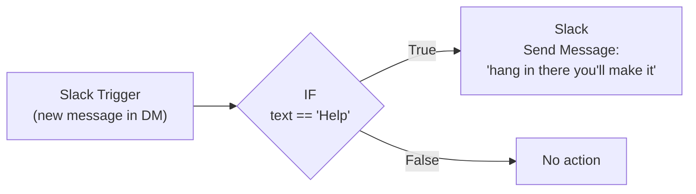

# n8n Workflow Automation Project

Build and deploy n8n automations using **natural language** with Claude AI and n8n MCP tools.

## Quick Start

Create your first workflow in 10 minutes:

```bash
claude
> "Create workflow: When [trigger], [action]"
```

Example:
```bash
> "Create workflow: When a new deal is created in HubSpot,
   send a notification to Slack #sales with deal details"
```

Claude will:
1. **Design** the workflow (ARCHITECTURE.md)
2. **Get your approval**
3. **Build and deploy** to n8n
4. **Save all artifacts** to git

See [docs/QUICK_REFERENCE.md](docs/QUICK_REFERENCE.md) for more examples.

---

## Documentation

- **[docs/QUICK_REFERENCE.md](docs/QUICK_REFERENCE.md)** - Quick reference for creating workflows
- **[docs/DEVELOPMENT.md](docs/DEVELOPMENT.md)** - Detailed development workflow guide
- **[workflows/README.md](workflows/README.md)** - Workflow structure and file reference
- **[claude.md](claude.md)** - Complete n8n-MCP tool reference

---

## Project Structure

```
├── docs/                        # Documentation
│   ├── QUICK_REFERENCE.md      # Quick reference guide
│   └── DEVELOPMENT.md          # Development workflow
├── workflows/                  # All n8n workflows
│   ├── _templates/            # Reusable templates
│   ├── README.md              # Workflow directory guide
│   ├── slack-help-bot/        # Example: Slack help bot
│   └── [workflow-name]/       # Your workflows
├── .mcp.json                  # MCP configuration
├── claude.md                  # n8n-MCP tool reference
└── README.md                  # This file
```

---

## Two-Phase Workflow Creation

### Phase 1: Architecture (Design)
You describe what you want, Claude designs it.

```bash
> "Create workflow: [your requirement]"
```

Claude generates:
- **ARCHITECTURE.md** - Full design document
- **architecture.mmd** - Visual diagram
- **test-data/** - Sample test files

✅ **Review and approve** before proceeding to Phase 2

### Phase 2: Build (Implementation)
Once approved, Claude builds and deploys automatically.

**Output:**
- **workflow.json** - n8n workflow (deployed)
- **deployment.json** - Deployment metadata
- **CHANGELOG.md** - Version history
- Commit to git

**Total time:** ~10 minutes from idea to live workflow

---

## Example Workflows

### 1. Slack Help Auto-Reply Workflow

A simple workflow that listens for "Help" in Slack DMs and replies with an encouraging message.

**Status**: Currently active in n8n instance
**Location**: `workflows/slack-help-bot/`

To create this workflow with natural language:

```bash
> "Create workflow: Listen for 'Help' in Slack DMs
   and reply with 'hang in there you'll make it'"
```

### Workflow Diagram

See [workflow.mmd](workflow.mmd) for the Mermaid diagram, or view it below:



---

## Getting Started

### 1. Create Your First Workflow

```bash
claude
> "Create workflow: [describe what you want]"
```

### 2. Review the Architecture

Claude will present:
- Overview and purpose
- Visual diagram (Mermaid)
- Node-by-node breakdown
- Configuration requirements
- Error handling strategy

### 3. Approve or Request Changes

```bash
> "Looks good, build it!"
# or
> "Can you change X to Y?"
```

### 4. Automated Deployment

Claude will:
- Build the workflow
- Validate everything
- Deploy to n8n
- Save all artifacts
- Commit to git

### 5. Test and Iterate

Once deployed, test the workflow:
```bash
> "Test the workflow with [sample data]"
```

Request updates:
```bash
> "Update the workflow: [change]"
```

---

## Guides

### For First-Time Users
Start with [docs/QUICK_REFERENCE.md](docs/QUICK_REFERENCE.md)
- Command reference
- Workflow examples
- Common requests

### For Detailed Learning
Read [docs/DEVELOPMENT.md](docs/DEVELOPMENT.md)
- Complete development workflow
- Architecture review checklist
- Best practices
- Common patterns
- Troubleshooting

### For Workflow Structure
See [workflows/README.md](workflows/README.md)
- Directory organization
- File reference
- Naming conventions
- Git strategy

### For n8n-MCP Reference
Check [claude.md](claude.md)
- Complete tool reference
- Validation strategies
- Connection syntax
- Advanced patterns
