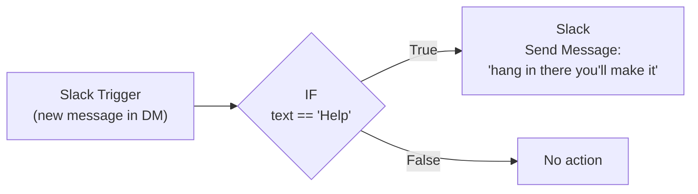

# workflowdemo

The goal of this repo is to try out some tools that could be useful for process automations.

## Slack Help Auto-Reply Workflow

A simple n8n workflow that listens for DMs containing "Help" and replies with an encouraging message.

### Workflow Diagram

See [workflow.mmd](workflow.mmd) for the Mermaid diagram, or view it below:

### Prerequisites

- An n8n instance (this project uses https://legalfly.app.n8n.cloud)
- A Slack workspace with a Slack App configured

#### Slack App Setup

1. Go to https://api.slack.com/apps
2. Click **Create New App** > **From scratch**
3. Name it (e.g., `n8n-helper-bot`) and select your workspace
4. Go to **OAuth & Permissions** and add these **Bot Token Scopes**:
   - `im:history` — read DMs
   - `im:read` — see DM channel info
   - `chat:write` — send messages
5. Click **Install to Workspace** and authorize
6. Go to **Event Subscriptions**, enable events, and subscribe to the **`message.im`** bot event
7. Save changes

#### n8n Credentials

1. In n8n, go to **Settings > Credentials > Add Credential**
2. Search for **Slack** and select **Slack OAuth2 API**
3. Follow the OAuth2 flow to connect your Slack workspace

### Building the Workflow in n8n

#### Step 1: Create the workflow

1. Open your n8n instance
2. Click **+ Add workflow**
3. Name it **Slack Help Auto-Reply**

#### Step 2: Add the Slack Trigger node

1. Click the **+** button on the canvas
2. Search for **Slack** and select **Slack Trigger**
3. Configure:
   - **Credential**: Select your Slack OAuth credential
   - **Events**: Select **New Message Posted to Channel** (or the `message` event)
   - **Channel**: Select your DM channel

#### Step 3: Add the IF node

1. Click **+** on the right side of the Slack Trigger node
2. Search for **IF** and select it
3. Configure the condition:
   - **Value 1**: Click `fx` and enter `{{ $json.text }}`
   - **Operation**: **is equal to**
   - **Value 2**: `Help`

#### Step 4: Add the Slack Send Message node

1. Click **+** on the **True** (green) output of the IF node
2. Search for **Slack** and select **Slack** (the regular node, not the trigger)
3. Configure:
   - **Credential**: Select your Slack credential
   - **Resource**: Message
   - **Operation**: Send
   - **Channel**: Click `fx` and enter `{{ $('Slack Trigger').item.json.channel }}`
   - **Text**: `hang in there you'll make it`

#### Step 5: Test

1. Click **Test Workflow** in the top-right
2. Send **Help** as a DM to your bot in Slack
3. Verify the bot replies with "hang in there you'll make it"

#### Step 6: Activate

1. Toggle the **Active** switch in the top-right to enable the workflow
2. The workflow will now run automatically on every DM
