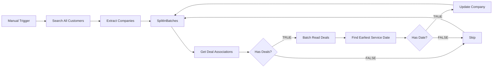

# Backfill Company Service Start Date — Architecture v1.0

## Overview

One-time manual backfill workflow. For each HubSpot company with `lifecyclestage = customer`, finds the oldest closed-won deal that has a `service_start_date` and writes that date to the company's `contract___service_start_date` property.

## Workflow Diagram

## Node Reference

### Manual Trigger (`trigger`)
- **Type**: n8n-nodes-base.manualTrigger
- **Purpose**: Start the workflow manually from the n8n editor

### Search All Customers (`search-customers`)
- **Type**: n8n-nodes-base.httpRequest v4.4
- **Purpose**: Fetch all companies with `lifecyclestage = customer`
- **Key config**: POST to HubSpot CRM Search API, limit 200 (covers all 140 customers in one call)
- **Output**: Full search response with `results[]` array

### Extract Companies (`extract-companies`)
- **Type**: n8n-nodes-base.code v2
- **Purpose**: Flatten search results into individual items
- **Output**: `{companyId, companyName}` per item

### SplitInBatches (`split-batches`)
- **Type**: n8n-nodes-base.splitInBatches v3
- **Purpose**: Process one company at a time to respect HubSpot rate limits
- **Key config**: batchSize = 1

### Get Deal Associations (`get-associations`)
- **Type**: n8n-nodes-base.httpRequest v4.4
- **Purpose**: Get all deal IDs associated with the current company
- **Key config**: GET `/crm/v4/objects/companies/{companyId}/associations/deals`
- **Output**: `{results: [{toObjectId, associationTypes}]}`

### Has Deals? (`has-deals`)
- **Type**: n8n-nodes-base.if v2.3
- **Purpose**: Check if company has any associated deals
- **Condition**: `$json.results` array is not empty
- **TRUE**: Proceed to batch read deals
- **FALSE**: Skip to next company

### Batch Read Deals (`batch-read-deals`)
- **Type**: n8n-nodes-base.httpRequest v4.4
- **Purpose**: Read all associated deals in one batch call
- **Key config**: POST `/crm/v3/objects/deals/batch/read` with properties `service_start_date`, `dealstage`, `dealname`
- **Output**: `{results: [{id, properties: {service_start_date, dealstage, dealname}}]}`

### Find Earliest Service Date (`find-earliest`)
- **Type**: n8n-nodes-base.code v2
- **Purpose**: Filter for closedwon deals with service_start_date, sort ascending, pick earliest
- **Output**: `{companyId, companyName, serviceStartDate, dealName, hasDate: true/false}`

### Has Date? (`has-date`)
- **Type**: n8n-nodes-base.if v2.3
- **Purpose**: Check if a qualifying deal was found
- **Condition**: `$json.hasDate` is true
- **TRUE**: Update company
- **FALSE**: Skip to next company

### Update Company (`update-company`)
- **Type**: n8n-nodes-base.httpRequest v4.4
- **Purpose**: Write the earliest service start date to the company record
- **Key config**: PATCH `/crm/v3/objects/companies/{companyId}` with `{contract___service_start_date: serviceStartDate}`

### Skip (`skip`)
- **Type**: n8n-nodes-base.noOp
- **Purpose**: Receives items from both IF FALSE branches, loops back to SplitInBatches

## Routing Logic

| Branch | Condition | Path |
|--------|-----------|------|
| Has Deals? TRUE | Company has associated deals | Batch Read Deals → Find Earliest → Has Date? |
| Has Deals? FALSE | No deals for this company | Skip → SplitInBatches (next) |
| Has Date? TRUE | Found a closedwon deal with service_start_date | Update Company → SplitInBatches (next) |
| Has Date? FALSE | All deals missing service_start_date or not closedwon | Skip → SplitInBatches (next) |

## Error Handling

- All HTTP Request nodes have `retryOnFail: true`, `maxTries: 3`, `waitBetweenTries: 1000ms`
- Error workflow `TA6Iq4wMW0KYsCiH` handles uncaught errors
- SplitInBatches (batch 1) prevents HubSpot rate limit issues

## Design Decisions

- **HTTP Request over HubSpot node**: The native HubSpot node doesn't support association-based deal search with sorting. HTTP Request gives full API control.
- **Code node for company fetch**: HubSpot Search API returns paginated results. A Code node cleanly flattens the response. With limit=200, all 140 customers fit in one page.
- **Batch Read for deals**: Instead of one GET per deal, batch/read fetches all deals for a company in a single call.
- **Sort in Code, not API**: HubSpot batch/read doesn't support sorting. The Code node filters for closedwon + has service_start_date, then sorts by date ascending.
- **closedate never used**: The `closedate` and `service_start_date` are fundamentally different fields. Only `service_start_date` is used.

## Credentials Required

| Service  | Credential Name | Used For               |
|----------|----------------|------------------------|
| HubSpot  | hubspot        | All HTTP Request nodes |

## n8n Instance

- **Workflow ID**: `HJGuurVOZ5Elh1xm`
- **URL**: https://legalfly.app.n8n.cloud/workflow/HJGuurVOZ5Elh1xm
