# Country Retroactive Enrichment v2.0 - Architecture

## Overview

Manual workflow to backfill the `country` property for HubSpot companies that have no country set. Uses a **five-phase enrichment cascade**: TLD extraction → Company name scan → Amplemarket domain API → Gemini blind inference → Gemini grounded inference (with Google Search). Companies that fail all phases get `country="Unknown"` written to HubSpot, preventing infinite retry loops.

Companies are fetched using a **cursor-based pagination loop** (100 per page, max 2 pages = 200 companies) to process larger batches than v1's 10-company limit.

**Workflow ID**: `h4Dwz3Z2bhksWYly`
**n8n URL**: `https://legalfly.app.n8n.cloud/workflow/h4Dwz3Z2bhksWYly`
**Status**: Inactive (manual trigger)

---

## Workflow Diagram

```mermaid
flowchart TD
    Start([Manual Trigger]) --> Init["Initialize State<br/>{after: null, allCompanies: [], pageCount: 0, maxPages: 2}"]
    Init --> Pass["Pass State"]
    Pass --> Fetch["Fetch Companies Page<br/>HubSpot Search API, limit:100"]
    Fetch --> Accum["Accumulate Results<br/>merge pages, extract cursor"]
    Accum --> More{IF More Pages<br/>after cursor not empty?}
    More -->|TRUE: loop back| Pass
    More -->|FALSE: done| Split["Split All Companies"]
    Split --> Prepare["Prepare Company Data<br/>companyId, companyName, domain"]

    Prepare --> CheckDomain{Check Has Domain?}
    CheckDomain -->|YES| TLD["Extract TLD Country<br/>120+ country TLDs"]
    CheckDomain -->|NO| NameScan["Extract Country from Name<br/>130+ country names"]
    TLD --> CheckTLD{TLD Resolved?}
    CheckTLD -->|YES| Result
    CheckTLD -->|NO| NameScan
    NameScan --> CheckName{Name Got Country?}
    CheckName -->|YES| Result

    CheckName -->|NO| CheckDomainAmp{Has Domain<br/>for Amplemarket?}
    CheckDomainAmp -->|YES| AmpDomain["Amplemarket Domain API<br/>GET /companies/find?domain="]
    CheckDomainAmp -->|NO| PrepBlind
    AmpDomain --> ParseAmp["Parse Amplemarket Country"]
    ParseAmp --> CheckAmp{Got Country?}
    CheckAmp -->|YES| Result

    CheckAmp -->|NO| PrepBlind["Prepare Gemini Blind Input"]
    PrepBlind --> GeminiBlind["Gemini Blind Inference<br/>gemini-2.5-flash, temp 0.1<br/>name+domain only"]
    GeminiBlind --> ParseBlind["Parse Gemini Blind Response<br/>JSON {country, confidence}"]
    ParseBlind --> CheckBlind{HIGH/MEDIUM<br/>confidence?}
    CheckBlind -->|YES| Result

    CheckBlind -->|NO| PrepGrounded["Prepare Gemini Grounded Input"]
    PrepGrounded --> GeminiGrounded["Gemini Grounded Inference<br/>gemini-2.5-flash + Google Search<br/>temp 0.1"]
    GeminiGrounded --> ParseGrounded["Parse Gemini Grounded Response"]
    ParseGrounded --> CheckGrounded{Got Country?}
    CheckGrounded -->|YES| Result
    CheckGrounded -->|NO| Unknown["Prepare Unknown<br/>country='Unknown'"]

    Result["Prepare Result<br/>country + enrichmentSource"] --> Snapshot
    Unknown --> Snapshot["Snapshot Data"]
    Snapshot --> UpdateHS["Update HubSpot<br/>country + countryenrichmentsource"]
    UpdateHS --> Restore["Restore Data"]
    Restore --> Aggregate["Aggregate All Results"]
    Aggregate --> Format["Format Summary<br/>source distribution stats"]
    Format --> Slack["Send Slack"]
```

---

## Node Breakdown

### Trigger & Pagination

| Node | ID | Type | Config |
|------|----|------|--------|
| **Manual Trigger** | `v2-trigger` | manualTrigger | Manual execution only |
| **Initialize State** | `v2-init` | code | Emits `{ after: null, allCompanies: [], pageCount: 0, maxPages: 2 }` |
| **Pass State** | `v2-pass` | code | Forwards pagination state into fetch loop (runOnceForEachItem) |
| **Fetch Companies Page** | `v2-fetch` | httpRequest | POST `https://api.hubapi.com/crm/v3/objects/companies/search` — filters companies with `country NOT_HAS_PROPERTY`. Fetches: `name`, `domain`. `limit: 100`. Passes `after` cursor for pagination. Retry: 3 attempts, 2000ms between |
| **Accumulate Results** | `v2-accumulate` | code | Merges current page results into `allCompanies`; extracts `paging.next.after` cursor; stops at `maxPages` |
| **IF More Pages** | `v2-if-more` | if | `after` cursor not empty → TRUE (loop back to Pass State). Empty → FALSE (proceed to split) |
| **Split All Companies** | `v2-split` | code | Maps `allCompanies` array into individual items with `{ id, properties }` |

---

### Phase 1: Zero-Cost Enrichment (TLD + Name Scan)

| Node | ID | Type | Config |
|------|----|------|--------|
| **Prepare Company Data** | `v2-prepare` | set | Extracts `companyId`, `companyName`, `domain` from item properties |
| **Check Has Domain** | `v2-check-domain` | if | `domain` not empty → TRUE (TLD extraction) / FALSE (name scan) |
| **Extract TLD Country** | `v2-tld` | code | Maps 120+ country-specific TLDs to country names (e.g., `.de` → Germany, `.co.uk` → United Kingdom) |
| **Check TLD Resolved** | `v2-check-tld` | if | `country` not empty → TRUE (result) / FALSE (name scan) |
| **Extract Country from Name** | `v2-name-scan` | code | Scans company name for 130+ country names and demonyms |
| **Check Name Got Country** | `v2-check-name` | if | `country` not empty → TRUE (result) / FALSE (Amplemarket) |

**Enrichment sources**: `"TLD"`, `"Company name"`

---

### Phase 2: Amplemarket Domain API

| Node | ID | Type | Config |
|------|----|------|--------|
| **Check Has Domain for Amplemarket** | `v2-check-domain-amp` | if | `domain` not empty → TRUE (Amplemarket call) / FALSE (skip to Gemini blind) |
| **Amplemarket Domain API** | `v2-amp-domain` | httpRequest | `GET https://api.amplemarket.com/companies/find?domain={domain}`. Auth: httpHeaderAuth. `onError: continueRegularOutput` |
| **Parse Amplemarket Country** | `v2-parse-amp` | code | Extracts `headquarters_country` from response |
| **Check Amplemarket Got Country** | `v2-check-amp` | if | `country` not empty → TRUE (result) / FALSE (Gemini blind) |

**Enrichment source**: `"Amplemarket"`

---

### Phase 3: Gemini Blind Inference (NEW in v2)

| Node | ID | Type | Config |
|------|----|------|--------|
| **Prepare Gemini Blind Input** | `v2-prep-blind` | code | Builds prompt with company name + domain. No web search, pure knowledge inference |
| **Gemini Blind Inference** | `v2-gemini-blind` | httpRequest | POST `https://generativelanguage.googleapis.com/v1beta/models/gemini-2.5-flash:generateContent`. Temperature: 0.1. No tools. `onError: continueRegularOutput` |
| **Parse Gemini Blind Response** | `v2-parse-blind` | code | Extracts JSON `{country, confidence}`. Parse errors → LOW confidence |
| **Check Gemini Blind Confidence** | `v2-check-blind` | if | confidence is HIGH or MEDIUM → TRUE (result) / FALSE (Gemini grounded) |

**Enrichment source**: `"Gemini blind"`
**Prompt file**: [`prompts/prompt-gemini-blind.md`](prompts/prompt-gemini-blind.md)

---

### Phase 4: Gemini Grounded Inference (NEW in v2 — replaces Jina.ai)

| Node | ID | Type | Config |
|------|----|------|--------|
| **Prepare Gemini Grounded Input** | `v2-prep-grounded` | code | Builds prompt asking Gemini to search the web for company HQ location |
| **Gemini Grounded Inference** | `v2-gemini-grounded` | httpRequest | POST `https://generativelanguage.googleapis.com/v1beta/models/gemini-2.5-flash:generateContent`. Temperature: 0.1. Tools: `[{"google_search": {}}]`. Retry: 3 attempts, 5000ms. `onError: continueRegularOutput` |
| **Parse Gemini Grounded Response** | `v2-parse-grounded` | code | Extracts country from JSON response. "Unknown" or parse failure → falls through |
| **Check Gemini Grounded Got Country** | `v2-check-grounded` | if | `country` not empty and not "Unknown" → TRUE (result) / FALSE (unknown fallback) |

**Enrichment source**: `"Gemini grounded"`
**Prompt file**: [`prompts/prompt-gemini-grounded.md`](prompts/prompt-gemini-grounded.md)

---

### Phase 5: Unknown Fallback (NEW in v2)

| Node | ID | Type | Config |
|------|----|------|--------|
| **Prepare Unknown** | `v2-prepare-unknown` | code | Sets `country="Unknown"`, `enrichmentSource="Unresolved"` |

---

### Convergence & Output

All enrichment paths converge at **Prepare Result** or **Prepare Unknown**, then flow through:

| Node | ID | Type | Config |
|------|----|------|--------|
| **Prepare Result** | `v2-prepare-result` | code | Normalizes `{companyId, companyName, country, enrichmentSource, resolved: true}` |
| **Snapshot Data** | `v2-snapshot` | set | Snapshots `companyId`, `companyName`, `country`, `enrichmentSource` before HubSpot write. Necessary because HubSpot update overwrites item context |
| **Update HubSpot** | `v2-update-hs` | hubspot | Writes `country` and `countryenrichmentsource` properties to company record |
| **Restore Data** | `v2-restore` | code | Re-reads from Snapshot Data node and re-emits result fields for aggregation |
| **Aggregate All Results** | `v2-aggregate` | aggregate | Collects all processed company results into a single array |
| **Format Summary** | `v2-format` | code | Builds Slack message with source distribution stats (TLD, Company name, Amplemarket, Gemini blind, Gemini grounded, Unresolved) |
| **Send Slack** | `v2-slack` | slack | Posts summary to channel `C0AG86U9927` |

---

## Routing Logic

| Node | Condition | TRUE → | FALSE → |
|------|-----------|--------|---------|
| **Check Has Domain** | `domain` not empty | Extract TLD Country | Extract Country from Name |
| **Check TLD Resolved** | `country` not empty | Prepare Result | Extract Country from Name |
| **Check Name Got Country** | `country` not empty | Prepare Result | Check Has Domain for Amplemarket |
| **Check Has Domain for Amplemarket** | `domain` not empty | Amplemarket Domain API | Prepare Gemini Blind Input |
| **Check Amplemarket Got Country** | `country` not empty | Prepare Result | Prepare Gemini Blind Input |
| **Check Gemini Blind Confidence** | confidence is HIGH or MEDIUM | Prepare Result | Prepare Gemini Grounded Input |
| **Check Gemini Grounded Got Country** | `country` not empty and not "Unknown" | Prepare Result | Prepare Unknown |
| **IF More Pages** | `after` cursor not empty | Pass State (loop) | Split All Companies |

---

## Gemini Configuration (both phases)

- **Model**: `gemini-2.5-flash`
- **Endpoint**: `POST https://generativelanguage.googleapis.com/v1beta/models/gemini-2.5-flash:generateContent`
- **Auth**: `googlePalmApi` (credential: `Gemini`)
- **Temperature**: `0.1` (lowered from v1's 0.3 for more deterministic output)
- **Blind phase**: No tools (pure knowledge inference with confidence scoring)
- **Grounded phase**: `"tools": [{"google_search": {}}]` — Gemini actively searches the web

---

## Error Handling

| Node | Strategy |
|------|----------|
| **Fetch Companies Page** | `retryOnFail: true`, `maxTries: 3`, `waitBetweenTries: 2000` |
| **Amplemarket Domain API** | `onError: continueRegularOutput` — failures fall through to Gemini blind |
| **Gemini Blind Inference** | `onError: continueRegularOutput` — parse errors treated as LOW confidence |
| **Gemini Grounded Inference** | `retryOnFail: true`, `maxTries: 3`, `waitBetweenTries: 5000`, `onError: continueRegularOutput` |
| **All other nodes** | Default error handling (workflow stops on error) |

---

## Complete Node List

| ID | Name | Type |
|----|------|------|
| v2-trigger | Manual Trigger | manualTrigger |
| v2-init | Initialize State | code |
| v2-pass | Pass State | code |
| v2-fetch | Fetch Companies Page | httpRequest |
| v2-accumulate | Accumulate Results | code |
| v2-if-more | IF More Pages | if |
| v2-split | Split All Companies | code |
| v2-prepare | Prepare Company Data | set |
| v2-check-domain | Check Has Domain | if |
| v2-tld | Extract TLD Country | code |
| v2-check-tld | Check TLD Resolved | if |
| v2-name-scan | Extract Country from Name | code |
| v2-check-name | Check Name Got Country | if |
| v2-check-domain-amp | Check Has Domain for Amplemarket | if |
| v2-amp-domain | Amplemarket Domain API | httpRequest |
| v2-parse-amp | Parse Amplemarket Country | code |
| v2-check-amp | Check Amplemarket Got Country | if |
| v2-prep-blind | Prepare Gemini Blind Input | code |
| v2-gemini-blind | Gemini Blind Inference | httpRequest |
| v2-parse-blind | Parse Gemini Blind Response | code |
| v2-check-blind | Check Gemini Blind Confidence | if |
| v2-prep-grounded | Prepare Gemini Grounded Input | code |
| v2-gemini-grounded | Gemini Grounded Inference | httpRequest |
| v2-parse-grounded | Parse Gemini Grounded Response | code |
| v2-check-grounded | Check Gemini Grounded Got Country | if |
| v2-prepare-unknown | Prepare Unknown | code |
| v2-prepare-result | Prepare Result | code |
| v2-snapshot | Snapshot Data | set |
| v2-update-hs | Update HubSpot | hubspot |
| v2-restore | Restore Data | code |
| v2-aggregate | Aggregate All Results | aggregate |
| v2-format | Format Summary | code |
| v2-slack | Send Slack | slack |

**Total**: 33 nodes

---

## Credentials Required

| Service | Credential Name | Type | Used For |
|---------|----------------|------|----------|
| HubSpot | `hubspot` | hubspotAppToken | Company search + update |
| Google Gemini | `Gemini` | googlePalmApi | Blind + grounded inference |
| Amplemarket | `amplemarket` | httpHeaderAuth | Domain company lookup |
| Slack | `Slack` | slackApi | Summary notification |

---

## Key Design Decisions

- **Gemini blind before grounded**: The blind pass (Phase 3) uses zero API quota and resolves ~50-70% of companies that reach it — well-known brands, unambiguous legal suffixes (GmbH, Ltd, BV), and geographic domain hints. This dramatically reduces the number of grounded searches needed.
- **Confidence scoring**: The blind pass returns HIGH/MEDIUM/LOW confidence. Only HIGH and MEDIUM are accepted — LOW falls through to the grounded search, avoiding false positives from ambiguous company names.
- **Google Search grounding replaces Jina.ai**: Instead of scraping websites with Jina (20 RPM bottleneck) then sending content to Gemini, a single Gemini call with `google_search` tool searches the web directly. Eliminates the Jina dependency entirely.
- **"Unknown" fallback**: Companies that fail all 5 phases get `country="Unknown"` written to HubSpot. This prevents them from being re-fetched on subsequent runs (the HubSpot search filters for `country NOT_HAS_PROPERTY`).
- **Pagination loop**: Fetches up to 200 companies per run (2 pages x 100) using cursor-based pagination. The `maxPages` parameter in Initialize State controls this.
- **Snapshot Data pattern**: A Set node before HubSpot Update preserves result data (`companyId`, `companyName`, `country`, `enrichmentSource`). The HubSpot node overwrites item context, so without this snapshot the Restore Data node would have nothing to aggregate.
- **Temperature 0.1**: Lowered from v1's 0.3 for more deterministic, consistent country identification.
- **Single Amplemarket call**: v1 had up to 3 Amplemarket calls per company (LinkedIn, domain, website-LinkedIn). v2 uses only the domain lookup — simpler and sufficient.
- **Source distribution stats**: The Slack summary includes a breakdown by enrichment source (e.g., "TLD: 45, Company name: 12, Amplemarket: 23, Gemini blind: 15, Gemini grounded: 3, Unresolved: 2") for monitoring enrichment effectiveness.

---

## Rate Limit Summary

| API | Limit | v2 calls per 200 companies |
|-----|-------|---------------------------|
| HubSpot Search | 100/10sec | 2 (paginated) |
| HubSpot Update | 100/10sec | up to 200 |
| Amplemarket | 500/min | max ~120 (after TLD+name filter) |
| Gemini Flash (blind) | generous | max ~80 (after Amplemarket filter) |
| Gemini Flash (grounded) | generous | max ~30-40 (after blind filter) |
| **Jina.ai** | **REMOVED** | **0** |

---

## n8n Instance

- **Workflow ID**: `h4Dwz3Z2bhksWYly`
- **URL**: https://legalfly.app.n8n.cloud/workflow/h4Dwz3Z2bhksWYly
