# Country Retroactive Enrichment v2.1 — Architecture

## Overview

Manual workflow to backfill the `country` property for HubSpot companies that have no country set. Uses a **four-phase enrichment cascade**: TLD extraction, company name scan, Amplemarket domain API, Jina web scraping/search + Gemini inference. Companies that fail all phases get `country="Unknown"` written to HubSpot, preventing infinite retry loops.

**v2.1 replaces Gemini blind + grounded passes with Jina web scraping + Gemini analysis.** This eliminates LLM hallucination (Gemini blind classified "dewitlawoffice" as Netherlands instead of Belgium) and provides full transparency into what content Gemini reads. Web search uses DuckDuckGo via Jina Reader instead of `s.jina.ai` for better accuracy.

**Workflow ID**: `h4Dwz3Z2bhksWYly`
**n8n URL**: `https://legalfly.app.n8n.cloud/workflow/h4Dwz3Z2bhksWYly`
**Status**: Inactive (manual trigger)

---

## Workflow Diagram

```mermaid
flowchart TD
    Start([Manual Trigger]) --> Init["Initialize State\n{after: null, allCompanies: [], pageCount: 0, maxPages: 1}"]
    Init --> Pass["Pass State"]
    Pass --> Fetch["Fetch Companies Page\nHubSpot Search API, limit:10"]
    Fetch --> Accum["Accumulate Results\nmerge pages, extract cursor"]
    Accum --> More{IF More Pages\nafter cursor not empty?}
    More -->|TRUE: loop back| Pass
    More -->|FALSE: done| Split["Split All Companies"]
    Split --> Prepare["Prepare Company Data\ncompanyId, companyName, domain"]

    Prepare --> CheckDomain{Check Has Domain?}
    CheckDomain -->|YES| TLD["Extract TLD Country\n120+ country TLDs"]
    CheckDomain -->|NO| NameScan["Extract Country from Name\n130+ country names"]
    TLD --> CheckTLD{TLD Resolved?}
    CheckTLD -->|YES| Result
    CheckTLD -->|NO| NameScan
    NameScan --> CheckName{Name Got Country?}
    CheckName -->|YES| Result

    CheckName -->|NO| CheckDomainAmp{Has Domain\nfor Amplemarket?}
    CheckDomainAmp -->|YES| AmpDomain["Amplemarket Domain API\nGET /companies/find?domain="]
    CheckDomainAmp -->|NO| JinaSearch
    AmpDomain --> ParseAmp["Parse Amplemarket Country"]
    ParseAmp --> CheckAmp{Got Country?}
    CheckAmp -->|YES| Result

    CheckAmp -->|NO| JinaScrape["Jina Website Scrape\nGET r.jina.ai/{domain}\n10s timeout"]
    JinaScrape --> CheckWebsite{Website Data\ncontent + no warning + len>200?}
    CheckWebsite -->|YES| PrepGemini["Prepare Gemini Input\nclean + truncate content"]
    CheckWebsite -->|NO| JinaSearch["DuckDuckGo Web Search\nGET r.jina.ai/duckduckgo.com/?q={name}\n10s timeout"]
    JinaSearch --> PrepGemini
    PrepGemini --> Gemini["Gemini Inference\ngemini-2.5-flash, temp 0.1\nNO tools, content-only"]
    Gemini --> ParseGemini["Parse Gemini Response\nJSON {country, evidence}"]
    ParseGemini --> CheckGemini{Got Country?}
    CheckGemini -->|YES| Result
    CheckGemini -->|NO| Unknown["Prepare Unknown\ncountry='Unknown'"]

    Result["Prepare Result\ncountry + enrichmentSource"] --> Snapshot
    Unknown --> Snapshot["Snapshot Data"]
    Snapshot --> UpdateHS["Update HubSpot\ncountry + countryenrichmentsource"]
    UpdateHS --> Restore["Restore Data"]
    Restore --> Format["Format Summary\nsingle Slack message\nuses $getWorkflowStaticData"]
    Format --> Slack["Send Slack"]
```

---

## Node Breakdown

### Trigger & Pagination

| Node | Type | Config |
|------|------|--------|
| **Manual Trigger** (`v2-trigger`) | manualTrigger | Manual execution only |
| **Initialize State** (`v2-init`) | code | Emits `{ after: null, allCompanies: [], pageCount: 0, maxPages: 1 }` — seeds the pagination loop |
| **Pass State** (`v2-pass`) | code | Forwards `{ after, allCompanies, pageCount, maxPages }` into the next fetch iteration |
| **Fetch Companies Page** (`v2-fetch`) | httpRequest | POST `https://api.hubapi.com/crm/v3/objects/companies/search` — filters `country NOT_HAS_PROPERTY`, fetches `name` and `domain`. `limit: 10`. Retry: 3x, 2s. Auth: `hubspotAppToken` |
| **Accumulate Results** (`v2-accumulate`) | code | Merges page results into `allCompanies`, extracts `paging.next.after` cursor, stops at `maxPages` |
| **IF More Pages** (`v2-if-more`) | if | `after` cursor not empty → TRUE (loop back to Pass State). Empty → FALSE (proceed to split) |
| **Split All Companies** (`v2-split`) | code | Maps `allCompanies` array into individual items with `{ id, properties }` |

---

### Phase 1: Zero-Cost Enrichment (TLD + Name Scan)

| Node | Type | Config |
|------|------|--------|
| **Prepare Company Data** (`v2-prepare`) | set | Extracts `companyId`, `companyName`, `domain` from each company |
| **Check Has Domain** (`v2-check-domain`) | if | `domain` not empty → Extract TLD Country / empty → Extract Country from Name |
| **Extract TLD Country** (`v2-tld`) | code | Maps 120+ country TLDs (`.de` → Germany, `.co.uk` → UK). Ignores generic TLDs (`.com`, `.io`, `.ai`, etc.). Checks compound TLDs first (`.co.uk`) before single TLDs (`.uk`) |
| **Check TLD Resolved** (`v2-check-tld`) | if | `countryFromTLD` not empty → Prepare Result / empty → Extract Country from Name |
| **Extract Country from Name** (`v2-name-scan`) | code | Scans company name for 130+ country names (case-insensitive substring match) |
| **Check Name Got Country** (`v2-check-name`) | if | `countryFromName` not empty → Prepare Result / empty → Check Has Domain for Amplemarket |

---

### Phase 2: Amplemarket Domain API

| Node | Type | Config |
|------|------|--------|
| **Check Has Domain for Amplemarket** (`v2-check-domain-amp`) | if | `domain` not empty → Amplemarket Domain API / empty → Jina Web Search |
| **Amplemarket Domain API** (`v2-amp-domain`) | httpRequest | `GET https://api.amplemarket.com/companies/find?domain={domain}`. Auth: `httpHeaderAuth` (credential: `amplemarket`). `onError: continueRegularOutput`, retry 3x/2s |
| **Parse Amplemarket Country** (`v2-parse-amp`) | code | Extracts primary location country from `locations` array (finds `is_primary` or uses first entry) |
| **Check Amplemarket Got Country** (`v2-check-amp`) | if | `countryFromAmplemarket` not empty → Prepare Result / empty → Jina Website Scrape |

---

### Phase 3: Jina + Gemini (Web Scraping + Content Analysis)

| Node | Type | Config |
|------|------|--------|
| **Jina Website Scrape** (`v2-jina-scrape`) | httpRequest | `GET https://r.jina.ai/https://{domain}`. Returns markdown content. Headers: `Authorization: Bearer {JINA_KEY}`, `Accept: application/json`, `X-Return-Format: markdown`. Timeout: 10s, no retries. `onError: continueRegularOutput` |
| **Check Website Data** (`v2-check-website`) | if | 3-condition quality gate: content `notEmpty` AND no `warning` AND content length > 200. Catches 404s, Wix errors, empty pages |
| **Jina Web Search** (`v2-jina-search`) | httpRequest | `GET https://r.jina.ai/https://duckduckgo.com/?q={companyName}`. DuckDuckGo results via Jina Reader. Same auth headers. Timeout: 10s, no retries |
| **Prepare Gemini Input** (`v2-prep-gemini`) | code | Tries website content first (secondary quality check), falls back to search. Cleans markdown images, cookie notices, DuckDuckGo boilerplate. Truncates to 3000 chars. Builds prompt with evidence requirement. Outputs `contentSource` (`website` or `search`) |
| **Gemini Inference** (`v2-gemini`) | httpRequest | `POST gemini-2.5-flash:generateContent`. Temperature 0.1. **NO tools** (no `google_search`). Content-only analysis. Auth: `googlePalmApi`. Retry 3x/2s |
| **Parse Gemini Response** (`v2-parse-gemini`) | code | Extracts `{country, evidence}` from JSON response. Strips markdown code fences. Passes `contentSource` downstream |
| **Check Gemini Got Country** (`v2-check-gemini`) | if | `geminiCountry` not empty → Prepare Result / empty → Prepare Unknown |

**Enrichment source**: `"Website"` (from scrape) or `"Web Search"` (from DuckDuckGo)
**Prompt file**: [`prompts/prompt-gemini.md`](prompts/prompt-gemini.md)

---

### Phase 4: Unknown Fallback

| Node | Type | Config |
|------|------|--------|
| **Prepare Unknown** (`v2-unknown`) | code | Sets `country="Unknown"`, `enrichmentSource="Unresolved"`, `resolved=false` |

---

### Convergence & Output

| Node | Type | Config |
|------|------|--------|
| **Prepare Result** (`v2-result`) | code | Normalizes `{companyId, companyName, country, enrichmentSource, resolved: true}`. Determines source from which field was populated: `countryFromTLD` → "Domain Code", `countryFromName` → "Company Name", `countryFromAmplemarket` → "Amplemarket", `geminiCountry` → "Website" or "Web Search" (based on `contentSource`) |
| **Snapshot Data** (`v2-snapshot`) | set | Preserves `companyId`, `companyName`, `country`, `enrichmentSource`, `resolved` before HubSpot write |
| **Update HubSpot** (`v2-update-hs`) | hubspot | Writes `country` via the standard `countryRegion` field in `updateFields` + `countryenrichmentsource` via `customPropertiesUi`. Auth: `hubspotAppToken`. Retry 3x/2s |
| **Restore Data** (`v2-restore`) | code | Re-reads from Snapshot Data and re-emits result fields for the summary |
| **Format Summary** (`v2-format`) | code | Uses `$getWorkflowStaticData('node')` to accumulate results across batches from different IF branches. Resets per execution via `$execution.id`. Returns `[]` until all items collected (compared against `$('Split All Companies').all().length`), then builds a single Slack message with enriched/unknown sections and HubSpot View links |
| **Send Slack** (`v2-slack`) | slack | Posts to channel `C0AG86U9927`. Text: `={{ $json.message }}` |

---

## Routing Logic

| Node | Condition | TRUE | FALSE |
|------|-----------|------|-------|
| **Check Has Domain** | domain not empty | Extract TLD Country | Extract Country from Name |
| **Check TLD Resolved** | countryFromTLD not empty | Prepare Result | Extract Country from Name |
| **Check Name Got Country** | countryFromName not empty | Prepare Result | Check Has Domain for Amplemarket |
| **Check Has Domain for Amplemarket** | domain not empty | Amplemarket Domain API | Jina Web Search |
| **Check Amplemarket Got Country** | countryFromAmplemarket not empty | Prepare Result | Jina Website Scrape |
| **Check Website Data** | content notEmpty AND no warning AND len > 200 | Prepare Gemini Input | Jina Web Search |
| **Check Gemini Got Country** | geminiCountry not empty | Prepare Result | Prepare Unknown |
| **IF More Pages** | after cursor not empty | Pass State (loop) | Split All Companies |

---

## Error Handling

| Node | Strategy |
|------|----------|
| **Fetch Companies Page** | `retryOnFail: true`, `maxTries: 3`, `waitBetweenTries: 2000` |
| **Amplemarket Domain API** | `onError: continueRegularOutput`, retry 3x/2s |
| **Jina Website Scrape** | `onError: continueRegularOutput`, timeout 10s, **no retries** |
| **Jina Web Search** | `onError: continueRegularOutput`, timeout 10s, **no retries** |
| **Gemini Inference** | `onError: continueRegularOutput`, retry 3x/2s |
| **Update HubSpot** | `onError: continueRegularOutput`, retry 3x/2s |

---

## Key Design Decisions

- **Jina replaces Gemini internal knowledge**: v2.0's blind pass hallucinated (classified "dewitlawoffice" as Netherlands, actually Belgium). Jina provides real web content, eliminating LLM guessing.
- **Jina replaces Gemini grounded search**: v2.0's grounded search was a black box — couldn't see what pages Gemini read. Jina scrape/search outputs are visible and debuggable.
- **DuckDuckGo replaces s.jina.ai**: The `s.jina.ai` search API returned poor results — "kode legal" was misclassified as US instead of UK. DuckDuckGo via `r.jina.ai` provides real search engine results with better accuracy.
- **Scrape-first, search-fallback**: When a domain exists, Jina scrapes the actual website. If scraping returns low-quality content, falls back to DuckDuckGo search.
- **3-condition website quality gate**: Check Website Data verifies content is not empty, has no Jina warning (catches 404s, Wix errors), and exceeds 200 chars. Prevents garbage content from being sent to Gemini.
- **DuckDuckGo boilerplate stripping**: Prepare Gemini Input strips navigation/UI boilerplate before the first numbered result, removes footer sections, and strips per-result action links.
- **Content truncation to 3000 chars**: Controls Gemini token usage (~1200 tokens per call including prompt).
- **Evidence requirement**: Gemini must quote actual text from the content, not use its own knowledge.
- **NO Gemini tools**: The Gemini call has no `google_search` tool — it can only analyze the content provided.
- **10s timeout, no retries on Jina**: Dead domains would hang Jina indefinitely. 10s timeout with no retries prevents blocking.
- **`countryRegion` for HubSpot writes**: `country` is a standard HubSpot property. Writing it via `customPropertiesUi` silently fails — must use the built-in `countryRegion` field under `updateFields` instead.
- **`$getWorkflowStaticData('node')` for single Slack message**: When items take different paths through IF nodes, they arrive at downstream convergence nodes as separate batches. Neither `$('NodeName').all()` nor the Aggregate node reliably waits for all batches. Static data accumulates items across batches and only produces output when `length >= totalExpected`. Uses `$execution.id` to reset between runs.
- **Standardized enrichment sources**: Domain Code, Company Name, Amplemarket, Website, Web Search, Unresolved — consistent naming for the HubSpot `countryenrichmentsource` property dropdown.

---

## Credentials Required

| Service | Credential Name | Type | Used For |
|---------|----------------|------|----------|
| HubSpot | `hubspot` | hubspotAppToken | Company search + update |
| Google Gemini | `Gemini` | googlePalmApi | Content analysis inference |
| Amplemarket | `amplemarket` | httpHeaderAuth | Domain company lookup |
| Jina | *(inline Bearer token)* | sendHeaders | Website scrape + DuckDuckGo search |
| Slack | `Slack` | slackApi | Summary notification |

---

## Complete Node List

| ID | Name | Type |
|----|------|------|
| v2-trigger | Manual Trigger | manualTrigger |
| v2-init | Initialize State | code |
| v2-pass | Pass State | code |
| v2-fetch | Fetch Companies Page | httpRequest |
| v2-accumulate | Accumulate Results | code |
| v2-if-more | IF More Pages | if |
| v2-split | Split All Companies | code |
| v2-prepare | Prepare Company Data | set |
| v2-check-domain | Check Has Domain | if |
| v2-tld | Extract TLD Country | code |
| v2-check-tld | Check TLD Resolved | if |
| v2-name-scan | Extract Country from Name | code |
| v2-check-name | Check Name Got Country | if |
| v2-check-domain-amp | Check Has Domain for Amplemarket | if |
| v2-amp-domain | Amplemarket Domain API | httpRequest |
| v2-parse-amp | Parse Amplemarket Country | code |
| v2-check-amp | Check Amplemarket Got Country | if |
| v2-jina-scrape | Jina Website Scrape | httpRequest |
| v2-check-website | Check Website Data | if |
| v2-jina-search | Jina Web Search | httpRequest |
| v2-prep-gemini | Prepare Gemini Input | code |
| v2-gemini | Gemini Inference | httpRequest |
| v2-parse-gemini | Parse Gemini Response | code |
| v2-check-gemini | Check Gemini Got Country | if |
| v2-result | Prepare Result | code |
| v2-unknown | Prepare Unknown | code |
| v2-snapshot | Snapshot Data | set |
| v2-update-hs | Update HubSpot | hubspot |
| v2-restore | Restore Data | code |
| v2-format | Format Summary | code |
| v2-slack | Send Slack | slack |

**Total**: 31 nodes

---

## n8n Instance

- **Workflow ID**: `h4Dwz3Z2bhksWYly`
- **URL**: https://legalfly.app.n8n.cloud/workflow/h4Dwz3Z2bhksWYly
