# Country Retroactive Enrichment v2.1 - Architecture

## Overview

Manual workflow to backfill the `country` property for HubSpot companies that have no country set. Uses a **four-phase enrichment cascade**: TLD extraction, Company name scan, Amplemarket domain API, Jina scraping/search + Gemini inference. Companies that fail all phases get `country="Unknown"` written to HubSpot, preventing infinite retry loops.

**v2.1 replaces Gemini blind + grounded passes with Jina web scraping + Gemini analysis.** This eliminates LLM hallucination (Gemini blind classified "dewitlawoffice" as Netherlands instead of Belgium) and provides full transparency into what content Gemini reads. Web search uses DuckDuckGo via Jina Reader instead of `s.jina.ai` for better accuracy.

**Workflow ID**: `h4Dwz3Z2bhksWYly`
**n8n URL**: `https://legalfly.app.n8n.cloud/workflow/h4Dwz3Z2bhksWYly`
**Status**: Inactive (manual trigger)

---

## Workflow Diagram

```mermaid
flowchart TD
    Start([Manual Trigger]) --> Init["Initialize State<br/>{after: null, allCompanies: [], pageCount: 0, maxPages: 1}"]
    Init --> Pass["Pass State"]
    Pass --> Fetch["Fetch Companies Page<br/>HubSpot Search API, limit:10"]
    Fetch --> Accum["Accumulate Results<br/>merge pages, extract cursor"]
    Accum --> More{IF More Pages<br/>after cursor not empty?}
    More -->|TRUE: loop back| Pass
    More -->|FALSE: done| Split["Split All Companies"]
    Split --> Prepare["Prepare Company Data<br/>companyId, companyName, domain"]

    Prepare --> CheckDomain{Check Has Domain?}
    CheckDomain -->|YES| TLD["Extract TLD Country<br/>120+ country TLDs"]
    CheckDomain -->|NO| NameScan["Extract Country from Name<br/>130+ country names"]
    TLD --> CheckTLD{TLD Resolved?}
    CheckTLD -->|YES| Result
    CheckTLD -->|NO| NameScan
    NameScan --> CheckName{Name Got Country?}
    CheckName -->|YES| Result

    CheckName -->|NO| CheckDomainAmp{Has Domain<br/>for Amplemarket?}
    CheckDomainAmp -->|YES| AmpDomain["Amplemarket Domain API<br/>GET /companies/find?domain="]
    CheckDomainAmp -->|NO| JinaSearch
    AmpDomain --> ParseAmp["Parse Amplemarket Country"]
    ParseAmp --> CheckAmp{Got Country?}
    CheckAmp -->|YES| Result

    CheckAmp -->|NO| JinaScrape["Jina Website Scrape<br/>GET r.jina.ai/{domain}<br/>10s timeout"]
    JinaScrape --> CheckWebsite{Website Data<br/>content + no warning + len>200?}
    CheckWebsite -->|YES| PrepGemini["Prepare Gemini Input<br/>clean + truncate content"]
    CheckWebsite -->|NO| JinaSearch["DuckDuckGo Web Search<br/>GET r.jina.ai/duckduckgo.com/?q={name}<br/>10s timeout"]
    JinaSearch --> PrepGemini
    PrepGemini --> Gemini["Gemini Inference<br/>gemini-2.5-flash, temp 0.1<br/>NO tools, content-only"]
    Gemini --> ParseGemini["Parse Gemini Response<br/>JSON {country, evidence}"]
    ParseGemini --> CheckGemini{Got Country?}
    CheckGemini -->|YES| Result
    CheckGemini -->|NO| Unknown["Prepare Unknown<br/>country='Unknown'"]

    Result["Prepare Result<br/>country + enrichmentSource"] --> Snapshot
    Unknown --> Snapshot["Snapshot Data"]
    Snapshot --> UpdateHS["Update HubSpot<br/>country + countryenrichmentsource"]
    UpdateHS --> Restore["Restore Data"]
    Restore --> Format["Format Summary<br/>single Slack message<br/>uses $('Restore Data').all()"]
    Format --> Slack["Send Slack"]
```

---

## Node Reference

### Trigger & Pagination

| Node | ID | Type | Purpose |
|------|----|------|---------|
| **Manual Trigger** | `v2-trigger` | manualTrigger | Manual execution only |
| **Initialize State** | `v2-init` | code | Emits `{ after: null, allCompanies: [], pageCount: 0, maxPages: 1 }` |
| **Pass State** | `v2-pass` | code | Forwards pagination state into fetch loop |
| **Fetch Companies Page** | `v2-fetch` | httpRequest | POST HubSpot search — `country NOT_HAS_PROPERTY`, limit: 10. Retry: 3x, 2s |
| **Accumulate Results** | `v2-accumulate` | code | Merges page results, extracts cursor, stops at maxPages |
| **IF More Pages** | `v2-if-more` | if | `after` not empty → loop; empty → proceed |
| **Split All Companies** | `v2-split` | code | Maps allCompanies into individual items |

### Phase 1: Zero-Cost Enrichment (TLD + Name Scan)

| Node | ID | Type | Purpose |
|------|----|------|---------|
| **Prepare Company Data** | `v2-prepare` | set | Extracts companyId, companyName, domain |
| **Check Has Domain** | `v2-check-domain` | if | domain not empty → TLD / empty → name scan |
| **Extract TLD Country** | `v2-tld` | code | Maps 120+ country TLDs (`.de` → Germany, `.co.uk` → UK) |
| **Check TLD Resolved** | `v2-check-tld` | if | country found → result / not → name scan |
| **Extract Country from Name** | `v2-name-scan` | code | Scans company name for 130+ country names |
| **Check Name Got Country** | `v2-check-name` | if | country found → result / not → Amplemarket |

### Phase 2: Amplemarket Domain API

| Node | ID | Type | Purpose |
|------|----|------|---------|
| **Check Has Domain for Amplemarket** | `v2-check-domain-amp` | if | domain not empty → Amplemarket / empty → DuckDuckGo search |
| **Amplemarket Domain API** | `v2-amp-domain` | httpRequest | GET `/companies/find?domain=`. Auth: httpHeaderAuth |
| **Parse Amplemarket Country** | `v2-parse-amp` | code | Extracts primary location country |
| **Check Amplemarket Got Country** | `v2-check-amp` | if | country found → result / not → Jina scrape |

### Phase 3: Jina + Gemini (replaces blind + grounded from v2.0)

| Node | ID | Type | Purpose |
|------|----|------|---------|
| **Jina Website Scrape** | `v2-jina-scrape` | httpRequest | GET `r.jina.ai/https://{domain}`. Returns markdown content. 10s timeout, no retries. Auth: Bearer token in header |
| **Check Website Data** | `v2-check-website` | if | 3-condition quality gate: content notEmpty AND no warning AND content length > 200 |
| **Jina Web Search** | `v2-jina-search` | httpRequest | GET `r.jina.ai/https://duckduckgo.com/?q={companyName}`. DuckDuckGo results via Jina Reader. 10s timeout, no retries |
| **Prepare Gemini Input** | `v2-prep-gemini` | code | Tries website content first (secondary quality check), falls back to search. Cleans markdown images, cookie notices, DuckDuckGo boilerplate. Truncates to 3000 chars. Builds prompt with evidence requirement |
| **Gemini Inference** | `v2-gemini` | httpRequest | POST gemini-2.5-flash. Temperature 0.1. **NO tools** (no google_search). Content-only analysis |
| **Parse Gemini Response** | `v2-parse-gemini` | code | Extracts `{country, evidence}` from JSON response. Passes `contentSource` downstream |
| **Check Gemini Got Country** | `v2-check-gemini` | if | country not empty → result / empty → unknown |

**Enrichment source**: `"Website"` (from scrape) or `"Web Search"` (from DuckDuckGo)
**Prompt file**: [`prompts/prompt-gemini.md`](prompts/prompt-gemini.md)

### Phase 4: Unknown Fallback

| Node | ID | Type | Purpose |
|------|----|------|---------|
| **Prepare Unknown** | `v2-unknown` | code | Sets `country="Unknown"`, `enrichmentSource="Unresolved"` |

### Convergence & Output

| Node | ID | Type | Purpose |
|------|----|------|---------|
| **Prepare Result** | `v2-result` | code | Normalizes `{companyId, companyName, country, enrichmentSource, resolved: true}`. Source: Domain Code / Company Name / Amplemarket / Website / Web Search |
| **Snapshot Data** | `v2-snapshot` | set | Preserves result before HubSpot write |
| **Update HubSpot** | `v2-update-hs` | hubspot | Writes `country` + `countryenrichmentsource` to company |
| **Restore Data** | `v2-restore` | code | Re-reads from Snapshot for summary |
| **Format Summary** | `v2-format` | code | Builds single Slack message using `$('Restore Data').all()`. Only sends when all companies processed. `runOnceForAllItems` mode |
| **Send Slack** | `v2-slack` | slack | Posts to channel `C0AG86U9927` |

---

## Routing Logic

| Node | Condition | TRUE | FALSE |
|------|-----------|------|-------|
| **Check Has Domain** | domain not empty | Extract TLD Country | Extract Country from Name |
| **Check TLD Resolved** | country not empty | Prepare Result | Extract Country from Name |
| **Check Name Got Country** | country not empty | Prepare Result | Check Has Domain for Amplemarket |
| **Check Has Domain for Amplemarket** | domain not empty | Amplemarket Domain API | Jina Web Search |
| **Check Amplemarket Got Country** | country not empty | Prepare Result | Jina Website Scrape |
| **Check Website Data** | content notEmpty AND no warning AND len > 200 | Prepare Gemini Input | Jina Web Search |
| **Check Gemini Got Country** | geminiCountry not empty | Prepare Result | Prepare Unknown |
| **IF More Pages** | after cursor not empty | Pass State (loop) | Split All Companies |

---

## Error Handling

| Node | Strategy |
|------|----------|
| **Fetch Companies Page** | `retryOnFail: true`, `maxTries: 3`, `waitBetweenTries: 2000` |
| **Amplemarket Domain API** | `onError: continueRegularOutput`, retry 3x/2s |
| **Jina Website Scrape** | `onError: continueRegularOutput`, timeout 10s, **no retries** |
| **Jina Web Search** | `onError: continueRegularOutput`, timeout 10s, **no retries** |
| **Gemini Inference** | `onError: continueRegularOutput`, retry 3x/2s |
| **Update HubSpot** | `onError: continueRegularOutput`, retry 3x/2s |

---

## Design Decisions

- **Jina replaces Gemini internal knowledge**: v2.0's blind pass hallucinated (classified "dewitlawoffice" as Netherlands, actually Belgium). Jina provides real web content, eliminating LLM guessing.
- **Jina replaces Gemini grounded search**: v2.0's grounded search was a black box — couldn't see what pages Gemini read. Jina scrape/search outputs are visible and debuggable.
- **DuckDuckGo replaces s.jina.ai**: The `s.jina.ai` search API returned poor results — "kode legal" was misclassified as US instead of UK. DuckDuckGo via `r.jina.ai` provides real search engine results with better accuracy. Google blocks Jina scraping with CAPTCHA.
- **Scrape-first, search-fallback**: When a domain exists, Jina scrapes the actual website. If scraping returns low-quality content (warning, < 200 chars, or empty), falls back to DuckDuckGo search for `{companyName}`.
- **3-condition website quality gate**: Check Website Data verifies content is not empty, has no Jina warning (catches 404s, Wix errors), and exceeds 200 chars. Prevents garbage content from being sent to Gemini.
- **DuckDuckGo boilerplate stripping**: Prepare Gemini Input strips DuckDuckGo navigation/UI boilerplate before the first numbered result, removes footer sections, and strips per-result action links.
- **Content truncation**: Both website scrape and DuckDuckGo search truncated to 3000 chars. Controls Gemini token usage (~1200 tokens per call including prompt).
- **Evidence requirement**: Gemini must quote actual text from the content, not use its own knowledge. This catches cases where the LLM tries to infer rather than read.
- **NO Gemini tools**: The Gemini call has no `google_search` tool — it can only analyze the content provided. This prevents Gemini from going off-script.
- **10s timeout, no retries on Jina**: Dead domains would hang Jina indefinitely. 10s timeout with no retries prevents blocking the entire execution.
- **Single Slack message**: Format Summary uses `$('Restore Data').all()` to collect all items across branches/batches. Returns empty array until `allResults.length >= totalCompanies`, ensuring one message per execution.
- **Standardized enrichment sources**: Domain Code, Company Name, Amplemarket, Website, Web Search, Unresolved — consistent naming for HubSpot property dropdown.

---

## Credentials Required

| Service | Credential Name | Type | Used For |
|---------|----------------|------|----------|
| HubSpot | `hubspot` | hubspotAppToken | Company search + update |
| Google Gemini | `Gemini` | googlePalmApi | Content analysis inference |
| Amplemarket | `amplemarket` | httpHeaderAuth | Domain company lookup |
| Jina | *(inline Bearer token)* | sendHeaders | Website scrape + DuckDuckGo search |
| Slack | `Slack` | slackApi | Summary notification |

---

## Token & Rate Limit Summary

| API | Per-company cost | For 200 companies |
|-----|-----------------|-------------------|
| HubSpot Search | 1 call | 2 (paginated) |
| HubSpot Update | 1 call | up to 200 |
| Amplemarket | 1 call (with domain) | max ~120 |
| Jina Scrape | 1 call (with domain, after Amplemarket fails) | max ~40 |
| Jina/DuckDuckGo Search | 0-1 call (fallback) | max ~20 |
| Gemini Flash | 1 call (~1200 tokens) | max ~50 |

---

## Complete Node List

| ID | Name | Type |
|----|------|------|
| v2-trigger | Manual Trigger | manualTrigger |
| v2-init | Initialize State | code |
| v2-pass | Pass State | code |
| v2-fetch | Fetch Companies Page | httpRequest |
| v2-accumulate | Accumulate Results | code |
| v2-if-more | IF More Pages | if |
| v2-split | Split All Companies | code |
| v2-prepare | Prepare Company Data | set |
| v2-check-domain | Check Has Domain | if |
| v2-tld | Extract TLD Country | code |
| v2-check-tld | Check TLD Resolved | if |
| v2-name-scan | Extract Country from Name | code |
| v2-check-name | Check Name Got Country | if |
| v2-check-domain-amp | Check Has Domain for Amplemarket | if |
| v2-amp-domain | Amplemarket Domain API | httpRequest |
| v2-parse-amp | Parse Amplemarket Country | code |
| v2-check-amp | Check Amplemarket Got Country | if |
| v2-jina-scrape | Jina Website Scrape | httpRequest |
| v2-check-website | Check Website Data | if |
| v2-jina-search | Jina Web Search | httpRequest |
| v2-prep-gemini | Prepare Gemini Input | code |
| v2-gemini | Gemini Inference | httpRequest |
| v2-parse-gemini | Parse Gemini Response | code |
| v2-check-gemini | Check Gemini Got Country | if |
| v2-result | Prepare Result | code |
| v2-unknown | Prepare Unknown | code |
| v2-snapshot | Snapshot Data | set |
| v2-update-hs | Update HubSpot | hubspot |
| v2-restore | Restore Data | code |
| v2-format | Format Summary | code |
| v2-slack | Send Slack | slack |

**Total**: 31 nodes

---

## n8n Instance

- **Workflow ID**: `h4Dwz3Z2bhksWYly`
- **URL**: https://legalfly.app.n8n.cloud/workflow/h4Dwz3Z2bhksWYly
