# Country Retroactive Enrichment

This workflow backfills the `country` property for HubSpot companies that have no country set. It runs manually, fetches all companies missing a country using paginated API calls, enriches each one through a four-phase cascade (TLD extraction, company name scan, Amplemarket API via domain + LinkedIn, web scraping + Gemini analysis), writes the result back to HubSpot, and sends a single Slack summary of everything it processed.

---

## Why it exists

When companies are created in HubSpot, the `country` field often gets left blank. Filling this in manually is slow and inconsistent. This workflow handles it in bulk, so the CRM stays clean without anyone having to research each company individually.

---

## When to run

Manually in n8n. Each execution processes up to **200 companies** (configurable via `maxPages` and `limit` in Initialize State). Current default: **100 companies** (limit: 100, maxPages: 1).

---

## What it does, step by step

### 1. Fetch companies without a country (with pagination)
Queries HubSpot for all companies where `country` has no value (`NOT_HAS_PROPERTY`). Uses cursor-based pagination to ensure every company is captured. Pages are accumulated into a single list before processing begins.

### 2. Enrich each company
For every company, the workflow tries to identify the country through four phases in order, stopping as soon as one succeeds:

```mermaid
flowchart TD
    Start([Manual Trigger]) --> Init["Initialize State\n{after: null, allCompanies: [], maxPages: 1}"]
    Init --> Pass["Pass State"]
    Pass --> Fetch["Fetch Companies Page\nHubSpot Search API, limit: 100"]
    Fetch --> Accum["Accumulate Results\nmerge pages, extract cursor"]
    Accum --> More{"IF More Pages\nafter cursor not empty?"}
    More -->|"TRUE: loop back"| Pass
    More -->|"FALSE: done"| Split["Split All Companies"]
    Split --> Prepare["Prepare Company Data\ncompanyId, companyName, domain"]

    Prepare --> CheckDomain{"Check Has Domain\ndomain not empty?"}
    CheckDomain -->|"YES"| TLD["Extract TLD Country\n120+ country TLDs"]
    CheckDomain -->|"NO"| NameScan["Extract Country from Name\n130+ country names"]
    TLD --> CheckTLD{"TLD Resolved?"}
    CheckTLD -->|"YES"| Result
    CheckTLD -->|"NO"| NameScan
    NameScan --> CheckName{"Name Got Country?"}
    CheckName -->|"YES"| Result

    CheckName -->|"NO"| CheckDomainAmp{"Has Domain\nfor Amplemarket?"}
    CheckDomainAmp -->|"YES"| AmpDomain["Amplemarket Domain API\nGET /companies/find?domain="]
    CheckDomainAmp -->|"NO"| JinaSearch
    AmpDomain --> ParseAmp["Parse Amplemarket Country"]
    ParseAmp --> CheckAmp{"Got Country?"}
    CheckAmp -->|"YES"| Result

    CheckAmp -->|"NO"| JinaScrape["Jina Website Scrape\nGET r.jina.ai/{domain}\n10s timeout"]
    JinaScrape --> CheckWebsite{"Website Data\ncontent + no warning + len > 200?"}
    CheckWebsite -->|"YES"| ExtractLI
    CheckWebsite -->|"NO"| JinaSearch["DuckDuckGo Web Search\nGET r.jina.ai/duckduckgo.com/?q={name}+headquarters+country+location\n10s timeout"]
    JinaSearch --> ExtractLI["Extract LinkedIn URL\nparse linkedin.com/company/ from results"]
    ExtractLI --> CheckLI{"Has LinkedIn URL?"}
    CheckLI -->|"YES"| AmpLI["Amplemarket LinkedIn Lookup\nGET /companies/find?linkedin_url="]
    CheckLI -->|"NO"| PrepGemini
    AmpLI --> ParseAmpLI["Parse LinkedIn Amplemarket Country"]
    ParseAmpLI --> CheckAmpLI{"Got Country from LinkedIn?"}
    CheckAmpLI -->|"YES"| Result
    CheckAmpLI -->|"NO"| PrepGemini
    PrepGemini --> Gemini["Gemini Inference\ngemini-2.5-flash, temp 0.1\nNO tools, content-only"]
    Gemini --> ParseGemini["Parse Gemini Response\nJSON {country, evidence}"]
    ParseGemini --> CheckGemini{"Got Country?"}
    CheckGemini -->|"YES"| Result
    CheckGemini -->|"NO"| Unknown["Prepare Unknown\ncountry = 'Unknown'"]

    Result["Prepare Result\ncountry + enrichmentSource"] --> Snapshot
    Unknown --> Snapshot["Snapshot Data"]
    Snapshot --> UpdateHS["Update HubSpot\ncountry + countryenrichmentsource"]
    UpdateHS --> Restore["Restore Data"]
    Restore --> Format["Format Summary\nsingle Slack message"]
    Format --> Slack["Send Slack"]
```

**Phase 1 — Zero-cost (instant)**
If the company has a domain, extract the TLD (`.de` -> Germany, `.co.uk` -> UK). If the TLD is generic (`.com`, `.io`, etc.) or there's no domain, scan the company name for country names or demonyms.

**Phase 2 — Amplemarket (single API call)**
If the company has a domain, call Amplemarket's `/companies/find?domain=` endpoint and extract the primary location country.

**Phase 3 — Jina + Gemini (web scraping + content analysis)**
If the company has a domain, scrape its website via Jina Reader (`r.jina.ai`). If the scrape returns usable content (no warnings, > 200 chars), feed it to Gemini. Otherwise, fall back to a DuckDuckGo search for the company name + "headquarters country location" via Jina Reader. If the search results contain a LinkedIn company URL, look it up via Amplemarket's LinkedIn API first. If that returns a country, use it directly. Otherwise, Gemini analyzes the real web content to identify the country, quoting evidence from the page.

**Phase 4 — Unknown fallback**
If all methods fail, set `country = "Unknown"` to prevent the company from being retried on the next run.

### 3. Update HubSpot
The country is written to the standard `country` property (via `countryRegion` in the n8n HubSpot node). The enrichment source is written to the custom `countryenrichmentsource` property.

### 4. Send a Slack summary
At the end of each run, a single Slack message is sent listing every company that was processed — with its name, the country assigned, which enrichment source was used, and a direct link to the HubSpot record. Companies that couldn't be resolved are listed separately.

---

## HubSpot properties written

| Property | Values |
|----------|--------|
| `country` | Full country name (e.g. `Germany`, `United Kingdom`) or `Unknown` |
| `countryenrichmentsource` | `Domain Code` / `Company Name` / `Amplemarket` / `Website` / `Web Search` / `Unresolved` |

---

## Credentials required

| Service | What it's used for |
|---------|-------------------|
| HubSpot | Company search + update |
| Google Gemini | Content analysis inference |
| Amplemarket | Domain + LinkedIn company lookup |
| Jina | Website scrape + DuckDuckGo search (inline Bearer token) |
| Slack | Summary notification |

---

## Files in this folder

| File | Purpose |
|------|---------|
| `workflow-v2.2.json` | The n8n workflow export — source of truth |
| `ARCHITECTURE-v2.2.md` | Full technical reference: all nodes, routing logic, design decisions |
| `architecture.mmd` | Mermaid diagram source |
| `CHANGELOG.md` | Version history |
| `prompts/prompt-gemini.md` | Gemini prompt used for country identification from web content |

---

## Version history

| Version | Date | Key changes |
|---------|------|-------------|
| v2.2 | 2026-02-24 | Better search query, LinkedIn URL → Amplemarket lookup, stricter Gemini prompt (anti-hallucination, country normalization), Jina rate limit protection. 36 nodes |
| v2.1 | 2026-02-24 | Replace Gemini blind + grounded with Jina scrape + DuckDuckGo search + Gemini content analysis. Fix HubSpot `country` write (countryRegion). Single Slack message via staticData. 31 nodes |
| v2.0 | 2026-02-23 | Pagination loop, Gemini blind pass, Gemini Google Search grounding, "Unknown" fallback |
| v1.0 | 2026-02-14 | Initial 8-step cascade (TLD, name, LinkedIn Amplemarket, domain Amplemarket, Jina scraping) |

---

## n8n instance

**Workflow ID**: `h4Dwz3Z2bhksWYly`
**URL**: [https://legalfly.app.n8n.cloud/workflow/h4Dwz3Z2bhksWYly](https://legalfly.app.n8n.cloud/workflow/h4Dwz3Z2bhksWYly)
