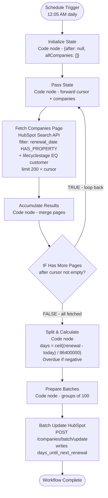

# HubSpot Days Until Renewal Calculator v1.0 - Architecture

## Overview

Silent daily workflow that calculates the number of days until each customer company's next contract renewal and writes it to HubSpot. Fetches all companies with `lifecyclestage = customer` and `contract___renewal_date` set, computes the date difference, and batch-updates `days_until_next_renewal` with either an exact day count or "Overdue".

**Workflow ID**: `CXKaD0HuoP9G5wDM`
**n8n URL**: `https://legalfly.app.n8n.cloud/workflow/CXKaD0HuoP9G5wDM`
**Status**: Inactive (ready to activate)

---

## Workflow Diagram

---

## Node Reference

### Schedule Trigger (`schedule-trigger`)
- **Type**: scheduleTrigger v1.3
- **Purpose**: Fires the workflow daily
- **Config**: Cron `5 0 * * *` (12:05 AM UTC)
- **Output**: Timestamp data (not used downstream)

### Initialize State (`init-pagination`)
- **Type**: code v2
- **Purpose**: Seeds the pagination loop
- **Config**: Emits `{ after: null, allCompanies: [] }`
- **Output**: Initial state for pagination

### Pass State (`pass-state`)
- **Type**: code v2 (runOnceForEachItem)
- **Purpose**: Loop re-entry point — forwards cursor and accumulated companies
- **Config**: Passes through `after` and `allCompanies` from input
- **Output**: Current pagination state

### Fetch Companies Page (`fetch-page`)
- **Type**: httpRequest v4.2
- **Purpose**: Queries HubSpot Search API for one page of companies
- **Config**:
  - POST `https://api.hubapi.com/crm/v3/objects/companies/search`
  - Filters: `contract___renewal_date HAS_PROPERTY` AND `lifecyclestage EQ customer`
  - Properties: `name`, `contract___renewal_date`, `days_until_next_renewal`, `lifecyclestage`
  - Limit: 200, passes `after` cursor when present
  - Auth: `hubspotAppToken` (credential: `hubspot`)
- **Output**: HubSpot search results with `results` array and `paging.next.after`

### Accumulate Results (`accumulate-results`)
- **Type**: code v2 (runOnceForEachItem)
- **Purpose**: Merges current page results into the running total
- **Config**: Reads `$('Pass State').item.json` for previous state, appends new results, extracts next cursor
- **Output**: Updated `{ after, allCompanies }` — growing array of all companies

### IF Has More Pages (`if-has-more`)
- **Type**: if v2.3
- **Purpose**: Controls the pagination loop
- **Config**: Checks `$json.after || ''` is not empty
- **TRUE output**: Loops back to Pass State (more pages to fetch)
- **FALSE output**: Proceeds to Split & Calculate (all pages fetched)

### Split & Calculate (`split-calculate`)
- **Type**: code v2
- **Purpose**: Converts the accumulated array into individual items with calculated days
- **Config**:
  - Uses UTC midnight as baseline: `new Date(Date.UTC(year, month, date))`
  - `days = Math.ceil((renewalDate - todayMidnight) / 86400000)`
  - If days < 0: value = `"Overdue"`
  - If days >= 0: value = exact number as string (e.g. `"45"`)
  - Handles both epoch-ms strings and ISO date formats from HubSpot
- **Output**: One item per company with `{ id, name, renewalDate, daysUntilRenewal, value }`

### Prepare Batches (`prepare-batches`)
- **Type**: code v2
- **Purpose**: Groups companies into batches of 100 for the HubSpot Batch Update API
- **Config**: Chunks items array, formats each batch as `{ inputs: [{ id, properties: { days_until_next_renewal } }] }`
- **Output**: One item per batch

### Batch Update HubSpot (`batch-update`)
- **Type**: httpRequest v4.2
- **Purpose**: Writes `days_until_next_renewal` to HubSpot in bulk
- **Config**:
  - POST `https://api.hubapi.com/crm/v3/objects/companies/batch/update`
  - Body: `{ inputs: $json.inputs }`
  - Auth: `hubspotAppToken` (credential: `hubspot`)
  - `onError: continueRegularOutput` — partial failures don't halt the workflow
- **Output**: HubSpot batch update response

---

## Complete Node List

| ID | Name | Type |
|----|------|------|
| schedule-trigger | Schedule Trigger | scheduleTrigger |
| init-pagination | Initialize State | code |
| pass-state | Pass State | code |
| fetch-page | Fetch Companies Page | httpRequest |
| accumulate-results | Accumulate Results | code |
| if-has-more | IF Has More Pages | if |
| split-calculate | Split & Calculate | code |
| prepare-batches | Prepare Batches | code |
| batch-update | Batch Update HubSpot | httpRequest |
| sticky-pagination | Sticky: Pagination | stickyNote |
| sticky-calculation | Sticky: Calculation | stickyNote |
| sticky-batch | Sticky: Batch Update | stickyNote |

**Total**: 12 nodes (9 functional + 3 sticky notes)

---

## Credentials Required

| Service | Credential Name | Type |
|---------|----------------|------|
| HubSpot | `hubspot` | hubspotAppToken |

---

## Key Design Decisions

- **Pagination loop**: Uses the same cursor-based pattern as hubspot-industry-categorization. Fetches 200 companies per page, accumulates all results before processing. Ensures no companies are missed regardless of volume.
- **UTC midnight baseline**: Calculates days using `Date.UTC` midnight, not `Date.now()`, so the result is consistent regardless of what time the workflow actually fires.
- **`Math.ceil`**: Ensures a renewal date of tomorrow always shows as 1 day (not 0.x).
- **"Overdue" for past dates**: The `days_until_next_renewal` property is string type, so we write "Overdue" for expired renewals instead of negative numbers. This is more readable in HubSpot lists and reports.
- **Batch API**: Uses `/companies/batch/update` with batches of 100 instead of individual updates. Much faster for a simple property write across many companies.
- **`onError: continueRegularOutput`**: If a batch fails (e.g. one invalid company ID), the workflow continues processing remaining batches rather than crashing.
- **Error workflow**: Linked to `TA6Iq4wMW0KYsCiH` (shared error handler). Unrecoverable crashes automatically post to the errors Slack channel.
- **12:05 AM UTC**: Runs 4 minutes after the industry categorization workflow (12:01 AM) to avoid simultaneous HubSpot API load.
- **No Slack output**: This is a silent data maintenance workflow. The companion workflow (Monthly Renewal Reminder) handles notifications.
