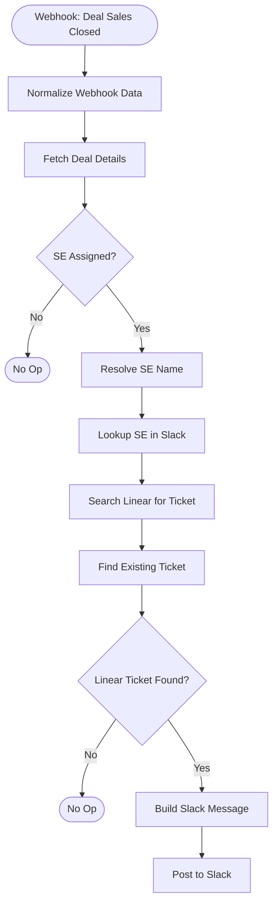

# HubSpot Deal Closed -> SE Linear Ticket Reminder -- Architecture v1.0

## Overview

When a deal moves to "06_Sales Closed" in the Sales Pipeline with a Solutions Engineer assigned, check Linear for a ticket linked to that deal. If found, post a Slack reminder asking the SE to update the ticket and move it to Done. The SE is tagged in Slack via a dynamic email-based lookup. This closes the loop on the SE-Linear ticket workflow.

## Workflow Diagram

## Node Reference

### Webhook: Deal Sales Closed (`webhook-trigger`)
- **Type**: n8n-nodes-base.webhook v2.1
- **Purpose**: Receives POST from HubSpot internal workflow when a deal enters 06_Sales Closed. The HubSpot workflow is configured to fire on dealstage change to `2406692058`.
- **Path**: `/hubspot-deal-closed-se`
- **Payload**: `{ "dealId": "123456" }`

### Normalize Webhook Data (`normalize-data`)
- **Type**: n8n-nodes-base.code v2
- **Purpose**: Extracts deal ID from webhook payload (handles both `body.dealId` and `dealId` formats)
- **Output**: `{ dealId }`
- **Reused from**: Line-items workflow (same pattern)

### Fetch Deal Details (`fetch-deal`)
- **Type**: n8n-nodes-base.httpRequest v4.4
- **URL**: `GET /crm/v3/objects/deals/{dealId}?properties=dealname,dealstage,amount,potential_amount,closedate,hubspot_owner_id,solutions_engineer`
- **Auth**: hubspotAppToken (predefined credential)
- **Retry**: 3 attempts, 1s between
- **Reused from**: SE-Linear workflow (identical URL and properties)

### SE Assigned? (`check-se-assigned`)
- **Type**: n8n-nodes-base.if v2.3
- **Condition**: `properties.solutions_engineer` is not empty
- **TRUE** -> Resolve SE Name | **FALSE** -> Stop (No SE)

### Stop (No SE) (`stop-no-se`)
- **Type**: n8n-nodes-base.noOp v1
- Terminal node for deals without an SE assigned

### Resolve SE Name (`resolve-se`)
- **Type**: n8n-nodes-base.httpRequest v4.4
- **URL**: `GET /crm/v3/owners/{solutions_engineer}`
- **Output**: SE `firstName`, `lastName`, `email`
- **Reused from**: SE-Linear workflow (identical pattern)

### Lookup SE in Slack (`slack-lookup`)
- **Type**: n8n-nodes-base.httpRequest v4.4
- **URL**: `GET https://slack.com/api/users.lookupByEmail?email={email}`
- **Auth**: slackApi (predefined credential)
- **Purpose**: Resolves the SE's email address to a Slack user ID for `<@U...>` tagging
- **Output**: `{ ok, user: { id } }` on success; `{ ok: false }` if no match
- **Fallback**: If lookup fails, Build Slack Message falls back to plain-text SE name

### Search Linear for Ticket (`search-linear`)
- **Type**: n8n-nodes-base.httpRequest v4.4
- **URL**: `POST https://api.linear.app/graphql`
- **Auth**: linearApi (predefined credential)
- **GraphQL query**: Searches Linear attachments for URLs containing `deal/{dealId}`
- **Output**: Array of attachment nodes with issue details (id, identifier, title, assignee, team)
- **Reused from**: SE-Linear workflow (identical query)

### Find Existing Ticket (`find-ticket`)
- **Type**: n8n-nodes-base.code v2
- **Purpose**: Filters Linear search results to the Solutions Engineering team (`fa68a3c7-fcbe-407e-8d66-94b572c31522`)
- **Output**: `{ existingIssue, found }`
- **Reused from**: SE-Linear workflow (identical logic)

### Linear Ticket Found? (`has-ticket`)
- **Type**: n8n-nodes-base.if v2.3
- **Condition**: `found` is true
- **TRUE** -> Build Slack Message | **FALSE** -> Stop (No Ticket)

### Stop (No Ticket) (`stop-no-ticket`)
- **Type**: n8n-nodes-base.noOp v1
- Terminal node when no Linear ticket is found for the deal

### Build Slack Message (`build-message`)
- **Type**: n8n-nodes-base.code v2
- **Purpose**: Composes a Slack mrkdwn message with deal context, SE Slack tag, and Linear ticket link
- **References**: Fetch Deal Details (deal name, amount, ID), Resolve SE Name (first/last name), Lookup SE in Slack (Slack user ID), Find Existing Ticket (ticket identifier, title)
- **Output**: `{ message }` with formatted Slack mrkdwn
- **Message format**: "Deal Closed!" header, deal link + amount, SE `<@U...>` tag (or plain name fallback), Linear ticket link, CTA to update and close

### Post to Slack (`post-slack`)
- **Type**: n8n-nodes-base.slack v2.4
- **Channel**: `C0AFSAD1E5A`
- **Text**: Dynamic from Build Slack Message node

## Routing Logic

Two sequential guards, ordered cheapest-first:

1. **SE guard**: Is `solutions_engineer` populated on the deal? Deals without an SE are irrelevant.
2. **Ticket guard**: Does a Linear ticket exist for this deal in the SE team? No ticket means nothing to remind about.

All negative paths terminate silently at NoOp nodes.

## Error Handling

- HTTP Request nodes (Fetch Deal, Resolve SE, Search Linear): 3 retries with 1s between attempts
- Lookup SE in Slack: No retry (graceful fallback to plain-text name if lookup fails)
- Global error handler: `TA6Iq4wMW0KYsCiH` (posts to Slack #errors channel)
- No per-node error handling -- errors propagate to the global handler

## Design Decisions

1. **HubSpot workflow trigger (not Private App webhook)**: HubSpot internal workflow sends the deal ID directly, so no event parsing or stage filtering is needed in n8n. Simpler and more reliable.
2. **Separate webhook from SE-Linear**: Different property trigger (`dealstage` vs `solutions_engineer`). Allows independent enable/disable.
3. **Linear attachment search (not HubSpot tickets)**: The SE-Linear workflow creates Linear tickets, not HubSpot tickets. Reuses the same GraphQL attachment-based dedup.
4. **Dynamic Slack user lookup**: Uses `users.lookupByEmail` to resolve the SE's email to a Slack user ID for proper `<@U...>` tagging. Falls back to plain-text name if the lookup fails.
5. **Channel post, not DM**: Visible to the team, simpler error handling.
6. **Re-trigger safe**: If a deal moves back to Sales Closed, the SE gets reminded again. Correct behavior.
7. **Silent skip on all negative paths**: No SE -> nothing. No ticket -> nothing. No noise.

## Credentials Required

| Service | Credential name | Used for |
|---------|----------------|---------|
| HubSpot | hubspot (`5ww8XNGf4HTQu4UI`) | Deal details, SE name resolution |
| Linear | Linear account (`Hy0y7IGsd1kE4waU`) | Ticket search via GraphQL |
| Slack | Slack (`lYs0WHzWk4c7z9Kk`) | Post message to channel, SE user lookup |

## Slack Scopes Required

- `chat:write` -- Post messages
- `users:read.email` -- Look up user by email

## n8n Instance

- **Workflow ID**: `WGDJgIZwuuv15uf4`
- **URL**: https://legalfly.app.n8n.cloud/workflow/WGDJgIZwuuv15uf4
