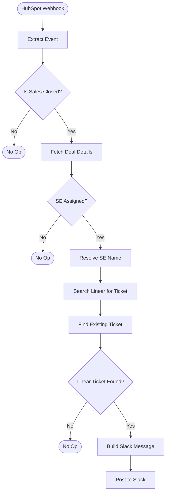

# HubSpot Deal Sales Closed -> SE Linear Ticket Reminder -- Architecture v1.0

## Overview

When a deal moves to "06_Sales Closed" in the Sales Pipeline with a Solutions Engineer assigned, check Linear for a ticket linked to that deal. If found, post a Slack reminder asking the SE to update the ticket and move it to Done. This closes the loop on the SE-Linear ticket workflow.

## Workflow Diagram

## Node Reference

### HubSpot Webhook (`webhook-trigger`)
- **Type**: n8n-nodes-base.webhook v2.1
- **Purpose**: Receives POST from HubSpot when `dealstage` changes on a deal
- **Path**: `/hubspot-deal-closed-se`
- **Mode**: Respond immediately (200 OK on receive)

### Extract Event (`extract-event`)
- **Type**: n8n-nodes-base.code v2
- **Purpose**: HubSpot sends events as an array -- extracts the first event
- **Output**: `objectId`, `propertyName`, `propertyValue`, `portalId`, `changeSource`
- **Reused from**: SE-Linear workflow (identical code)

### Is Sales Closed? (`filter-sales-closed`)
- **Type**: n8n-nodes-base.if v2.3
- **Condition**: `propertyValue` equals `2406692058` (06_Sales Closed stage in Sales Pipeline)
- **TRUE** -> Fetch Deal Details | **FALSE** -> Stop

### Fetch Deal Details (`fetch-deal`)
- **Type**: n8n-nodes-base.httpRequest v4.4
- **URL**: `GET /crm/v3/objects/deals/{objectId}?properties=dealname,dealstage,amount,potential_amount,closedate,hubspot_owner_id,solutions_engineer`
- **Auth**: hubspotAppToken (predefined credential)
- **Retry**: 3 attempts, 1s between
- **Reused from**: SE-Linear workflow (identical URL and properties)

### SE Assigned? (`check-se-assigned`)
- **Type**: n8n-nodes-base.if v2.3
- **Condition**: `properties.solutions_engineer` is not empty
- **TRUE** -> Resolve SE Name | **FALSE** -> Stop

### Resolve SE Name (`resolve-se`)
- **Type**: n8n-nodes-base.httpRequest v4.4
- **URL**: `GET /crm/v3/owners/{solutions_engineer}`
- **Output**: SE `firstName`, `lastName`
- **Reused from**: SE-Linear workflow (identical pattern)

### Search Linear for Ticket (`search-linear`)
- **Type**: n8n-nodes-base.httpRequest v4.4
- **URL**: `POST https://api.linear.app/graphql`
- **Auth**: linearApi (predefined credential)
- **GraphQL query**: Searches Linear attachments for URLs containing `deal/{dealId}`
- **Output**: Array of attachment nodes with issue details (id, identifier, title, assignee, team)
- **Reused from**: SE-Linear workflow (identical query)

### Find Existing Ticket (`find-ticket`)
- **Type**: n8n-nodes-base.code v2
- **Purpose**: Filters Linear search results to the Solutions Engineering team (`fa68a3c7-fcbe-407e-8d66-94b572c31522`)
- **Output**: `{ existingIssue, found }`
- **Reused from**: SE-Linear workflow (identical logic)

### Linear Ticket Found? (`has-ticket`)
- **Type**: n8n-nodes-base.if v2.3
- **Condition**: `found` is true
- **TRUE** -> Build Slack Message | **FALSE** -> Stop

### Build Slack Message (`build-message`)
- **Type**: n8n-nodes-base.code v2
- **Purpose**: Composes a Slack mrkdwn message with deal context and Linear ticket link
- **References**: Fetch Deal Details (deal name, amount, ID), Resolve SE Name (first/last name), Find Existing Ticket (ticket identifier, title)
- **Output**: `{ message }` with formatted Slack mrkdwn
- **Message format**: Celebratory header, deal link + amount, SE name, Linear ticket link, CTA to update and close

### Post to Slack (`post-slack`)
- **Type**: n8n-nodes-base.slack v2.4
- **Channel**: `C0AFSAD1E5A` (enrichment summaries channel)
- **Text**: Dynamic from Build Slack Message node

### Stop nodes (x3)
- **Type**: n8n-nodes-base.noOp v1
- Terminal nodes for: not sales closed, no SE assigned, no Linear ticket

## Routing Logic

Three sequential guards, ordered cheapest-first:

1. **Stage guard**: Is the new stage 06_Sales Closed (`2406692058`)? All other stage changes are ignored.
2. **SE guard**: Is `solutions_engineer` populated on the deal? Deals without an SE are irrelevant.
3. **Ticket guard**: Does a Linear ticket exist for this deal in the SE team? No ticket means nothing to compile.

All negative paths terminate silently at NoOp nodes.

## Error Handling

- HTTP Request nodes (Fetch Deal, Resolve SE, Search Linear): 3 retries with 1s between attempts
- Global error handler: `TA6Iq4wMW0KYsCiH` (posts to Slack #errors channel)
- No per-node error handling -- errors propagate to the global handler

## Design Decisions

1. **Separate webhook from SE-Linear**: Different property trigger (`dealstage` vs `solutions_engineer`). Allows independent enable/disable.
2. **Linear attachment search (not HubSpot tickets)**: The SE-Linear workflow creates Linear tickets, not HubSpot tickets. Reuses the same GraphQL attachment-based dedup.
3. **Resolve SE name via API**: Need the human-readable name for the Slack message. Can't use just the HubSpot owner ID.
4. **Channel post, not DM**: Simpler (no Slack user ID mapping needed), visible to the team.
5. **Re-trigger safe**: If a deal moves back to Sales Closed, the SE gets reminded again. Correct behavior.
6. **Silent skip on all negative paths**: No SE -> nothing. No ticket -> nothing. No noise.

## Credentials Required

| Service | Credential name | Used for |
|---------|----------------|---------|
| HubSpot | hubspot (`5ww8XNGf4HTQu4UI`) | Deal details, SE name resolution |
| Linear | Linear account (`Hy0y7IGsd1kE4waU`) | Ticket search via GraphQL |
| Slack | Slack (`lYs0WHzWk4c7z9Kk`) | Post message to channel |

## n8n Instance

- **Workflow ID**: `WGDJgIZwuuv15uf4`
- **URL**: https://legalfly.app.n8n.cloud/workflow/WGDJgIZwuuv15uf4
