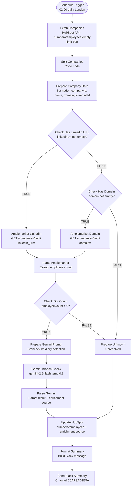

# HubSpot Employee Count Enrichment v1.0 - Architecture

## Overview

Workflow that enriches HubSpot companies missing `numberofemployees` using Amplemarket as the primary data source. Gemini 2.5 Flash handles a single edge case: detecting branches/subsidiaries (e.g. "KPMG Spain") and estimating the parent company's global employee count. Companies that Amplemarket cannot resolve are marked as "Unresolved".

Runs nightly at 02:00 Europe/London, processing up to 100 companies per run.

**Workflow ID**: `u9IcVLMFzBO6Idkw`
**n8n URL**: `https://legalfly.app.n8n.cloud/workflow/u9IcVLMFzBO6Idkw`
**Status**: Inactive (activate after testing)

---

## Workflow Diagram

---

## Node Reference

### Schedule Trigger (`emp-trigger`)
- **Type**: n8n-nodes-base.scheduleTrigger v1.3
- **Purpose**: Trigger workflow daily at 02:00 Europe/London
- **Config**: `triggerAtHour: 2`, timezone set at workflow level
- **Output**: Timestamp object (triggers downstream)

### Fetch Companies (`emp-fetch`)
- **Type**: n8n-nodes-base.httpRequest v4.2
- **Purpose**: Search HubSpot for companies where `numberofemployees` has no value
- **Config**: POST `https://api.hubapi.com/crm/v3/objects/companies/search`
- **Body**: `filterGroups: [{filters: [{propertyName: 'numberofemployees', operator: 'NOT_HAS_PROPERTY'}]}]`
- **Properties requested**: `name`, `domain`, `linkedin_company_page`
- **Limit**: 100 companies per run
- **Auth**: hubspotAppToken credential
- **Output**: `{results: [{id, properties: {name, domain, linkedin_company_page}}]}`

### Split Companies (`emp-split`)
- **Type**: n8n-nodes-base.code v2
- **Purpose**: Expand the `results` array into individual items for per-company processing
- **Mode**: runOnceForAllItems
- **Output**: One item per company

### Prepare Company Data (`emp-prepare`)
- **Type**: n8n-nodes-base.set v3.4
- **Purpose**: Extract and normalize company fields into a clean schema
- **Fields**: `companyId`, `companyName`, `domain`, `linkedinUrl`
- **Note**: `includeOtherFields: false` - only passes these 4 fields downstream
- **Output**: `{companyId, companyName, domain, linkedinUrl}`

### Check Has LinkedIn URL (`emp-check-li`)
- **Type**: n8n-nodes-base.if v2.3
- **Purpose**: Route companies with a LinkedIn URL to the preferred Amplemarket lookup path
- **Condition**: `linkedinUrl` is not empty (string notEmpty)
- **TRUE**: -> Amplemarket LinkedIn
- **FALSE**: -> Check Has Domain

### Amplemarket LinkedIn (`emp-amp-li`)
- **Type**: n8n-nodes-base.httpRequest v4.2
- **Purpose**: Look up company data by LinkedIn URL (preferred, more accurate)
- **Config**: GET `https://api.amplemarket.com/companies/find?linkedin_url={url}`
- **Auth**: httpHeaderAuth (amplemarket)
- **Error handling**: `onError: continueRegularOutput`, retry 3x/2s
- **Output**: Amplemarket company data (raw JSON response)

### Check Has Domain (`emp-check-domain`)
- **Type**: n8n-nodes-base.if v2.3
- **Purpose**: Fallback routing - if no LinkedIn URL, check if domain is available
- **Condition**: `domain` is not empty
- **TRUE**: -> Amplemarket Domain
- **FALSE**: -> Prepare Unknown (no lookup possible)

### Amplemarket Domain (`emp-amp-domain`)
- **Type**: n8n-nodes-base.httpRequest v4.2
- **Purpose**: Look up company data by domain (fallback when no LinkedIn URL)
- **Config**: GET `https://api.amplemarket.com/companies/find?domain={domain}`
- **Auth**: httpHeaderAuth (amplemarket)
- **Error handling**: `onError: continueRegularOutput`, retry 3x/2s
- **Output**: Amplemarket company data (raw JSON response)

### Parse Amplemarket (`emp-parse-amp`)
- **Type**: n8n-nodes-base.code v2
- **Purpose**: Extract employee count from Amplemarket response (handles different response structures)
- **Mode**: runOnceForEachItem
- **Fields checked**: `employee_count`, `employees`, `size`, `number_of_employees`, `headcount`
- **Note**: Also checks nested `data` and `company` wrappers. Carries forward `companyId`, `companyName`, `domain` from Prepare Company Data via `$()` reference.
- **Output**: `{companyId, companyName, domain, employeeCount, amplemarketRaw}`

### Check Got Count (`emp-check-count`)
- **Type**: n8n-nodes-base.if v2.3
- **Purpose**: Route based on whether Amplemarket returned a valid employee count
- **Condition**: `employeeCount > 0` (number gt)
- **TRUE**: -> Prepare Gemini Prompt (send for branch detection)
- **FALSE**: -> Prepare Unknown (Amplemarket returned 0 or no data)

### Prepare Gemini Prompt (`emp-prep-gemini`)
- **Type**: n8n-nodes-base.code v2
- **Purpose**: Build the Gemini prompt for branch/subsidiary detection
- **Mode**: runOnceForEachItem
- **Key config**: String concatenation to build prompt with company name, domain, and employee count
- **Output**: `{companyId, companyName, domain, originalCount, prompt}`

### Gemini Branch Check (`emp-gemini`)
- **Type**: n8n-nodes-base.httpRequest v4.2
- **Purpose**: Ask Gemini whether the company is a branch/subsidiary and estimate global count
- **Config**: POST `https://generativelanguage.googleapis.com/v1beta/models/gemini-2.5-flash:generateContent`
- **Temperature**: 0.1 (very low - deterministic output)
- **Auth**: googlePalmApi (Gemini)
- **Error handling**: retry 3x/2s
- **Output**: Gemini API response with candidates array

### Parse Gemini (`emp-parse-gemini`)
- **Type**: n8n-nodes-base.code v2
- **Purpose**: Parse Gemini's JSON response and determine final employee count + enrichment source
- **Mode**: runOnceForEachItem
- **Key logic**:
  - Extracts text from `candidates[0].content.parts[0].text`
  - Strips markdown code blocks if present
  - Parses JSON: `{employeeCount, isSubsidiary, parentCompany}`
  - Falls back to original Amplemarket count on parse failure
  - Sets enrichment source: `Amplemarket` or `Amplemarket (parent: {name})`
- **Output**: `{companyId, companyName, employeeCount, enrichmentSource}`

### Prepare Unknown (`emp-unknown`)
- **Type**: n8n-nodes-base.code v2
- **Purpose**: Create standard output for companies that couldn't be enriched
- **Mode**: runOnceForEachItem
- **Receives from**: Check Has Domain FALSE, Check Got Count FALSE
- **Output**: `{companyId, companyName, employeeCount: '', enrichmentSource: 'Unresolved'}`

### Update HubSpot (`emp-update-hs`)
- **Type**: n8n-nodes-base.hubspot v2.2
- **Purpose**: Write enriched data back to HubSpot company records
- **Config**: resource=company, operation=update
- **Properties written**:
  - `numberofemployees`: `$json.employeeCount` (standard field via customPropertiesUi)
  - `number-employees-enrichment-source`: `$json.enrichmentSource` (custom field)
- **Auth**: hubspotAppToken
- **Output**: Updated company object

### Format Summary (`emp-format`)
- **Type**: n8n-nodes-base.code v2
- **Purpose**: Aggregate all results into a single Slack-formatted summary message
- **Mode**: runOnceForAllItems
- **Key logic**: Counts enriched, subsidiaries, unresolved. Builds markdown summary with per-company details (capped at 50).
- **Output**: `{message: '...'}`

### Send Slack Summary (`emp-slack`)
- **Type**: n8n-nodes-base.slack v2.4
- **Purpose**: Post enrichment summary to Slack channel
- **Config**: resource=message, operation=post, channel=`C0AFSAD1E5A`
- **Auth**: slackApi

---

## Routing Logic

### Amplemarket Lookup Cascade
1. **LinkedIn URL available** (Check Has LinkedIn URL = TRUE) -> Amplemarket LinkedIn lookup
2. **Domain available** (Check Has Domain = TRUE) -> Amplemarket Domain lookup
3. **Neither available** (Check Has Domain = FALSE) -> Prepare Unknown (Unresolved)

### Post-Amplemarket Routing
1. **Employee count > 0** (Check Got Count = TRUE) -> Gemini branch detection -> Update HubSpot
2. **Employee count = 0** (Check Got Count = FALSE) -> Prepare Unknown -> Update HubSpot

### Convergence Points
- **Parse Amplemarket**: Receives from both Amplemarket LinkedIn and Amplemarket Domain
- **Prepare Unknown**: Receives from Check Has Domain FALSE and Check Got Count FALSE
- **Update HubSpot**: Receives from Parse Gemini (enriched) and Prepare Unknown (unresolved)

---

## Error Handling

| Node | Strategy | Details |
|------|----------|---------|
| Amplemarket LinkedIn | `onError: continueRegularOutput` + retry 3x/2s | Graceful failure - passes empty response to parser |
| Amplemarket Domain | `onError: continueRegularOutput` + retry 3x/2s | Same as above |
| Gemini Branch Check | retry 3x/2s | Retries on API failures |
| Parse Gemini | try/catch in code | Falls back to original Amplemarket count on parse failure |
| Workflow level | `errorWorkflow: TA6Iq4wMW0KYsCiH` | Error Handler sends Slack notification |

---

## Design Decisions

1. **Amplemarket-only data source**: No web scraping or other APIs. Keeps the workflow simple and fast.
2. **LinkedIn URL preferred over domain**: LinkedIn lookups are more accurate for Amplemarket. Domain is fallback only.
3. **Gemini only for branch detection**: Gemini does NOT estimate employee counts from scratch. It only adjusts when a subsidiary is detected (estimating the parent's global count).
4. **Low temperature (0.1)**: Branch detection needs deterministic, consistent responses.
5. **100 company limit**: Prevents long-running executions. Companies not processed in this run will be picked up tomorrow.
6. **Parse Amplemarket checks multiple field names**: The Amplemarket API response structure may vary; defensive parsing covers `employee_count`, `employees`, `size`, `headcount`, etc.
7. **Unresolved companies still get updated**: The enrichment source is written as "Unresolved" so the company isn't re-processed needlessly (the search filter would need adjustment to skip these).

---

## Credentials Required

| Service | Credential Name | Type | Used For |
|---------|----------------|------|----------|
| HubSpot | hubspot | hubspotAppToken | Fetch + update companies |
| Amplemarket | amplemarket | httpHeaderAuth | Employee data lookup |
| Google Gemini | Gemini | googlePalmApi | Branch/subsidiary detection |
| Slack | Slack | slackApi | Summary notifications |

## n8n Instance
- **Workflow ID**: `u9IcVLMFzBO6Idkw`
- **URL**: https://legalfly.app.n8n.cloud/workflow/u9IcVLMFzBO6Idkw
- **Error Workflow**: `TA6Iq4wMW0KYsCiH`
- **Timezone**: Europe/London
