# HubSpot Employee Count Enrichment v2.0 — Architecture

## Overview

Workflow that enriches HubSpot companies created **yesterday** with employee counts using a multi-stage pipeline: Gemini classifies companies as independent vs subsidiary, Amplemarket provides batch employee data (using parent domains for subsidiaries), and Jina+Gemini estimates counts as a fallback. Writes employee count, enrichment source, subsidiary status, and parent company name to HubSpot.

Runs daily at 02:01 Europe/London. Uses cursor-based pagination to process all companies regardless of volume.

**Workflow ID**: `TxZMblqjvC86tHAu`
**n8n URL**: `https://legalfly.app.n8n.cloud/workflow/TxZMblqjvC86tHAu`
**Status**: Inactive (activate after testing)
**Replaces**: v1.0 (`u9IcVLMFzBO6Idkw`) — kept as rollback

---

## Workflow Diagram

```mermaid
flowchart TD
    Start([Schedule Trigger\n02:01 daily London])

    Start --> InitState["Initialize State\n{after: null, allCompanies: []}"]
    InitState --> PassState["Pass State"]
    PassState --> FetchPage["Fetch Companies Page\nHubSpot API - createdate yesterday\nlimit 200 + cursor"]
    FetchPage --> Accumulate["Accumulate Results\nMerge pages"]
    Accumulate --> IfMore{IF Has More Pages\ncursor not empty?}
    IfMore -->|TRUE: loop back| PassState
    IfMore -->|FALSE: done| SplitAll["Split All Companies"]

    SplitAll --> Prepare["Prepare Company Data\ncompanyId, name, domain, linkedinUrl, existingEmployeeCount"]
    Prepare --> PrepClassify["Prepare Gemini Batch\nAll company names in single prompt"]
    PrepClassify --> GeminiClassify["Gemini Classify\ngemini-2.5-flash temp 0.2"]
    GeminiClassify --> ParseClassify["Parse Classification\nMerge results, replace branch domains"]
    ParseClassify --> Route{Check Needs Enrichment\nno count OR isSubsidiary?}

    Route -->|TRUE: needs enrichment| BuildBatch["Build Batch Request"]
    Route -->|FALSE: already good| Skip["Skip Independent\nnoOp"]

    BuildBatch --> SubmitBatch["Submit Batch\nPOST /enrichment-requests"]
    SubmitBatch --> InitPoll["Init Poll State"]
    InitPoll --> Wait["Wait 15s"]
    Wait --> Poll["Poll Status"]
    Poll --> MergePoll["Merge Poll State"]
    MergePoll --> CheckComplete{Check Complete?}
    CheckComplete -->|TRUE| ParseBatch["Parse Batch Results"]
    CheckComplete -->|FALSE| IncCounter["Increment Counter"]
    IncCounter --> Wait

    ParseBatch --> CheckResolved{Check Resolved\nemployeeCount > 0?}
    CheckResolved -->|TRUE| PrepSource["Prepare Source"]
    CheckResolved -->|FALSE| CheckDomain{Check Has Domain?}

    PrepSource --> PreservePreUpdate
    CheckDomain -->|TRUE| JinaScrape["Jina Scrape"]
    CheckDomain -->|FALSE| Default["Prepare Default\n5 employees"]

    JinaScrape --> PrepEstimate["Prep Estimate Prompt"]
    PrepEstimate --> CheckContent{Has Content?}
    CheckContent -->|TRUE| GeminiEstimate["Gemini Estimate"]
    CheckContent -->|FALSE| Default

    GeminiEstimate --> ParseEstimate["Parse Estimate"]
    ParseEstimate --> PreservePreUpdate
    Default --> PreservePreUpdate

    PreservePreUpdate["Preserve Pre-Update"]
    PreservePreUpdate --> UpdateHS["Update HubSpot"]
    UpdateHS --> PreserveResult["Preserve Result"]
    PreserveResult --> Aggregate["Aggregate Results"]
    Aggregate --> FormatSummary["Format Summary"]
    FormatSummary --> Slack["Send Slack"]
```

---

## Node Reference

### Phase 1: Paginated HubSpot Fetch

#### Schedule Trigger (`emp2-trigger`)
- **Type**: scheduleTrigger v1.3
- **Purpose**: Trigger workflow daily at 02:01 Europe/London
- **Config**: Cron `1 2 * * *`
- **Output**: Timestamp object

#### Initialize State (`emp2-init`)
- **Type**: code v2
- **Purpose**: Seed pagination loop with initial state
- **Output**: `{after: null, allCompanies: []}`

#### Pass State (`emp2-pass-state`)
- **Type**: code v2 (runOnceForEachItem)
- **Purpose**: Forward pagination state — receives from Initialize State on first run, from IF Has More Pages TRUE on subsequent runs
- **Output**: `{after, allCompanies}`

#### Fetch Companies Page (`emp2-fetch`)
- **Type**: httpRequest v4.2
- **Purpose**: Search HubSpot for companies created yesterday
- **Config**: POST `https://api.hubapi.com/crm/v3/objects/companies/search`
- **Filters**: `createdate GTE yesterday-midnight AND LT today-midnight` (UTC)
- **Properties**: `name`, `domain`, `linkedin_company_page`, `numberofemployees`
- **Limit**: 200 per page, cursor-based pagination
- **Auth**: hubspotAppToken

#### Accumulate Results (`emp2-accumulate`)
- **Type**: code v2 (runOnceForEachItem)
- **Purpose**: Merge current page results into `allCompanies`, extract `paging.next.after` cursor
- **References**: `$('Pass State')` for previous accumulation

#### IF Has More Pages (`emp2-if-more`)
- **Type**: if v2.3
- **Condition**: `after` cursor not empty
- **TRUE**: Loop back to Pass State
- **FALSE**: Proceed to Split All Companies

### Phase 2: Gemini Batch Classification

#### Split All Companies (`emp2-split`)
- **Type**: code v2 (runOnceForAllItems)
- **Purpose**: Expand `allCompanies` array into individual items
- **Output**: One item per company with `{id, properties}`

#### Prepare Company Data (`emp2-prepare`)
- **Type**: set v3.4
- **Purpose**: Normalize company fields into clean schema
- **Fields**: `companyId`, `companyName`, `domain`, `linkedinUrl`, `existingEmployeeCount`
- **Note**: `includeOtherFields: false`, `existingEmployeeCount` parsed from `numberofemployees`

#### Prepare Gemini Batch (`emp2-prep-classify`)
- **Type**: code v2 (runOnceForAllItems)
- **Purpose**: Build single Gemini prompt listing ALL company names for batch classification
- **Output**: Single item with `{prompt, companyData (JSON string), companyCount}`
- **Prompt file**: [`prompts/prompt-classify-batch.md`](prompts/prompt-classify-batch.md)

#### Gemini Classify (`emp2-gemini-classify`)
- **Type**: httpRequest v4.2
- **Purpose**: Classify all companies as independent vs subsidiary in one API call
- **Config**: POST `gemini-2.5-flash:generateContent`, temperature 0.2
- **Auth**: googlePalmApi (Gemini)
- **Error handling**: retry 3x/3s, timeout 60s

#### Parse Classification (`emp2-parse-classify`)
- **Type**: code v2 (runOnceForAllItems)
- **Purpose**: Parse Gemini JSON array, merge classification with company data
- **Key logic**: For subsidiaries, replaces `enrichmentDomain` with parent domain
- **Fallback**: On parse failure, treats all as independent
- **Output**: Individual items with `{companyId, companyName, domain, linkedinUrl, existingEmployeeCount, isSubsidiary, parentCompany, parentDomain, enrichmentDomain}`

#### Check Needs Enrichment (`emp2-route`)
- **Type**: if v2.3
- **Condition**: `existingEmployeeCount <= 0` **OR** `isSubsidiary === true`
- **TRUE** (Group A + B): Needs enrichment — proceed to Amplemarket batch
- **FALSE** (Group C): Already has count and is independent — skip

#### Skip Independent (`emp2-skip`)
- **Type**: noOp v1
- **Purpose**: Terminal node for Group C companies. No further processing.

### Phase 3: Batch Amplemarket + Poll Loop

#### Build Batch Request (`emp2-build-batch`)
- **Type**: code v2 (runOnceForAllItems)
- **Purpose**: Collect all companies needing enrichment into a single batch payload
- **Key logic**: Uses `enrichmentDomain` (parent domain for subsidiaries), includes `linkedin_url` only for independent companies
- **Output**: Single item with `{batchPayload: {companies: [...]}, allCompanyData (JSON string)}`

#### Submit Batch (`emp2-amp-submit`)
- **Type**: httpRequest v4.2
- **Purpose**: Submit batch enrichment request to Amplemarket
- **Config**: POST `https://api.amplemarket.com/companies/enrichment-requests`
- **Auth**: httpHeaderAuth (amplemarket)
- **Error handling**: retry 3x/2s

#### Init Poll State (`emp2-init-poll`)
- **Type**: code v2 (runOnceForEachItem)
- **Purpose**: Extract request ID from submit response, initialize poll counter
- **References**: `$('Build Batch Request')` for allCompanyData
- **Output**: `{requestId, pollCount: 0, maxPolls: 20, allCompanyData}`

#### Wait 15s (`emp2-wait`)
- **Type**: wait v1.1
- **Purpose**: 15-second delay between poll attempts
- **Config**: `resume: timeInterval, amount: 15, unit: seconds`

#### Poll Status (`emp2-amp-poll`)
- **Type**: httpRequest v4.2
- **Purpose**: Check batch enrichment status
- **Config**: GET `/companies/enrichment-requests/{requestId}?page[size]=200`
- **Auth**: httpHeaderAuth (amplemarket)
- **Error handling**: retry 2x/3s, `onError: continueRegularOutput`

#### Merge Poll State (`emp2-merge-poll`)
- **Type**: code v2 (runOnceForEachItem)
- **Purpose**: Combine API response with state from Wait node (requestId, pollCount, allCompanyData)
- **Key logic**: Checks `status === 'completed'` and `pollCount >= maxPolls`
- **References**: `$('Wait 15s')` for state data

#### Check Complete (`emp2-check-poll`)
- **Type**: if v2.3
- **Condition**: `isComplete === true`
- **TRUE**: Proceed to Parse Batch Results
- **FALSE**: Loop back via Increment Counter

#### Increment Counter (`emp2-poll-inc`)
- **Type**: code v2 (runOnceForEachItem)
- **Purpose**: Pass state through with current pollCount (already incremented in Merge Poll State)
- **Output**: Loops back to Wait 15s

### Phase 4: Parse Results + Route

#### Parse Batch Results (`emp2-parse-batch`)
- **Type**: code v2 (runOnceForAllItems)
- **Purpose**: Match Amplemarket results to companies by domain/linkedin_url
- **Key logic**: Builds lookup maps by domain and linkedin_url, matches companies, extracts `estimated_number_of_employees`
- **Output**: Individual items with employeeCount (0 if no match)

#### Check Resolved (`emp2-check-resolved`)
- **Type**: if v2.3
- **Condition**: `employeeCount > 0`
- **TRUE**: Amplemarket provided data → Prepare Source
- **FALSE**: No data → scrape fallback

#### Prepare Source (`emp2-prep-source`)
- **Type**: code v2 (runOnceForEachItem)
- **Purpose**: Set enrichment source label
- **Output**: `enrichmentSource` = `"Amplemarket"` or `"Amplemarket (parent: {name})"`

### Phase 5: Scrape Fallback

#### Check Has Domain (`emp2-check-domain`)
- **Type**: if v2.3
- **Condition**: `domain` not empty
- **TRUE**: Jina Scrape
- **FALSE**: Prepare Default (5 employees)

#### Jina Scrape (`emp2-jina`)
- **Type**: httpRequest v4.2
- **Purpose**: Scrape company website for content to estimate employee count
- **Config**: GET `https://r.jina.ai/https://{domain}`
- **Error handling**: `onError: continueRegularOutput`, timeout 30s

#### Prep Estimate Prompt (`emp2-prep-estimate`)
- **Type**: code v2 (runOnceForEachItem)
- **Purpose**: Clean scraped content, build Gemini estimation prompt, set `hasContent` flag
- **References**: `$('Check Has Domain')` for company data
- **Prompt file**: [`prompts/prompt-estimate-employees.md`](prompts/prompt-estimate-employees.md)

#### Check Has Content (`emp2-check-content`)
- **Type**: if v2.3
- **Condition**: `hasContent === true` (content > 50 chars after cleaning)
- **TRUE**: Gemini Estimate
- **FALSE**: Prepare Default

#### Gemini Estimate (`emp2-gemini-estimate`)
- **Type**: httpRequest v4.2
- **Purpose**: Estimate employee count from website content
- **Config**: POST `gemini-2.5-flash:generateContent`, temperature 0.3
- **Auth**: googlePalmApi (Gemini)
- **Error handling**: retry 3x/2s

#### Parse Estimate (`emp2-parse-estimate`)
- **Type**: code v2 (runOnceForEachItem)
- **Purpose**: Extract employee count from Gemini response
- **References**: `$('Prep Estimate Prompt')` for company data
- **Fallback**: Default to 5 on parse failure
- **Output**: `{employeeCount, enrichmentSource: "Estimated"}`

### Phase 6: Default

#### Prepare Default (`emp2-default`)
- **Type**: code v2 (runOnceForEachItem)
- **Purpose**: Set default employee count (5) for companies with no data source
- **Receives from**: Check Has Domain FALSE, Check Has Content FALSE
- **References**: `$('Check Has Domain')` for company data, fallback to `$json`
- **Output**: `{employeeCount: 5, enrichmentSource: "Estimated"}`

### Phase 7: HubSpot Update + Slack

#### Preserve Pre-Update (`emp2-preserve-pre`)
- **Type**: set v3.4
- **Purpose**: Snapshot all fields before HubSpot write (HubSpot update overwrites item context)
- **Fields**: companyId, companyName, domain, isSubsidiary, parentCompany, employeeCount, enrichmentSource

#### Update HubSpot (`emp2-update-hs`)
- **Type**: hubspot v2.2
- **Purpose**: Write enriched data back to HubSpot company records
- **Properties written**:
  - `numberofemployees` — employee count
  - `number-employees-enrichment-source` — data source label
  - `is_subsidiary` — boolean (true/false as string)
  - `parent_company_name` — parent company name (empty if independent)
- **Auth**: hubspotAppToken

#### Preserve Result (`emp2-preserve-result`)
- **Type**: code v2 (runOnceForEachItem)
- **Purpose**: Re-read from Preserve Pre-Update (HubSpot update overwrites context)
- **References**: `$('Preserve Pre-Update')`

#### Aggregate Results (`emp2-aggregate`)
- **Type**: aggregate v1
- **Purpose**: Collect all processed company results into single array

#### Format Summary (`emp2-format`)
- **Type**: code v2 (runOnceForEachItem)
- **Purpose**: Build Slack-formatted summary with categories and per-company details

#### Send Slack (`emp2-slack`)
- **Type**: slack v2.4
- **Purpose**: Post enrichment summary to Slack
- **Config**: Channel `C0AG86U9927`
- **Auth**: slackApi

---

## Routing Logic

### 3-Way Classification Route
1. **Group A** — No employee count (`existingEmployeeCount <= 0`) → needs enrichment
2. **Group B** — Has count BUT is subsidiary (`isSubsidiary === true`) → needs re-enrichment with parent data
3. **Group C** — Has count AND is independent → skip (already correct)

Groups A and B both proceed to Amplemarket batch. For Group B, the `enrichmentDomain` has been replaced with the parent's domain in Parse Classification.

### Enrichment Cascade
1. **Amplemarket batch** (primary) — POST companies with domain/linkedin, poll for results
2. **Jina + Gemini estimate** (fallback) — Scrape website, AI-estimate employee count
3. **Default = 5** (last resort) — No domain or empty website content

### Convergence Points
- **Prepare Source**: Receives from Check Resolved TRUE (Amplemarket success)
- **Prepare Default**: Receives from Check Has Domain FALSE and Check Has Content FALSE
- **Preserve Pre-Update**: Receives from Prepare Source, Parse Estimate, and Prepare Default
- **Aggregate Results**: Collects all processed companies

---

## Enrichment Source Values

| Value | Meaning |
|-------|---------|
| `Amplemarket` | Direct Amplemarket data, independent company |
| `Amplemarket (parent: KPMG)` | Subsidiary; parent's Amplemarket data used |
| `Estimated` | Gemini estimated from website scrape, or default (5) |

---

## Error Handling

| Node | Strategy | Details |
|------|----------|---------|
| Gemini Classify | retry 3x/3s | 60s timeout for large batches |
| Submit Batch | retry 3x/2s | Amplemarket batch submission |
| Poll Status | retry 2x/3s + `onError: continueRegularOutput` | Graceful poll failure |
| Jina Scrape | `onError: continueRegularOutput` | Scrape failures fall through |
| Gemini Estimate | retry 3x/2s | AI estimation |
| Parse Classification | try/catch | Falls back to all-independent on parse failure |
| Parse Estimate | try/catch | Falls back to 5 employees on parse failure |
| Workflow level | `errorWorkflow: TA6Iq4wMW0KYsCiH` | Error Handler sends Slack notification |

---

## Design Decisions

1. **Gemini BEFORE Amplemarket** — Classify first so branches get looked up by parent domain, not their own. Solves the v1.0 "KPMG Spain" problem.
2. **Single batch Gemini prompt** — One API call classifies all companies (cheaper + faster than per-company calls in v1.0).
3. **Batch Amplemarket with poll loop** — 1 POST + polling replaces up to 200 sequential GETs from v1.0.
4. **Both identifiers sent together** — linkedin_url + domain in same Amplemarket request for best match rate.
5. **Jina Reader for scrape fallback** — Proven pattern from industry-categorization workflow. v1.0 had no fallback.
6. **Default = 5** — Non-zero value for CRM segmentation; tagged as "Estimated" so it can be identified.
7. **Fetch ALL yesterday's companies** — Same pattern as industry-categorization. Processes all companies, not just those missing employee count, so branches with incorrect local counts are also caught.
8. **New workflow, not update** — Created fresh to preserve v1.0 as rollback option.
9. **Preserve Pre-Update pattern** — Proven from industry-categorization. HubSpot node overwrites item context, so snapshot first.
10. **Poll loop with max 20 iterations** — 20 x 15s = 5 minutes max wait. Prevents infinite polling.

---

## Complete Node List

| ID | Name | Type | Phase |
|----|------|------|-------|
| emp2-trigger | Schedule Trigger | scheduleTrigger | 1 |
| emp2-init | Initialize State | code | 1 |
| emp2-pass-state | Pass State | code | 1 |
| emp2-fetch | Fetch Companies Page | httpRequest | 1 |
| emp2-accumulate | Accumulate Results | code | 1 |
| emp2-if-more | IF Has More Pages | if | 1 |
| emp2-split | Split All Companies | code | 2 |
| emp2-prepare | Prepare Company Data | set | 2 |
| emp2-prep-classify | Prepare Gemini Batch | code | 2 |
| emp2-gemini-classify | Gemini Classify | httpRequest | 2 |
| emp2-parse-classify | Parse Classification | code | 2 |
| emp2-route | Check Needs Enrichment | if | 2 |
| emp2-skip | Skip Independent | noOp | 2 |
| emp2-build-batch | Build Batch Request | code | 3 |
| emp2-amp-submit | Submit Batch | httpRequest | 3 |
| emp2-init-poll | Init Poll State | code | 3 |
| emp2-wait | Wait 15s | wait | 3 |
| emp2-amp-poll | Poll Status | httpRequest | 3 |
| emp2-merge-poll | Merge Poll State | code | 3 |
| emp2-check-poll | Check Complete | if | 3 |
| emp2-poll-inc | Increment Counter | code | 3 |
| emp2-parse-batch | Parse Batch Results | code | 4 |
| emp2-check-resolved | Check Resolved | if | 4 |
| emp2-prep-source | Prepare Source | code | 4 |
| emp2-check-domain | Check Has Domain | if | 5 |
| emp2-jina | Jina Scrape | httpRequest | 5 |
| emp2-prep-estimate | Prep Estimate Prompt | code | 5 |
| emp2-check-content | Check Has Content | if | 5 |
| emp2-gemini-estimate | Gemini Estimate | httpRequest | 5 |
| emp2-parse-estimate | Parse Estimate | code | 5 |
| emp2-default | Prepare Default | code | 6 |
| emp2-preserve-pre | Preserve Pre-Update | set | 7 |
| emp2-update-hs | Update HubSpot | hubspot | 7 |
| emp2-preserve-result | Preserve Result | code | 7 |
| emp2-aggregate | Aggregate Results | aggregate | 7 |
| emp2-format | Format Summary | code | 7 |
| emp2-slack | Send Slack | slack | 7 |

**Total**: 37 nodes + 3 sticky notes = 40

---

## HubSpot Properties Written

| Property | Internal Name | Type | Notes |
|----------|--------------|------|-------|
| Employee Count | `numberofemployees` | Standard | Number |
| Enrichment Source | `number-employees-enrichment-source` | Custom | Text (existing from v1.0) |
| Is Subsidiary | `is_subsidiary` | Custom | Checkbox/boolean (NEW — must create in HubSpot) |
| Parent Company | `parent_company_name` | Custom | Text (NEW — must create in HubSpot) |

---

## Credentials Required

| Service | Credential Name | Type | Used For |
|---------|----------------|------|----------|
| HubSpot | hubspot | hubspotAppToken | Fetch + update companies |
| Amplemarket | amplemarket | httpHeaderAuth | Batch employee enrichment |
| Google Gemini | Gemini | googlePalmApi | Classification + estimation |
| Slack | Slack | slackApi | Summary notifications |

---

## n8n Instance
- **Workflow ID**: `TxZMblqjvC86tHAu`
- **URL**: https://legalfly.app.n8n.cloud/workflow/TxZMblqjvC86tHAu
- **Error Workflow**: `TA6Iq4wMW0KYsCiH`
- **Timezone**: Europe/London
- **v1.0 (rollback)**: `u9IcVLMFzBO6Idkw`
