# HubSpot Employee Count Enrichment v3.0 — Architecture

## Overview

Workflow that enriches HubSpot companies created **yesterday** with employee counts using a two-stage pipeline: Gemini classifies companies as independent vs subsidiary (with a much more conservative prompt targeting 5-10% subsidiary rate), then Amplemarket provides batch employee data (using parent domains for subsidiaries). Companies Amplemarket can't resolve default to 5 employees. If a parent company exists in HubSpot, `parent_company_name` is written as a clickable HubSpot URL; otherwise plain text.

Runs daily at 02:01 Europe/London. Uses cursor-based pagination to process all companies regardless of volume.

**Workflow ID**: `TxZMblqjvC86tHAu`
**n8n URL**: `https://legalfly.app.n8n.cloud/workflow/TxZMblqjvC86tHAu`
**Status**: Active
**Replaces**: v2.1 (in-place update; v2.1 version history preserved as rollback)

### v3.0 Changes (from v2.1)

1. **Removed Phase 5: Scrape Fallback** — 6 nodes deleted (Check Has Domain, Jina Scrape, Prep Estimate Prompt, Check Has Content, Gemini Estimate, Parse Estimate). If Amplemarket has no data, default to 5. The scrape fallback added complexity but minimal value.
2. **Rewired routing** — Check Resolved FALSE now goes directly to Prepare Default (was Check Has Domain).
3. **Updated Prepare Default** — Changed `$('Check Has Domain')` reference to `$('Check Resolved')`.
4. **Conservative classification prompt** — Complete rewrite. Only 5 specific evidence categories (name + domain only, no LinkedIn): Fortune Global 500/Big 4 + geography, explicit words (Branch/Office/Division), famous acquisitions (100% certain), subdomains, duplicate TLD entries. Explicitly excludes airlines, geography-in-brand-name, consumer email domains (icloud.com, me.com). Target: 5-10% subsidiary rate (was ~39%).
5. **Simplified Slack summary** — 3 categories: Amplemarket, Parent enriched, Default (removed "Extracted"). Version label v3.0.
6. **Removed "Extracted" enrichment source** — Only `Amplemarket`, `Amplemarket (parent: X)`, and `Estimated` remain.
7. **Gemini now classification-only** — No longer used for employee count extraction.

---

## Workflow Diagram

```mermaid
flowchart TD
    Start([Schedule Trigger\n02:01 daily London])

    Start --> InitState["Initialize State\n{after: null, allCompanies: []}"]
    InitState --> PassState["Pass State"]
    PassState --> FetchPage["Fetch Companies Page\nHubSpot API - createdate yesterday\nlimit 200 + cursor"]
    FetchPage --> Accumulate["Accumulate Results\nMerge pages"]
    Accumulate --> IfMore{IF Has More Pages\ncursor not empty?}
    IfMore -->|TRUE: loop back| PassState
    IfMore -->|FALSE: done| SplitAll["Split All Companies"]

    SplitAll --> Prepare["Prepare Company Data\ncompanyId, name, domain, existingEmployeeCount"]
    Prepare --> PrepClassify["Prepare Gemini Batch\nAll company names in single prompt"]
    PrepClassify --> GeminiClassify["Gemini Classify\ngemini-2.5-pro temp 0.2\nindependent vs subsidiary"]
    GeminiClassify --> ParseClassify["Parse Classification\nMerge results, replace branch domains"]

    ParseClassify --> PrepParentLookup["Prep Parent Lookup\nExtract parent company names"]
    PrepParentLookup --> SearchParentHS["Search Parent HubSpot\nFind parent companies in CRM"]
    SearchParentHS --> MergeParentResults["Merge Parent Results\nSet parent_company_name as URL or plain text"]

    MergeParentResults --> Route{Check Needs Enrichment\nno count OR isSubsidiary?}

    Route -->|TRUE: needs enrichment| BuildBatch["Build Batch Request"]
    Route -->|FALSE: already good| Skip["Skip Independent\nnoOp"]

    BuildBatch --> SubmitBatch["Submit Batch\nPOST /enrichment-requests"]
    SubmitBatch --> InitPoll["Init Poll State"]
    InitPoll --> Wait["Wait 15s"]
    Wait --> Poll["Poll Status"]
    Poll --> MergePoll["Merge Poll State"]
    MergePoll --> CheckComplete{Check Complete?}
    CheckComplete -->|TRUE| ParseBatch["Parse Batch Results"]
    CheckComplete -->|FALSE| IncCounter["Increment Counter"]
    IncCounter --> Wait

    ParseBatch --> CheckResolved{Check Resolved\nemployeeCount > 0?}
    CheckResolved -->|TRUE| PrepSource["Prepare Source"]
    CheckResolved -->|FALSE| Default["Prepare Default\n5 employees"]

    PrepSource --> PreservePreUpdate
    Default --> PreservePreUpdate

    PreservePreUpdate["Preserve Pre-Update"]
    PreservePreUpdate --> UpdateHS["Update HubSpot"]
    UpdateHS --> PreserveResult["Preserve Result"]
    PreserveResult --> Aggregate["Aggregate Results"]
    Aggregate --> FormatSummary["Format Summary"]
    FormatSummary --> Slack["Send Slack"]
```

---

## Node Reference

### Phase 1: Paginated HubSpot Fetch

#### Schedule Trigger (`emp2-trigger`)
- **Type**: scheduleTrigger v1.3
- **Purpose**: Trigger workflow daily at 02:01 Europe/London
- **Config**: Cron `1 2 * * *`

#### Initialize State (`emp2-init`)
- **Type**: code v2
- **Purpose**: Seed pagination loop with initial state
- **Output**: `{after: null, allCompanies: []}`

#### Pass State (`emp2-pass-state`)
- **Type**: code v2 (runOnceForEachItem)
- **Purpose**: Forward pagination state

#### Fetch Companies Page (`emp2-fetch`)
- **Type**: httpRequest v4.2
- **Purpose**: Search HubSpot for companies created yesterday
- **Config**: POST `https://api.hubapi.com/crm/v3/objects/companies/search`
- **Properties**: `name`, `domain`, `linkedin_company_page`, `numberofemployees`
- **Limit**: 200 per page, cursor-based pagination
- **Auth**: hubspotAppToken

#### Accumulate Results (`emp2-accumulate`)
- **Type**: code v2 (runOnceForEachItem)
- **Purpose**: Merge current page results into `allCompanies`, extract cursor

#### IF Has More Pages (`emp2-if-more`)
- **Type**: if v2.3
- **Condition**: `after` cursor not empty
- **TRUE**: Loop back to Pass State
- **FALSE**: Proceed to Split All Companies

### Phase 2: Gemini Batch Classification

#### Split All Companies (`emp2-split`)
- **Type**: code v2
- **Purpose**: Expand `allCompanies` array into individual items

#### Prepare Company Data (`emp2-prepare`)
- **Type**: set v3.4
- **Purpose**: Normalize company fields into clean schema
- **Fields**: `companyId`, `companyName`, `domain`, `existingEmployeeCount`

#### Prepare Gemini Batch (`emp2-prep-classify`)
- **Type**: code v2
- **Purpose**: Build single Gemini prompt listing ALL company names for batch classification
- **Prompt file**: [`prompts/prompt-classify-batch.md`](prompts/prompt-classify-batch.md)
- **v3.0 change**: Complete prompt rewrite — 5 specific evidence categories (name + domain only, no LinkedIn URLs). Explicit exclusions for airlines, geography-in-brand-name, consumer email domains. LinkedIn URLs removed because HubSpot data is often incorrect (wrong company linked).

#### Gemini Classify (`emp2-gemini-classify`)
- **Type**: httpRequest v4.2
- **Purpose**: Classify all companies in one API call
- **Config**: POST `gemini-2.5-pro:generateContent`, temperature 0.2
- **Auth**: googlePalmApi (Gemini)
- **Error handling**: retry 3x/3s, timeout 180s

#### Parse Classification (`emp2-parse-classify`)
- **Type**: code v2
- **Purpose**: Parse Gemini JSON array, merge classification with company data
- **Key logic**: For subsidiaries, replaces `enrichmentDomain` with parent domain
- **Fallback**: On parse failure, treats all as independent

### Phase 2b: Parent Company HubSpot Lookup

#### Prep Parent Lookup (`emp2-prep-parent-lookup`)
- **Type**: code v2
- **Purpose**: Extract unique parent company names from classified subsidiaries

#### Search Parent HubSpot (`emp2-search-parent-hs`)
- **Type**: httpRequest v4.2
- **Purpose**: Search HubSpot CRM for parent companies by domain
- **Auth**: hubspotAppToken
- **Error handling**: optional (parent lookup is non-blocking)

#### Merge Parent Results (`emp2-merge-parent-results`)
- **Type**: code v2
- **Purpose**: If parent found in HubSpot, sets `parent_company_name` to clickable URL; otherwise plain text

### Phase 2c: Routing

#### Check Needs Enrichment (`emp2-route`)
- **Type**: if v2.3
- **Condition**: `existingEmployeeCount <= 0` **OR** `isSubsidiary === true`
- **TRUE**: Needs enrichment → Amplemarket batch
- **FALSE**: Already has count and is independent → skip

#### Skip Independent (`emp2-skip`)
- **Type**: noOp v1
- **Purpose**: Terminal node for companies that don't need enrichment

### Phase 3: Batch Amplemarket + Poll Loop

#### Build Batch Request (`emp2-build-batch`)
- **Type**: code v2
- **Purpose**: Collect all companies into single batch payload
- **Key logic**: Uses `enrichmentDomain` (parent domain for subsidiaries)

#### Submit Batch (`emp2-amp-submit`)
- **Type**: httpRequest v4.2
- **Config**: POST `https://api.amplemarket.com/companies/enrichment-requests`
- **Auth**: httpHeaderAuth (amplemarket)
- **Error handling**: retry 3x/2s

#### Init Poll State (`emp2-init-poll`)
- **Type**: code v2
- **Purpose**: Extract request ID, initialize poll counter

#### Wait 15s (`emp2-wait`)
- **Type**: wait v1.1
- **Config**: 15-second delay between poll attempts

#### Poll Status (`emp2-amp-poll`)
- **Type**: httpRequest v4.2
- **Config**: GET `/companies/enrichment-requests/{requestId}?page[size]=200`
- **Auth**: httpHeaderAuth (amplemarket)
- **Error handling**: retry 2x/3s, `onError: continueRegularOutput`

#### Merge Poll State (`emp2-merge-poll`)
- **Type**: code v2
- **Purpose**: Combine API response with poll state

#### Check Complete (`emp2-check-poll`)
- **Type**: if v2.3
- **Condition**: `isComplete === true`
- **TRUE**: Parse results; **FALSE**: Loop back

#### Increment Counter (`emp2-poll-inc`)
- **Type**: code v2
- **Purpose**: Pass state through for next poll iteration

### Phase 4: Parse Results + Route

#### Parse Batch Results (`emp2-parse-batch`)
- **Type**: code v2
- **Purpose**: Match Amplemarket results to companies by domain/linkedin_url

#### Check Resolved (`emp2-check-resolved`)
- **Type**: if v2.3
- **Condition**: `employeeCount > 0`
- **TRUE**: Amplemarket provided data → Prepare Source
- **FALSE**: No data → Prepare Default
- **v3.0 change**: FALSE branch now goes directly to Prepare Default (was Check Has Domain)

#### Prepare Source (`emp2-prep-source`)
- **Type**: code v2
- **Purpose**: Set enrichment source label (`Amplemarket` or `Amplemarket (parent: X)`)

### Phase 5: Default

#### Prepare Default (`emp2-default`)
- **Type**: code v2
- **Purpose**: Set default employee count (5) for companies with no Amplemarket data
- **Receives from**: Check Resolved FALSE
- **References**: `$('Check Resolved')` for company data, fallback to `$json`
- **Output**: `{employeeCount: 5, enrichmentSource: "Estimated"}`
- **v3.0 change**: Updated reference from `$('Check Has Domain')` to `$('Check Resolved')`

### Phase 6: HubSpot Update + Slack

#### Preserve Pre-Update (`emp2-preserve-pre`)
- **Type**: set v3.4
- **Purpose**: Snapshot all fields before HubSpot write

#### Update HubSpot (`emp2-update-hs`)
- **Type**: hubspot v2.2
- **Purpose**: Write enriched data back to HubSpot
- **Properties written**: `numberofemployees`, `number-employees-enrichment-source`, `is_subsidiary`, `parent_company_name`
- **Auth**: hubspotAppToken

#### Preserve Result (`emp2-preserve-result`)
- **Type**: code v2
- **Purpose**: Re-read from Preserve Pre-Update (HubSpot update overwrites context)

#### Aggregate Results (`emp2-aggregate`)
- **Type**: aggregate v1
- **Purpose**: Collect all processed company results into single array

#### Format Summary (`emp2-format`)
- **Type**: code v2
- **Purpose**: Build Slack-formatted summary with 3 categories: Amplemarket, Parent enriched, Default
- **v3.0 change**: Removed "Extracted" category, updated version label to v3.0

#### Send Slack (`emp2-slack`)
- **Type**: slack v2.4
- **Purpose**: Post enrichment summary to Slack
- **Config**: Channel `C0AG86U9927`
- **Auth**: slackApi

---

## Routing Logic

### 3-Way Classification Route
1. **Group A** — No employee count (`existingEmployeeCount <= 0`) — needs enrichment
2. **Group B** — Has count BUT is subsidiary (`isSubsidiary === true`) — needs re-enrichment with parent data
3. **Group C** — Has count AND is independent — skip

### Enrichment Flow (v3.0 simplified)
1. **Amplemarket batch** (primary) — POST companies with domain, poll for results
2. **Default = 5** (fallback) — No Amplemarket data → assign 5 employees

No scrape fallback. Amplemarket has data → use it. Doesn't → default to 5. Done.

### Convergence Points
- **Prepare Source**: Receives from Check Resolved TRUE (Amplemarket success)
- **Prepare Default**: Receives from Check Resolved FALSE (no Amplemarket data)
- **Preserve Pre-Update**: Receives from both Prepare Source and Prepare Default

---

## Enrichment Source Values

| Value | Meaning |
|-------|---------|
| `Amplemarket` | Direct Amplemarket data, independent company |
| `Amplemarket (parent: KPMG)` | Subsidiary; parent's Amplemarket data used |
| `Estimated` | Default value (5); no data available |

---

## Error Handling

| Node | Strategy | Details |
|------|----------|---------|
| Gemini Classify | retry 3x/3s | 180s timeout for large batches |
| Search Parent HubSpot | optional | Parent lookup is non-blocking |
| Submit Batch | retry 3x/2s | Amplemarket batch submission |
| Poll Status | retry 2x/3s + `onError: continueRegularOutput` | Graceful poll failure |
| Parse Classification | try/catch | Falls back to all-independent on parse failure |
| Workflow level | `errorWorkflow: TA6Iq4wMW0KYsCiH` | Error Handler sends Slack notification |

---

## Design Decisions

1. **Gemini BEFORE Amplemarket** — Classify first so branches get looked up by parent domain, not their own.
2. **Single batch Gemini prompt** — One API call classifies all companies.
3. **Batch Amplemarket with poll loop** — 1 POST + polling replaces sequential GETs.
4. **No scrape fallback (v3.0)** — Jina + Gemini extraction added 6 nodes but minimal value. If Amplemarket doesn't have data, a default of 5 is equally useful for CRM segmentation.
5. **Default = 5** — Non-zero value for CRM segmentation; tagged as "Estimated" so it can be identified.
6. **Conservative classification (v3.0)** — Only 5 specific evidence categories (name + domain only, no LinkedIn URLs). Previous prompt (~39% subsidiary rate) was hallucinating parent relationships based on bad HubSpot LinkedIn data. Target: 5-10%.
7. **Airlines explicitly excluded (v3.0)** — Ita Airways, Eurowings etc. are brands, not subsidiaries for our purposes.
8. **Geography-in-brand-name excluded (v3.0)** — Berlin Brands Group, Heidelberg Engineering, Swiss Life are independent companies with geographic brand names.
9. **No LinkedIn URLs in classification prompt** — HubSpot LinkedIn data is often wrong (e.g., "Fingular" linked to Apple's LinkedIn page). Sending LinkedIn URLs caused Gemini to hallucinate parent relationships based on bad CRM data. Only company name and domain are sent.
10. **Preserve Pre-Update pattern** — HubSpot node overwrites item context, so snapshot first.
11. **Poll loop with max 20 iterations** — 20 x 15s = 5 minutes max wait.
12. **Parent company HubSpot link** — Clickable URL is more useful than plain text name.

---

## Complete Node List

| ID | Name | Type | Phase |
|----|------|------|-------|
| emp2-trigger | Schedule Trigger | scheduleTrigger | 1 |
| emp2-init | Initialize State | code | 1 |
| emp2-pass-state | Pass State | code | 1 |
| emp2-fetch | Fetch Companies Page | httpRequest | 1 |
| emp2-accumulate | Accumulate Results | code | 1 |
| emp2-if-more | IF Has More Pages | if | 1 |
| emp2-split | Split All Companies | code | 2 |
| emp2-prepare | Prepare Company Data | set | 2 |
| emp2-prep-classify | Prepare Gemini Batch | code | 2 |
| emp2-gemini-classify | Gemini Classify | httpRequest | 2 |
| emp2-parse-classify | Parse Classification | code | 2 |
| emp2-prep-parent-lookup | Prep Parent Lookup | code | 2b |
| emp2-search-parent-hs | Search Parent HubSpot | httpRequest | 2b |
| emp2-merge-parent-results | Merge Parent Results | code | 2b |
| emp2-route | Check Needs Enrichment | if | 2c |
| emp2-skip | Skip Independent | noOp | 2c |
| emp2-build-batch | Build Batch Request | code | 3 |
| emp2-amp-submit | Submit Batch | httpRequest | 3 |
| emp2-init-poll | Init Poll State | code | 3 |
| emp2-wait | Wait 15s | wait | 3 |
| emp2-amp-poll | Poll Status | httpRequest | 3 |
| emp2-merge-poll | Merge Poll State | code | 3 |
| emp2-check-poll | Check Complete | if | 3 |
| emp2-poll-inc | Increment Counter | code | 3 |
| emp2-parse-batch | Parse Batch Results | code | 4 |
| emp2-check-resolved | Check Resolved | if | 4 |
| emp2-prep-source | Prepare Source | code | 4 |
| emp2-default | Prepare Default | code | 5 |
| emp2-preserve-pre | Preserve Pre-Update | set | 6 |
| emp2-update-hs | Update HubSpot | hubspot | 6 |
| emp2-preserve-result | Preserve Result | code | 6 |
| emp2-aggregate | Aggregate Results | aggregate | 6 |
| emp2-format | Format Summary | code | 6 |
| emp2-slack | Send Slack | slack | 6 |

**Total**: 34 nodes + 3 sticky notes = 37

---

## HubSpot Properties Written

| Property | Internal Name | Type | Notes |
|----------|--------------|------|-------|
| Employee Count | `numberofemployees` | Standard | Number |
| Enrichment Source | `number-employees-enrichment-source` | Custom | Text — `Amplemarket`, `Amplemarket (parent: X)`, or `Estimated` |
| Is Subsidiary | `is_subsidiary` | Custom | Checkbox/boolean |
| Parent Company | `parent_company_name` | Custom | Text — clickable HubSpot URL if parent exists in CRM, otherwise plain text |

---

## Credentials Required

| Service | Credential Name | Type | Used For |
|---------|----------------|------|----------|
| HubSpot | hubspot | hubspotAppToken | Fetch + update companies, parent lookup |
| Amplemarket | amplemarket | httpHeaderAuth | Batch employee enrichment |
| Google Gemini | Gemini | googlePalmApi | Classification only (no longer extraction) |
| Slack | Slack | slackApi | Summary notifications |

---

## n8n Instance
- **Workflow ID**: `TxZMblqjvC86tHAu`
- **URL**: https://legalfly.app.n8n.cloud/workflow/TxZMblqjvC86tHAu
- **Error Workflow**: `TA6Iq4wMW0KYsCiH`
- **Timezone**: Europe/London
- **v2.1 (rollback)**: Version history preserved in n8n
- **v1.0 (rollback)**: `u9IcVLMFzBO6Idkw`
