# HubSpot Employee Count Enrichment v4.0 -- Architecture

## Overview

Two-track employee enrichment for HubSpot companies created **yesterday**:

- **Track A**: Enrich `numberofemployees` for companies with no value (default to 5 if Amplemarket has no data)
- **Track B**: For subsidiaries, get parent/group-level employee count and write to `parent_company_number_of_employees`

Track A and Track B are **mutually exclusive**. A company without employee count goes to Track A (get its own count). A company with employee count that is a subsidiary goes to Track B (get group-level count). The key invariant: **`numberofemployees` is NEVER overwritten by Track B** -- group data goes to a separate property.

Gemini classifies companies with a two-tier confidence system (HIGH/MEDIUM). HIGH always auto-writes. MEDIUM auto-writes only if parent exists in HubSpot (validated); otherwise skipped and flagged in Slack for manual review.

Runs daily at 02:01 Europe/London. Uses cursor-based pagination to process all companies regardless of volume.

**Workflow ID**: `TxZMblqjvC86tHAu`
**n8n URL**: `https://legalfly.app.n8n.cloud/workflow/TxZMblqjvC86tHAu`
**Status**: Active (production)
**Replaces**: v3.0 (in-place update; version history preserved as rollback)

### v4.0 Changes (from v3.0)

1. **Two-track enrichment** -- Track A (employee count for missing) and Track B (group-level count for subsidiaries) are now separate concerns. `numberofemployees` is never touched by Track B.
2. **New HubSpot property** -- `parent_company_number_of_employees` stores parent/group-level employee count for subsidiaries.
3. **Confidence tiers** -- Classification now returns HIGH or MEDIUM confidence. HIGH auto-writes; MEDIUM is not written and flagged in Slack for manual review.
4. **Self-referencing block** -- Parse Classification prevents a company from being classified as subsidiary of itself (Kotak Mahindra bug fix).
5. **No domain-based classification rules** -- Removed subdomain and TLD-based rules. Classification is purely name-based + Gemini knowledge of corporate structures.
6. **Combined Amplemarket batch** -- One batch with all unique domains (company domains for Track A + parent domains for Track B), smart routing at write time.
7. **Removed 3 nodes** -- Check Resolved, Prepare Source, Prepare Default absorbed into Parse Batch Results.
8. **Update HubSpot rewritten as Code node** -- Dynamically builds HubSpot PATCH payload based on which tracks apply per company. Uses `this.helpers.httpRequestWithAuthentication`.
9. **Slack summary v4.0** -- Two sections (Track A + Track B) with confidence flags and review section for medium-confidence items.

---

## Workflow Diagram

```mermaid
flowchart TD
    Start([Schedule Trigger\n02:01 daily London])

    Start --> InitState["Initialize State\n{after: null, allCompanies: []}"]
    InitState --> PassState["Pass State"]
    PassState --> FetchPage["Fetch Companies Page\nHubSpot API - createdate yesterday\nlimit 200 + cursor\nprops: name, domain, numberofemployees, parent_company_number_of_employees"]
    FetchPage --> Accumulate["Accumulate Results\nMerge pages"]
    Accumulate --> IfMore{IF Has More Pages\ncursor not empty?}
    IfMore -->|TRUE: loop back| PassState
    IfMore -->|FALSE: done| SplitAll["Split All Companies"]

    SplitAll --> Prepare["Prepare Company Data\ncompanyId, name, domain,\nexistingEmployeeCount, existingGroupEmployeeCount"]
    Prepare --> PrepClassify["Prepare Gemini Batch\nConfidence tiers: HIGH/MEDIUM\nNo domain-based rules"]
    PrepClassify --> GeminiClassify["Gemini Classify\ngemini-2.5-pro temp 0.2"]
    GeminiClassify --> ParseClassify["Parse Classification\n+ self-referencing block\n+ confidence field"]

    ParseClassify --> PrepParentLookup["Prep Parent Lookup\nExtract parent domains"]
    PrepParentLookup --> SearchParentHS["Search Parent HubSpot\nFind parent companies in CRM"]
    SearchParentHS --> MergeParentResults["Merge Parent Results\nSet parentCompanyValue as URL or text\nPass confidence + existingGroupEmployeeCount"]

    MergeParentResults --> Route{Check Needs Enrichment\nno count OR isSubsidiary?}

    Route -->|TRUE: needs enrichment| BuildBatch["Build Batch Request\nCombined: company domains (Track A)\n+ parent domains (Track B)\nDe-duplicated"]
    Route -->|FALSE: already good| Skip["Skip Independent\nnoOp"]

    BuildBatch --> SubmitBatch["Submit Batch\nPOST /enrichment-requests"]
    SubmitBatch --> InitPoll["Init Poll State"]
    InitPoll --> Wait["Wait 15s"]
    Wait --> Poll["Poll Status"]
    Poll --> MergePoll["Merge Poll State"]
    MergePoll --> CheckComplete{Check Complete?}
    CheckComplete -->|TRUE| ParseBatch["Parse Batch Results\nSmart merge: Track A -> employeeCount\nTrack B -> groupEmployeeCount"]
    CheckComplete -->|FALSE| IncCounter["Increment Counter"]
    IncCounter --> Wait

    ParseBatch --> PreservePreUpdate["Preserve Pre-Update\nSnapshot all fields incl. confidence"]
    PreservePreUpdate --> UpdateHS["Update HubSpot\nCode node: conditional PATCH\nTrack A: numberofemployees + source\nTrack B: parent_company_number_of_employees + is_subsidiary + parent"]
    UpdateHS --> PreserveResult["Preserve Result"]
    PreserveResult --> Aggregate["Aggregate Results"]
    Aggregate --> FormatSummary["Format Summary\nv4.0: Track A + Track B sections\n+ review section for medium confidence"]
    FormatSummary --> Slack["Send Slack\nChannel C0AG86U9927"]
```

---

## Node Reference

### Phase 1: Paginated HubSpot Fetch

#### Schedule Trigger (`emp2-trigger`)
- **Type**: scheduleTrigger v1.3
- **Purpose**: Trigger workflow daily at 02:01 Europe/London
- **Config**: Cron `1 2 * * *`

#### Initialize State (`emp2-init`)
- **Type**: code v2
- **Purpose**: Seed pagination loop with initial state
- **Output**: `{after: null, allCompanies: []}`

#### Pass State (`emp2-pass-state`)
- **Type**: code v2 (runOnceForEachItem)
- **Purpose**: Forward pagination state

#### Fetch Companies Page (`emp2-fetch`)
- **Type**: httpRequest v4.2
- **Purpose**: Search HubSpot for companies created yesterday
- **Config**: POST `https://api.hubapi.com/crm/v3/objects/companies/search`
- **Properties**: `name`, `domain`, `linkedin_company_page`, `numberofemployees`, `parent_company_number_of_employees`
- **Limit**: 200 per page, cursor-based pagination
- **Auth**: hubspotAppToken
- **v4.0 change**: Added `parent_company_number_of_employees` to fetched properties

#### Accumulate Results (`emp2-accumulate`)
- **Type**: code v2 (runOnceForEachItem)
- **Purpose**: Merge current page results into `allCompanies`, extract cursor

#### IF Has More Pages (`emp2-if-more`)
- **Type**: if v2.3
- **Condition**: `after` cursor not empty
- **TRUE**: Loop back to Pass State
- **FALSE**: Proceed to Split All Companies

### Phase 2: Gemini Batch Classification

#### Split All Companies (`emp2-split`)
- **Type**: code v2
- **Purpose**: Expand `allCompanies` array into individual items

#### Prepare Company Data (`emp2-prepare`)
- **Type**: set v3.4
- **Purpose**: Normalize company fields into clean schema
- **Fields**: `companyId`, `companyName`, `domain`, `linkedinUrl`, `existingEmployeeCount`, `existingGroupEmployeeCount`
- **v4.0 change**: Added `existingGroupEmployeeCount` field

#### Prepare Gemini Batch (`emp2-prep-classify`)
- **Type**: code v2
- **Purpose**: Build single Gemini prompt listing ALL company names for batch classification
- **Prompt file**: [`prompts/prompt-classify-batch.md`](prompts/prompt-classify-batch.md)
- **v4.0 change**: Complete prompt rewrite -- confidence tiers (HIGH/MEDIUM), no domain-based rules, self-referencing block rule, airlines excluded, geography-in-brand-name excluded

#### Gemini Classify (`emp2-gemini-classify`)
- **Type**: httpRequest v4.2
- **Purpose**: Classify all companies in one API call
- **Config**: POST `gemini-2.5-pro:generateContent`, temperature 0.2
- **Auth**: googlePalmApi (Gemini)
- **Error handling**: retry 3x/3s, timeout 180s

#### Parse Classification (`emp2-parse-classify`)
- **Type**: code v2
- **Purpose**: Parse Gemini JSON array, merge classification with company data, block self-referencing
- **Key logic**:
  - Parses `confidence` field (high/medium/null)
  - Self-referencing block: if parentCompany == companyName, force independent
  - Passes `existingGroupEmployeeCount` through
- **Fallback**: On parse failure, treats all as independent

### Phase 2b: Parent Company HubSpot Lookup

#### Prep Parent Lookup (`emp2-prep-parent-lookup`)
- **Type**: code v2
- **Purpose**: Extract unique parent domains from classified subsidiaries, build HubSpot search

#### Search Parent HubSpot (`emp2-search-parent-hs`)
- **Type**: httpRequest v4.2
- **Purpose**: Search HubSpot CRM for parent companies by domain
- **Auth**: hubspotAppToken

#### Merge Parent Results (`emp2-merge-parent-results`)
- **Type**: code v2
- **Purpose**: If parent found in HubSpot, sets `parentCompanyValue` to clickable URL; otherwise plain text
- **v4.0 fix**: Now passes `confidence` and `existingGroupEmployeeCount` through (was dropped in v3.0)

### Phase 2c: Routing

#### Check Needs Enrichment (`emp2-route`)
- **Type**: if v2.3
- **Condition**: `existingEmployeeCount <= 0` **OR** `isSubsidiary === true`
- **TRUE**: Needs enrichment (Track A and/or Track B)
- **FALSE**: Already has count and is independent -- skip

#### Skip Independent (`emp2-skip`)
- **Type**: noOp v1
- **Purpose**: Terminal node for companies that don't need enrichment

### Phase 3: Batch Amplemarket + Poll Loop

#### Build Batch Request (`emp2-build-batch`)
- **Type**: code v2
- **Purpose**: Collect all unique domains into single batch payload
- **v4.0 change**: Combined batch -- Track A company domains + Track B parent domains, de-duplicated. Adds `trackA`/`trackB` flags (mutually exclusive) to each company. Parent domains skipped when parent already has employee count in HubSpot.

#### Submit Batch (`emp2-amp-submit`)
- **Type**: httpRequest v4.2
- **Config**: POST `https://api.amplemarket.com/companies/enrichment-requests`
- **Auth**: httpHeaderAuth (amplemarket)
- **Error handling**: retry 3x/2s

#### Init Poll State (`emp2-init-poll`)
- **Type**: code v2
- **Purpose**: Extract request ID, initialize poll counter

#### Wait 15s (`emp2-wait`)
- **Type**: wait v1.1
- **Config**: 15-second delay between poll attempts

#### Poll Status (`emp2-amp-poll`)
- **Type**: httpRequest v4.2
- **Config**: GET `/companies/enrichment-requests/{requestId}?page[size]=200`
- **Auth**: httpHeaderAuth (amplemarket)
- **Error handling**: retry 2x/3s, `onError: continueRegularOutput`

#### Merge Poll State (`emp2-merge-poll`)
- **Type**: code v2
- **Purpose**: Combine API response with poll state

#### Check Complete (`emp2-check-poll`)
- **Type**: if v2.3
- **Condition**: `isComplete === true`
- **TRUE**: Parse results; **FALSE**: Loop back

#### Increment Counter (`emp2-poll-inc`)
- **Type**: code v2
- **Purpose**: Pass state through for next poll iteration

### Phase 4: Parse Results + Write

#### Parse Batch Results (`emp2-parse-batch`)
- **Type**: code v2
- **Purpose**: Smart merge -- maps Amplemarket results to the right property per company
- **v4.0 change**: Absorbed Check Resolved, Prepare Source, and Prepare Default. Now handles:
  - Track A: employee count from company's own domain (Amplemarket or default 5)
  - Track B: group employee count from parent domain (HubSpot priority > Amplemarket). Only if group > company count.
  - Sets `updateEmployeeCount` and `updateGroupCount` flags (mutually exclusive tracks)

#### Preserve Pre-Update (`emp2-preserve-pre`)
- **Type**: set v3.4
- **Purpose**: Snapshot all fields before HubSpot write
- **v4.0 change**: Added `confidence`, `groupEmployeeCount`, `groupSource`, `updateEmployeeCount`, `updateGroupCount`, `existingEmployeeCount` fields

#### Update HubSpot (`emp2-update-hs`)
- **Type**: code v2 (was hubspot v2.2 in v3.0)
- **Purpose**: Conditionally write properties to HubSpot based on track flags
- **v4.0 change**: Rewritten as Code node using `this.helpers.httpRequestWithAuthentication` for conditional payload:
  - Track A: `numberofemployees` + `number-employees-enrichment-source` (only if `updateEmployeeCount`)
  - Track B: `is_subsidiary` + `parent_company_name` + `parent_company_number_of_employees` (only if HIGH confidence OR MEDIUM validated by HubSpot, AND group > company count)
  - Medium-confidence subsidiaries without HubSpot parent are skipped
  - Skips companies with nothing to update
- **Status**: **ENABLED** (production)

#### Preserve Result (`emp2-preserve-result`)
- **Type**: code v2
- **Purpose**: Re-read from Preserve Pre-Update (HubSpot update overwrites context)
- **v4.0 change**: Added confidence, groupEmployeeCount, existingEmployeeCount, updateEmployeeCount, updateGroupCount fields

#### Aggregate Results (`emp2-aggregate`)
- **Type**: aggregate v1
- **Purpose**: Collect all processed company results into single array

#### Format Summary (`emp2-format`)
- **Type**: code v2
- **Purpose**: Build Slack-formatted summary with Track A + Track B sections
- **v4.0 change**: Two-section format with confidence flags, review section for medium-confidence items

#### Send Slack (`emp2-slack`)
- **Type**: slack v2.4
- **Purpose**: Post enrichment summary to Slack
- **Config**: Channel `C0AG86U9927`
- **Auth**: slackApi

---

## Routing Logic

### Two-Track System

| Track | Purpose | Trigger | HubSpot Property | Source |
|-------|---------|---------|-----------------|--------|
| A | Employee count for companies with none | `existingEmployeeCount <= 0` | `numberofemployees` | Company's own domain via Amplemarket (or default 5) |
| B | Group-level employee count | `existingEmployeeCount > 0 && isSubsidiary` | `parent_company_number_of_employees` | Parent domain via HubSpot (priority) or Amplemarket. Only written if group > company count. |

Track A and Track B are **mutually exclusive**. A company is in one track or neither, never both.

### Classification Confidence

| Tier | Auto-write | Slack flag | Example |
|------|-----------|------------|---------|
| HIGH | Yes (always) | No | KPMG Spain -> KPMG, Instagram -> Meta |
| MEDIUM + parent in HubSpot | Yes (validated) | No | Subsidiary with CRM-validated parent |
| MEDIUM + no parent in HubSpot | No (skipped) | Yes (flagged for review) | Keepmoat Regeneration -> Keepmoat |

### Critical Invariant

**`numberofemployees` is NEVER overwritten by Track B.** Track B only writes to `parent_company_number_of_employees`. This prevents the v3.0 data destruction bug where subsidiaries like Kotak Mahindra (201 employees), Keepmoat Regeneration (496), and XXXLutz Deutschland (750) had their real employee counts overwritten.

---

## Error Handling

| Node | Strategy | Details |
|------|----------|---------|
| Gemini Classify | retry 3x/3s | 180s timeout for large batches |
| Search Parent HubSpot | optional | Parent lookup is non-blocking |
| Submit Batch | retry 3x/2s | Amplemarket batch submission |
| Poll Status | retry 2x/3s + `onError: continueRegularOutput` | Graceful poll failure |
| Parse Classification | try/catch + self-ref block | Falls back to all-independent on parse failure |
| Workflow level | `errorWorkflow: TA6Iq4wMW0KYsCiH` | Error Handler sends Slack notification |

---

## Design Decisions

1. **Two separate properties** -- `numberofemployees` (company's own count) and `parent_company_number_of_employees` (parent/group count) are independent. This prevents data destruction when enriching subsidiaries.
2. **Combined Amplemarket batch** -- One batch with all unique domains (Track A + Track B) is simpler than two separate batches, and Amplemarket de-duplication handles overlaps.
3. **Confidence tiers** -- HIGH = always auto-write. MEDIUM + parent in HubSpot = auto-write (CRM validates the relationship). MEDIUM + no parent in HubSpot = skip, flagged in Slack for manual review.
4. **Self-referencing block** -- Gemini sometimes classifies "Kotak Mahindra" as subsidiary of "Kotak Mahindra". Parse Classification catches and blocks this.
5. **No domain-based rules** -- Subdomain/TLD patterns were unreliable and caused more errors than they prevented. Classification is purely name-based + Gemini knowledge.
6. **Code node for HubSpot update** -- Conditional property payload (only set fields that need updating) requires dynamic logic that the native HubSpot node can't express.
7. **Group > company check** -- `parent_company_number_of_employees` is only written if the group count exceeds the company's own `numberofemployees`. Prevents writing misleadingly small group counts (e.g., Amplemarket returning 35 for a company with 80,000).
8. **Airlines excluded** -- Even if owned by a group (Ita Airways by Lufthansa Group), they are independent for our purposes.
9. **Default = 5** -- Non-zero value for CRM segmentation; tagged as "Estimated" so it can be identified.
10. **Poll loop with max 20 iterations** -- 20 x 15s = 5 minutes max wait.
11. **Parent company HubSpot link** -- Clickable URL is more useful than plain text name.

---

## Complete Node List

| ID | Name | Type | Phase |
|----|------|------|-------|
| emp2-trigger | Schedule Trigger | scheduleTrigger | 1 |
| emp2-init | Initialize State | code | 1 |
| emp2-pass-state | Pass State | code | 1 |
| emp2-fetch | Fetch Companies Page | httpRequest | 1 |
| emp2-accumulate | Accumulate Results | code | 1 |
| emp2-if-more | IF Has More Pages | if | 1 |
| emp2-split | Split All Companies | code | 2 |
| emp2-prepare | Prepare Company Data | set | 2 |
| emp2-prep-classify | Prepare Gemini Batch | code | 2 |
| emp2-gemini-classify | Gemini Classify | httpRequest | 2 |
| emp2-parse-classify | Parse Classification | code | 2 |
| emp2-prep-parent-lookup | Prep Parent Lookup | code | 2b |
| emp2-search-parent-hs | Search Parent HubSpot | httpRequest | 2b |
| emp2-merge-parent-results | Merge Parent Results | code | 2b |
| emp2-route | Check Needs Enrichment | if | 2c |
| emp2-skip | Skip Independent | noOp | 2c |
| emp2-build-batch | Build Batch Request | code | 3 |
| emp2-amp-submit | Submit Batch | httpRequest | 3 |
| emp2-init-poll | Init Poll State | code | 3 |
| emp2-wait | Wait 15s | wait | 3 |
| emp2-amp-poll | Poll Status | httpRequest | 3 |
| emp2-merge-poll | Merge Poll State | code | 3 |
| emp2-check-poll | Check Complete | if | 3 |
| emp2-poll-inc | Increment Counter | code | 3 |
| emp2-parse-batch | Parse Batch Results | code | 4 |
| emp2-preserve-pre | Preserve Pre-Update | set | 4 |
| emp2-update-hs | Update HubSpot | code | 4 |
| emp2-preserve-result | Preserve Result | code | 4 |
| emp2-aggregate | Aggregate Results | aggregate | 4 |
| emp2-format | Format Summary | code | 4 |
| emp2-slack | Send Slack | slack | 4 |

**Total**: 31 nodes (down from 34 in v3.0 -- removed Check Resolved, Prepare Source, Prepare Default)

---

## HubSpot Properties Written

| Property | Internal Name | Type | Track | Notes |
|----------|--------------|------|-------|-------|
| Employee Count | `numberofemployees` | Standard | A | Only written when company has no existing value |
| Enrichment Source | `number-employees-enrichment-source` | Custom | A | `Amplemarket` or `Estimated` |
| Is Subsidiary | `is_subsidiary` | Custom | B | Checkbox/boolean |
| Parent Company | `parent_company_name` | Custom | B | Clickable HubSpot URL if parent exists in CRM |
| Group Employee Count | `parent_company_number_of_employees` | Custom | B | Parent/group-level employee count from Amplemarket |

---

## Credentials Required

| Service | Credential Name | Type | Used For |
|---------|----------------|------|----------|
| HubSpot | hubspot | hubspotAppToken | Fetch + update companies, parent lookup |
| Amplemarket | amplemarket | httpHeaderAuth | Batch employee enrichment |
| Google Gemini | Gemini | googlePalmApi | Classification only |
| Slack | Slack | slackApi | Summary notifications |

---

## n8n Instance
- **Workflow ID**: `TxZMblqjvC86tHAu`
- **URL**: https://legalfly.app.n8n.cloud/workflow/TxZMblqjvC86tHAu
- **Error Workflow**: `TA6Iq4wMW0KYsCiH`
- **Timezone**: Europe/London
- **v3.0 (rollback)**: Version history preserved in n8n
- **v1.0 (rollback)**: `u9IcVLMFzBO6Idkw`
