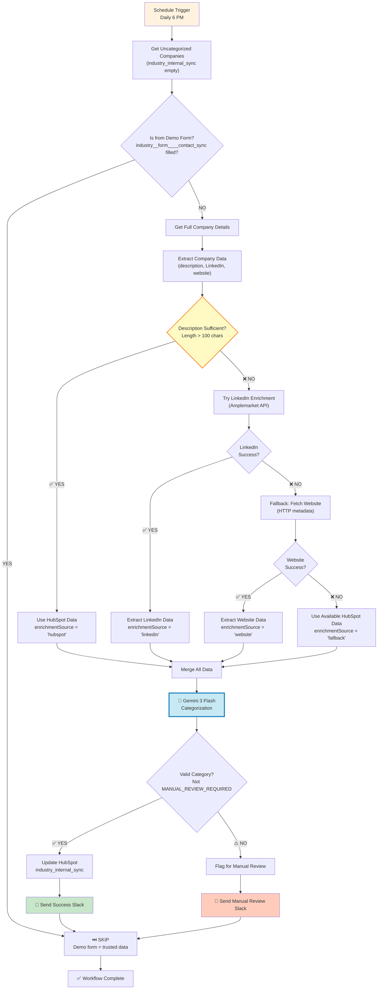

# HubSpot Company Industry Categorization - Architecture v2.0

## Overview

**Purpose**: Daily batch categorization of uncategorized companies in HubSpot using a three-tier data priority system: HubSpot Description → LinkedIn → Website.

**Trigger**: Daily at 6:00 PM (end of business day)
**Outcome**: All uncategorized companies are processed and categorized into 15 internal industry categories

## Key Changes from v1.0

1. ✅ **Description-First Logic**: Check if HubSpot description is exhaustive BEFORE trying enrichment
2. ✅ **Daily Batch Processing**: Changed from 5-minute intervals to daily at 6 PM
3. ✅ **Fixed Slack References**: Corrected enrichment source display in notifications
4. ✅ **Smart Fallback**: Use HubSpot data even if enrichment fails

## Requirements

- ✅ HubSpot Private App Token with company read/write permissions
- ✅ HubSpot custom property: `industry_internal_sync` (single-select with 15 options)
- ✅ HubSpot field check: `industry__form____contact_sync` (to skip demo form submissions)
- ✅ Google Gemini 3 Flash API access
- ✅ Amplemarket API key for LinkedIn company enrichment
- ✅ Slack workspace with bot access
- ✅ 15 internal industry categories defined

## Workflow Diagram (v2.0)



## Critical Logic Flow Changes

### NEW: Description Quality Check (Priority 1)

**After "Prepare LinkedIn Call" node, add:**

**Node: Check Description Quality (n8n-nodes-base.if)**
- **Purpose**: Determine if HubSpot description is sufficient to skip enrichment
- **Configuration**:
  ```javascript
  Condition:
    ($json.description && $json.description.length > 100) OR
    ($json.aboutUs && $json.aboutUs.length > 100)
  ```
- **TRUE Path**: Description exists and is exhaustive → Skip enrichment, use HubSpot data
- **FALSE Path**: Description missing/short → Try LinkedIn enrichment

**Node: Use HubSpot Data (n8n-nodes-base.set)**
- **Purpose**: Prepare HubSpot data for categorization without enrichment
- **Configuration**:
  ```javascript
  {
    "enrichmentSource": "hubspot",
    "useHubSpotData": true
  }
  ```
- **Output**: Skip LinkedIn/Website, go directly to "Merge Enriched Data"

### UPDATED: Merge Enriched Data Logic

**Merge logic now handles 4 sources:**
1. **hubspot**: Used HubSpot description directly (no enrichment needed)
2. **linkedin**: LinkedIn enrichment successful
3. **website**: Website enrichment successful (LinkedIn failed)
4. **fallback**: Both enrichments failed, use whatever HubSpot data exists

```javascript
{
  "enrichedData": {
    "companyName": $node['Prepare LinkedIn Call'].json.companyName,
    "description": $node['Prepare LinkedIn Call'].json.description || '',
    "aboutUs": $node['Prepare LinkedIn Call'].json.aboutUs || '',
    "keywords": $node['Prepare LinkedIn Call'].json.keywords || '',
    "linkedinDescription": $json.linkedinDescription || '',
    "linkedinIndustry": $json.linkedinIndustry || '',
    "linkedinSpecialties": $json.linkedinSpecialties || '',
    "websiteDescription": $json.websiteDescription || '',
    "enrichmentSource": $json.enrichmentSource || 'fallback'
  }
}
```

### FIXED: Slack Message References

**Send Manual Review Slack - CORRECTED:**
```javascript
Text:
⚠️ *Manual Review Required* for *{{ $node['Prepare LinkedIn Call'].json.companyName }}*

Available data:
- Description: {{ $node['Prepare LinkedIn Call'].json.description }}
- Keywords: {{ $node['Prepare LinkedIn Call'].json.keywords }}
- Enrichment Source: {{ $node['Merge Enriched Data'].json.enrichedData.enrichmentSource }}

🔗 <https://app.hubspot.com/contacts/142047914/company/{{ $node['Prepare LinkedIn Call'].json.companyId }}|View in HubSpot>
```

**Key Fix**: Changed `$json.enrichmentSource` → `$node['Merge Enriched Data'].json.enrichedData.enrichmentSource`

### UPDATED: Daily Scheduling

**Schedule Trigger - CHANGED:**
```json
{
  "rule": {
    "interval": [
      {
        "field": "cronExpression",
        "expression": "0 18 * * *"
      }
    ]
  }
}
```
**Effect**: Runs daily at 6:00 PM (18:00) instead of every 5 minutes

### UPDATED: Get Recent Companies → Get Uncategorized Companies

**HubSpot Node - CHANGED:**
```json
{
  "resource": "company",
  "operation": "getRecentlyCreatedUpdated",
  "filters": {
    "propertyName": "industry_internal_sync",
    "operator": "NOT_HAS_PROPERTY"
  },
  "returnAll": false,
  "limit": 50
}
```
**Effect**: Only fetch companies where `industry_internal_sync` is empty (uncategorized)

## Updated Gemini Prompt

```
You are an expert business industry classifier. Categorize this company into ONE of these 15 internal industry categories:

1. Accounting | 2. Insurance | 3. Legal Services | 4. Technology | 5. Healthcare
6. Public Sector | 7. Retail and Consumer Goods | 8. Consulting | 9. Construction
10. Payroll and HR Services | 11. Banking | 12. Energy | 13. Financial Services
14. Manufacturing | 15. Transportation

COMPANY DATA:
Name: {{ $json.enrichedData.companyName }}

HubSpot Direct Data:
- Description: {{ $json.enrichedData.description || 'Not provided' }}
- About Us: {{ $json.enrichedData.aboutUs || 'Not provided' }}
- Keywords: {{ $json.enrichedData.keywords || 'Not provided' }}

Enriched Data ({{ $json.enrichedData.enrichmentSource }}):
- LinkedIn Description: {{ $json.enrichedData.linkedinDescription || 'Not available' }}
- LinkedIn Industry: {{ $json.enrichedData.linkedinIndustry || 'Not available' }}
- LinkedIn Specialties: {{ $json.enrichedData.linkedinSpecialties || 'Not available' }}
- Website Description: {{ $json.enrichedData.websiteDescription || 'Not available' }}

RULES:
1. PRIORITIZE HubSpot description/about_us if available
2. Use enriched data (LinkedIn/Website) as supporting evidence
3. Look for PRIMARY business keywords
4. If company creates tech (software/SaaS) → Technology
5. If company USES tech but does something else → Their actual industry
6. If confidence < 70%, respond: "MANUAL_REVIEW_REQUIRED"

Respond ONLY with the category name or "MANUAL_REVIEW_REQUIRED". No explanation.
```

## New Node Structure

### Total Nodes: 20 (was 19)

**NEW NODES:**
1. **Check Description Quality** (IF node) - After "Prepare LinkedIn Call"
2. **Use HubSpot Data** (Set node) - TRUE branch from description check

**UPDATED NODES:**
1. **Schedule Trigger** - Changed to daily cron
2. **Get Recent Companies** - Now filters by empty `industry_internal_sync`
3. **Merge Enriched Data** - Updated to handle 4 enrichment sources
4. **Send Manual Review Slack** - Fixed node references
5. **Both Failed - Error** - Now routes to "Merge Enriched Data" instead of Slack
6. **Gemini Categorization** - Updated prompt to prioritize HubSpot data

## Error Handling Updates

### No More "Enrichment Failed" Alerts

**OLD Behavior**: If LinkedIn AND Website both fail → Send error alert, stop workflow

**NEW Behavior**: If LinkedIn AND Website both fail → Use available HubSpot data with enrichmentSource = 'fallback', continue to categorization

**Rationale**: Even with minimal data, Gemini can often categorize companies. If it can't, it will flag for manual review. This eliminates the confusing double-notification issue.

## Data Priority System

### Tier 1: HubSpot Direct Data (ALWAYS USED)
- Company name
- Description (if length > 100)
- About Us (if description empty)
- Keywords

**Decision Point**: If description/about_us is sufficient (>100 chars) → SKIP enrichment entirely

### Tier 2A: LinkedIn Enrichment (IF Tier 1 insufficient)
- Company description from LinkedIn
- Industry classification
- Specialties list

**Fallback**: If LinkedIn fails → Try Website

### Tier 2B: Website Enrichment (IF LinkedIn fails)
- Meta description (og:description)
- Page title
- Website content preview

**Fallback**: If Website fails → Use whatever HubSpot data exists (fallback mode)

### Tier 3: AI Categorization (ALWAYS RUNS)
- Gemini analyzes ALL available data
- Prioritizes HubSpot description > LinkedIn > Website
- Makes confident decision OR flags for manual review

## Expected Outcomes

### For OVO Energy (your test case):
1. ✅ Schedule runs at 6 PM daily
2. ✅ Gets OVO Energy (uncategorized)
3. ✅ Checks description: "OVO Energy is a UK gas and electricity company..." (139 chars)
4. ✅ **Description sufficient → Skip LinkedIn/Website enrichment**
5. ✅ Merge with enrichmentSource = "hubspot"
6. ✅ Gemini categorizes as "Energy" (high confidence)
7. ✅ Updates HubSpot: `industry_internal_sync = "Energy"`
8. ✅ Slack: "✅ OVO Energy categorized as Energy (Source: hubspot)"

**Result**: No more "Enrichment Failed" messages, no more "Unknown" sources!

## Testing Plan

### Test Case 1: Company with Good Description
- **Input**: Company with description > 100 chars
- **Expected**: Skip enrichment, use HubSpot data, categorize successfully
- **Slack**: "✅ Company categorized (Source: hubspot)"

### Test Case 2: Company with Poor Description
- **Input**: Company with description < 100 chars
- **Expected**: Try LinkedIn → Success → Categorize
- **Slack**: "✅ Company categorized (Source: linkedin)"

### Test Case 3: Company with No Description, LinkedIn Fails
- **Input**: Company with no description, LinkedIn API fails
- **Expected**: Try Website → Success → Categorize
- **Slack**: "✅ Company categorized (Source: website)"

### Test Case 4: All Data Sources Minimal
- **Input**: Company with minimal data everywhere
- **Expected**: Use fallback data → Gemini flags for manual review
- **Slack**: "⚠️ Manual Review Required (Source: fallback)"

### Test Case 5: Daily Batch Processing
- **Input**: 10 uncategorized companies in HubSpot
- **Expected**: All 10 processed in single workflow run at 6 PM
- **Verification**: Check execution log shows 10 items processed

## Deployment Checklist

- [ ] Update Schedule Trigger to daily cron
- [ ] Add "Check Description Quality" IF node
- [ ] Add "Use HubSpot Data" Set node
- [ ] Update "Get Recent Companies" with filter
- [ ] Update "Merge Enriched Data" logic
- [ ] Fix "Send Manual Review Slack" references
- [ ] Remove direct path from "Both Failed - Error" to Slack
- [ ] Update Gemini prompt
- [ ] Test with OVO Energy
- [ ] Verify no more duplicate Slack messages
- [ ] Monitor first daily run

## Version History

- **v2.0.0** (2026-02-16): Major refactor
  - Added description-first logic
  - Changed to daily batch processing
  - Fixed Slack message references
  - Eliminated "Enrichment Failed" alerts
  - Added fallback mode for minimal data
- **v1.0.0** (2026-02-15): Initial implementation
