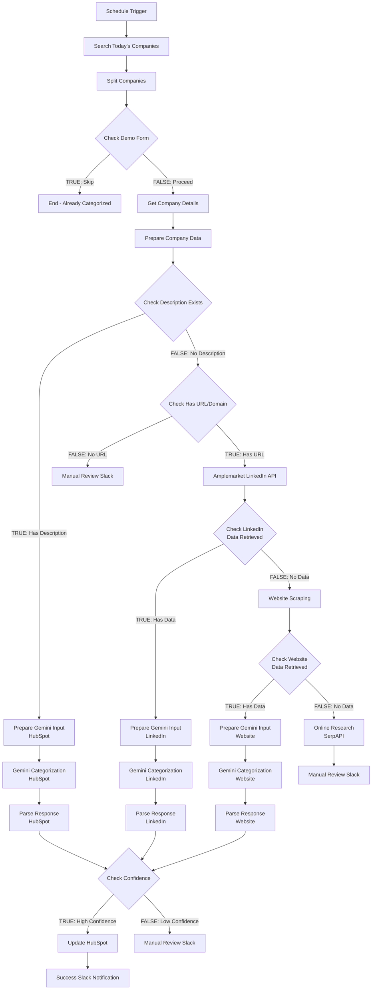

# HubSpot Industry Categorization v3.3 - Multi-Path LLM Architecture

## Overview

Workflow that categorizes HubSpot companies using **three independent LLM paths**, each optimized for different data sources.

**Workflow ID**: `8DM3CCwXLxOT3G8B7` (to be updated)
**Version**: v3.3
**Status**: Architecture Design Phase

---

## Key Changes from v3.2

### v3.2 Architecture (Previous)
- Single LLM path: All enrichment sources → Merge → One Gemini call
- Problem: One generic prompt for different data formats

### v3.3 Architecture (New)
- **Three independent LLM paths**, each with data-source-specific prompts:
  1. **HubSpot Description Path**: Companies with HubSpot descriptions
  2. **LinkedIn Enrichment Path**: Companies without descriptions, enriched via Amplemarket API
  3. **Website Scraping Path**: Companies without descriptions or LinkedIn data, enriched via website scraping

- **Benefits**:
  - Prompts optimized for each data source format
  - Better categorization accuracy
  - Independent error handling per path
  - Maintains existing fallback cascade

---

## Architecture Diagram



---

## Node Breakdown

### Trigger & Initial Processing (Unchanged)
1. **Schedule Trigger** - Daily at 6 PM
2. **Search Today's Companies** - HTTP Request to HubSpot API
3. **Split Companies** - Code node to split into individual items
4. **Check Demo Form** - IF node: Skip if `industry__form____contact_sync` filled
5. **Get Company Details** - HubSpot node: Fetch full company record
6. **Prepare Company Data** - Set node: Normalize data structure

### Routing Logic (Modified)
7. **Check Description Exists** - IF node: Route to Path 1 or Path 2/3
8. **Check Has URL/Domain** - IF node (NEW): Verify domain exists for enrichment
9. **Check LinkedIn Data Retrieved** - IF node (NEW): Verify Amplemarket response
10. **Check Website Data Retrieved** - IF node (NEW): Verify website scraping success

---

## Three Independent LLM Paths

### PATH 1: HubSpot Description Path (Existing - No Changes)

**Trigger**: Company has `description` or `about_us` in HubSpot

**Flow**:
```
Check Description Exists (TRUE)
→ Prepare Gemini Input - HubSpot
→ Gemini Categorization - HubSpot
→ Parse Response - HubSpot
→ Check Confidence
```

**Nodes**:
- **Prepare Gemini Input - HubSpot** (existing `prepare-gemini` node)
  - Uses HubSpot description/about_us fields
  - Prompt optimized for direct company descriptions

- **Gemini Categorization - HubSpot** (existing `gemini-cat` node)
  - Model: `gemini-2.5-flash`
  - Temperature: 0.3
  - Max tokens: 50

- **Parse Response - HubSpot** (existing `parse-response` node)
  - Extracts category from Gemini response
  - Maps "Others" → "Unknown"
  - Sets `enrichmentSource: 'hubspot'`

**Prompt Structure**:
```
COMPANY DATA:
Name: ${companyName}
Domain: ${domain}

HubSpot Direct Data:
- Description: ${description}
- About Us: ${aboutUs}

RULES:
1. PRIORITIZE HubSpot description/about_us
2. Look for PRIMARY business keywords
3. If company creates tech (software/SaaS) -> Technology
4. If company USES tech but does something else -> Their actual industry
5. If confidence < 70%, respond: MANUAL_REVIEW_REQUIRED

Respond ONLY with category name or MANUAL_REVIEW_REQUIRED.
```

---

### PATH 2: LinkedIn Enrichment Path (NEW)

**Trigger**: Company has NO description but HAS URL/domain

**Flow**:
```
Check Description Exists (FALSE)
→ Check Has URL/Domain (TRUE)
→ Amplemarket LinkedIn API
→ Check LinkedIn Data Retrieved (TRUE)
→ Prepare Gemini Input - LinkedIn
→ Gemini Categorization - LinkedIn
→ Parse Response - LinkedIn
→ Check Confidence
```

**New Nodes**:

1. **Check Has URL/Domain** (IF node)
   ```json
   {
     "id": "check-has-url",
     "name": "Check Has URL/Domain",
     "type": "n8n-nodes-base.if",
     "typeVersion": 2.3,
     "parameters": {
       "conditions": {
         "options": {"version": 3},
         "conditions": [{
           "id": "url-check",
           "operator": {"type": "string", "operation": "notEmpty"},
           "leftValue": "={{ $json.domain }}"
         }]
       }
     }
   }
   ```

2. **Amplemarket LinkedIn API** (HTTP Request node)
   ```json
   {
     "id": "amplemarket-linkedin",
     "name": "Amplemarket LinkedIn API",
     "type": "n8n-nodes-base.httpRequest",
     "typeVersion": 4.2,
     "parameters": {
       "method": "POST",
       "url": "https://api.amplemarket.com/company/linkedin/enrichment",
       "authentication": "genericCredentialType",
       "genericAuthType": "httpHeaderAuth",
       "sendBody": true,
       "specifyBody": "json",
       "jsonBody": "={{ JSON.stringify({ domain: $json.domain, company_name: $json.companyName }) }}",
       "options": {
         "timeout": 30000,
         "retry": {
           "enabled": true,
           "maxRetries": 2,
           "retryInterval": 1000
         }
       }
     },
     "onError": "continueRegularOutput"
   }
   ```

3. **Check LinkedIn Data Retrieved** (IF node)
   ```json
   {
     "id": "check-linkedin-success",
     "name": "Check LinkedIn Data Retrieved",
     "type": "n8n-nodes-base.if",
     "typeVersion": 2.3,
     "parameters": {
       "conditions": {
         "options": {"version": 3},
         "conditions": [{
           "id": "linkedin-data-check",
           "operator": {"type": "string", "operation": "notEmpty"},
           "leftValue": "={{ $json.description || $json.company?.description || '' }}"
         }]
       }
     }
   }
   ```

4. **Prepare Gemini Input - LinkedIn** (Code node)
   ```javascript
   const companyData = $('Prepare Company Data').item.json;
   const linkedinData = $json;

   // Extract LinkedIn fields (Amplemarket response format)
   const description = linkedinData.description || linkedinData.company?.description || 'Not available';
   const industry = linkedinData.industry || linkedinData.company?.industry || 'Not available';
   const companySize = linkedinData.company_size || linkedinData.company?.employeeCount || 'Not available';
   const specialties = linkedinData.specialties?.join(', ') || linkedinData.company?.specialties?.join(', ') || 'Not available';
   const tagline = linkedinData.tagline || linkedinData.company?.tagline || 'Not available';

   const prompt = `You are an expert business industry classifier. Categorize this company into ONE of these 16 internal industry categories:

   1. Accounting | 2. Insurance | 3. Legal Services | 4. Technology | 5. Healthcare
   6. Public Sector | 7. Retail and Consumer Goods | 8. Consulting | 9. Construction
   10. HR and Payroll Services | 11. Banking | 12. Energy | 13. Financial Services
   14. Manufacturing | 15. Transportation | 16. Others

   COMPANY DATA (from LinkedIn):
   Name: ${companyData.companyName}
   Domain: ${companyData.domain || 'Not provided'}

   LinkedIn Profile:
   - Description: ${description}
   - Industry: ${industry}
   - Company Size: ${companySize}
   - Specialties: ${specialties}
   - Tagline: ${tagline}

   RULES:
   1. LinkedIn "Industry" field is a HINT, not definitive
   2. Look at description and specialties for PRIMARY business activity
   3. If company creates tech (software/SaaS) -> Technology
   4. If company USES tech but does something else -> Their actual industry
   5. If confidence < 70%, respond: MANUAL_REVIEW_REQUIRED

   Respond ONLY with the exact category name from the list above, or MANUAL_REVIEW_REQUIRED. No explanation.`;

   return {
     json: {
       companyId: companyData.companyId,
       companyName: companyData.companyName,
       enrichmentSource: 'linkedin',
       prompt: prompt
     }
   };
   ```

5. **Gemini Categorization - LinkedIn** (HTTP Request node)
   - Same configuration as HubSpot Gemini node
   - Model: `gemini-2.5-flash`
   - Temperature: 0.3
   - Max tokens: 50

6. **Parse Response - LinkedIn** (Code node)
   ```javascript
   const response = $json;
   const geminiText = response?.candidates?.[0]?.content?.parts?.[0]?.text || '';
   let category = geminiText.trim();

   // Map display label to HubSpot internal enum value
   if (category === 'Others') category = 'Unknown';

   const prepData = $('Prepare Gemini Input - LinkedIn').item.json;
   return [{
     json: {
       companyId: prepData.companyId,
       companyName: prepData.companyName,
       enrichmentSource: prepData.enrichmentSource,
       category: category,
       needsManualReview: category === 'MANUAL_REVIEW_REQUIRED'
     }
   }];
   ```

---

### PATH 3: Website Scraping Path (NEW)

**Trigger**: Company has NO description AND LinkedIn enrichment failed

**Flow**:
```
Check LinkedIn Data Retrieved (FALSE)
→ Website Scraping
→ Check Website Data Retrieved (TRUE)
→ Prepare Gemini Input - Website
→ Gemini Categorization - Website
→ Parse Response - Website
→ Check Confidence
```

**New Nodes**:

1. **Website Scraping** (existing node, keep as-is)
   - HTTP GET request to company domain
   - Extracts HTML content

2. **Check Website Data Retrieved** (IF node - modify existing)
   ```json
   {
     "id": "check-website-success",
     "name": "Check Website Data Retrieved",
     "type": "n8n-nodes-base.if",
     "typeVersion": 2.3,
     "parameters": {
       "conditions": {
         "options": {"version": 3},
         "conditions": [{
           "id": "website-data-check",
           "operator": {"type": "string", "operation": "notEmpty"},
           "leftValue": "={{ $json.data || '' }}"
         }]
       }
     }
   }
   ```

3. **Prepare Gemini Input - Website** (Code node - NEW)
   ```javascript
   const companyData = $('Prepare Company Data').item.json;
   const websiteData = $json.data || '';

   // Extract meta tags and content snippets
   const metaDescription = websiteData.match(/<meta\s+name="description"\s+content="([^"]+)"/i)?.[1] || '';
   const ogDescription = websiteData.match(/<meta\s+property="og:description"\s+content="([^"]+)"/i)?.[1] || '';
   const title = websiteData.match(/<title>([^<]+)<\/title>/i)?.[1] || '';

   // Get first 500 chars of visible text (rough extraction)
   const bodyText = websiteData.replace(/<script[^>]*>[\s\S]*?<\/script>/gi, '')
                               .replace(/<style[^>]*>[\s\S]*?<\/style>/gi, '')
                               .replace(/<[^>]+>/g, ' ')
                               .replace(/\s+/g, ' ')
                               .trim()
                               .substring(0, 500);

   const prompt = `You are an expert business industry classifier. Categorize this company into ONE of these 16 internal industry categories:

   1. Accounting | 2. Insurance | 3. Legal Services | 4. Technology | 5. Healthcare
   6. Public Sector | 7. Retail and Consumer Goods | 8. Consulting | 9. Construction
   10. HR and Payroll Services | 11. Banking | 12. Energy | 13. Financial Services
   14. Manufacturing | 15. Transportation | 16. Others

   COMPANY DATA (from Website):
   Name: ${companyData.companyName}
   Domain: ${companyData.domain}

   Website Information:
   - Page Title: ${title || 'Not available'}
   - Meta Description: ${metaDescription || 'Not available'}
   - OG Description: ${ogDescription || 'Not available'}
   - Content Preview: ${bodyText || 'Not available'}

   RULES:
   1. Focus on business activity described on website
   2. Meta descriptions often contain company positioning
   3. If company creates tech (software/SaaS) -> Technology
   4. If company USES tech but does something else -> Their actual industry
   5. If confidence < 70%, respond: MANUAL_REVIEW_REQUIRED

   Respond ONLY with the exact category name from the list above, or MANUAL_REVIEW_REQUIRED. No explanation.`;

   return {
     json: {
       companyId: companyData.companyId,
       companyName: companyData.companyName,
       enrichmentSource: 'website',
       prompt: prompt
     }
   };
   ```

4. **Gemini Categorization - Website** (HTTP Request node - NEW)
   - Same configuration as other Gemini nodes
   - Model: `gemini-2.5-flash`
   - Temperature: 0.3
   - Max tokens: 50

5. **Parse Response - Website** (Code node - NEW)
   ```javascript
   const response = $json;
   const geminiText = response?.candidates?.[0]?.content?.parts?.[0]?.text || '';
   let category = geminiText.trim();

   // Map display label to HubSpot internal enum value
   if (category === 'Others') category = 'Unknown';

   const prepData = $('Prepare Gemini Input - Website').item.json;
   return [{
     json: {
       companyId: prepData.companyId,
       companyName: prepData.companyName,
       enrichmentSource: prepData.enrichmentSource,
       category: category,
       needsManualReview: category === 'MANUAL_REVIEW_REQUIRED'
     }
   }];
   ```

---

## Convergence Point & Shared Nodes

All three paths converge at **Check Confidence** node. These nodes are **reused** across all paths:

### Shared Nodes (No Changes)
1. **Check Confidence** (IF node)
   - Checks `$json.needsManualReview === false`
   - Routes to Update HubSpot (TRUE) or Manual Review Slack (FALSE)

2. **Update HubSpot** (HubSpot node)
   - Updates `industry__internal_` property
   - Uses `$json.category` from any path

3. **Send Success Slack** (Slack node)
   - Notification: "✅ Company categorized as {category}"
   - Source: `$json.enrichmentSource` (hubspot/linkedin/website)

4. **Send Manual Review Slack** (Slack node)
   - Notification: "⚠️ Manual Review Required"
   - Source: `$json.enrichmentSource`

---

## Node Reuse Strategy

### Reusable (Shared across paths)
- ✅ Check Confidence
- ✅ Update HubSpot
- ✅ Send Success Slack
- ✅ Send Manual Review Slack
- ✅ Trigger & initial processing nodes

### Non-Reusable (Path-specific)
- ❌ Prepare Gemini Input (3 separate nodes - different prompts)
- ❌ Gemini Categorization (3 separate nodes - same config, different inputs)
- ❌ Parse Response (3 separate nodes - different upstream references)

**Rationale**: Each path has different data structures and prompt requirements. Code nodes reference specific upstream nodes by name (e.g., `$('Prepare Gemini Input - LinkedIn')`), requiring separate instances.

---

## Complete Node List (v3.3)

| ID | Node Name | Type | Status |
|----|-----------|------|--------|
| schedule-trigger | Schedule Trigger | scheduleTrigger | Existing |
| search-companies | Search Today's Companies | httpRequest | Existing |
| normalize-company | Split Companies | code | Existing |
| check-demo | Check Demo Form | if | Existing |
| get-details | Get Company Details | hubspot | Existing |
| prepare-data | Prepare Company Data | set | Existing |
| check-desc | Check Description Exists | if | Existing |
| **check-has-url** | **Check Has URL/Domain** | **if** | **NEW** |
| **amplemarket-linkedin** | **Amplemarket LinkedIn API** | **httpRequest** | **NEW** |
| **check-linkedin-success** | **Check LinkedIn Data Retrieved** | **if** | **NEW** |
| prepare-gemini-hs | Prepare Gemini Input - HubSpot | code | Existing (rename) |
| gemini-cat-hs | Gemini Categorization - HubSpot | httpRequest | Existing (rename) |
| parse-response-hs | Parse Response - HubSpot | code | Existing (rename) |
| **prepare-gemini-linkedin** | **Prepare Gemini Input - LinkedIn** | **code** | **NEW** |
| **gemini-cat-linkedin** | **Gemini Categorization - LinkedIn** | **httpRequest** | **NEW** |
| **parse-response-linkedin** | **Parse Response - LinkedIn** | **code** | **NEW** |
| website-scrape | Website Scraping | httpRequest | Existing |
| check-website | Check Website Data Retrieved | if | Existing (modify) |
| **prepare-gemini-website** | **Prepare Gemini Input - Website** | **code** | **NEW** |
| **gemini-cat-website** | **Gemini Categorization - Website** | **httpRequest** | **NEW** |
| **parse-response-website** | **Parse Response - Website** | **code** | **NEW** |
| online-research | Online Research | httpRequest | Existing |
| check-confidence | Check Confidence | if | Existing |
| update-hubspot | Update HubSpot | hubspot | Existing |
| slack-success | Send Success Slack | slack | Existing |
| slack-manual | Send Manual Review Slack | slack | Existing |

**Total Nodes**: 27 (was 18, added 9 new nodes)

---

## Connection Changes

### Connections to Remove
```
- "Merge Enrichment Branches" node (DELETE - no longer needed)
- "Check Description Exists" FALSE → "LinkedIn Enrichment" (old direct connection)
- All connections to/from old "Merge Enrichment Branches"
```

### Connections to Add

**Path 1: HubSpot Description**
```
- "Check Description Exists" TRUE → "Prepare Gemini Input - HubSpot"
- "Prepare Gemini Input - HubSpot" → "Gemini Categorization - HubSpot"
- "Gemini Categorization - HubSpot" → "Parse Response - HubSpot"
- "Parse Response - HubSpot" → "Check Confidence"
```

**Path 2: LinkedIn Enrichment**
```
- "Check Description Exists" FALSE → "Check Has URL/Domain"
- "Check Has URL/Domain" TRUE → "Amplemarket LinkedIn API"
- "Check Has URL/Domain" FALSE → "Send Manual Review Slack"
- "Amplemarket LinkedIn API" → "Check LinkedIn Data Retrieved"
- "Check LinkedIn Data Retrieved" TRUE → "Prepare Gemini Input - LinkedIn"
- "Check LinkedIn Data Retrieved" FALSE → "Website Scraping" (fallback)
- "Prepare Gemini Input - LinkedIn" → "Gemini Categorization - LinkedIn"
- "Gemini Categorization - LinkedIn" → "Parse Response - LinkedIn"
- "Parse Response - LinkedIn" → "Check Confidence"
```

**Path 3: Website Scraping**
```
- "Website Scraping" → "Check Website Data Retrieved"
- "Check Website Data Retrieved" TRUE → "Prepare Gemini Input - Website"
- "Check Website Data Retrieved" FALSE → "Online Research" (final fallback)
- "Prepare Gemini Input - Website" → "Gemini Categorization - Website"
- "Gemini Categorization - Website" → "Parse Response - Website"
- "Parse Response - Website" → "Check Confidence"
- "Online Research" → "Send Manual Review Slack"
```

**Convergence**
```
- "Check Confidence" TRUE → "Update HubSpot"
- "Check Confidence" FALSE → "Send Manual Review Slack"
- "Update HubSpot" → "Send Success Slack"
```

---

## Testing Strategy

### Test Case 1: HubSpot Description Path
**Input**: Company with `description` in HubSpot
**Expected**: Uses Path 1, skips LinkedIn/Website enrichment
**Verify**:
- `enrichmentSource === 'hubspot'`
- No API calls to Amplemarket or website
- Category assigned correctly

### Test Case 2: LinkedIn Enrichment Path
**Input**: Company WITHOUT description, WITH domain
**Expected**: Calls Amplemarket API, uses LinkedIn data
**Verify**:
- `enrichmentSource === 'linkedin'`
- Amplemarket API called successfully
- LinkedIn-specific prompt used
- Category assigned correctly

### Test Case 3: Website Scraping Path
**Input**: Company WITHOUT description, LinkedIn API fails
**Expected**: Falls back to website scraping
**Verify**:
- `enrichmentSource === 'website'`
- Website scraping executed
- Website-specific prompt used
- Category assigned correctly

### Test Case 4: All Enrichments Fail
**Input**: Company WITHOUT description, NO domain OR all APIs fail
**Expected**: Manual review Slack sent
**Verify**:
- Slack alert sent with "Manual Review Required"
- No HubSpot update attempted

### Test Case 5: Low Confidence
**Input**: Any path returns `MANUAL_REVIEW_REQUIRED`
**Expected**: Manual review Slack sent
**Verify**:
- `needsManualReview === true`
- Slack alert sent
- No HubSpot update

---

## Deployment Plan

### Phase 1: Build New Nodes
1. Create 3 new IF nodes (URL check, LinkedIn check, Website check)
2. Create Amplemarket LinkedIn API node
3. Create 3 "Prepare Gemini Input" nodes (LinkedIn, Website, rename existing)
4. Create 3 "Gemini Categorization" nodes (LinkedIn, Website, rename existing)
5. Create 3 "Parse Response" nodes (LinkedIn, Website, rename existing)

### Phase 2: Update Connections
1. Remove "Merge Enrichment Branches" node
2. Connect Path 1 (HubSpot Description)
3. Connect Path 2 (LinkedIn Enrichment)
4. Connect Path 3 (Website Scraping)
5. Connect all paths to "Check Confidence"

### Phase 3: Validation
1. Validate each node configuration
2. Validate workflow structure
3. Validate all connections
4. Test each path independently

### Phase 4: Deploy & Test
1. Deploy to n8n instance
2. Run test execution for each path
3. Monitor Slack notifications
4. Verify HubSpot updates

---

## Credentials Required

- ✅ HubSpot Private App Token (existing)
- ✅ Slack API (existing)
- ✅ Google Gemini API (existing)
- ⚠️ **Amplemarket API Key** (NEW - required for LinkedIn path)
- ⚠️ SerpAPI Key (optional - for Online Research fallback)

---

## Next Steps

1. **Get Amplemarket API credentials**
2. **Build workflow with new architecture**
3. **Validate all nodes and connections**
4. **Deploy to n8n instance**
5. **Test all three paths**
6. **Monitor execution results**
7. **Update CHANGELOG.md to v3.3**

---

## Estimated Complexity

- **Setup Time**: 45-60 minutes
- **Node Count**: 27 nodes
- **New Nodes**: 9 nodes
- **Modified Nodes**: 3 nodes (renamed)
- **Deleted Nodes**: 1 node (Merge Enrichment Branches)
- **API Dependencies**: 4 (HubSpot, Slack, Gemini, Amplemarket)

---

**Architecture Approved**: Ready for implementation
**Version**: v3.3
**Date**: 2026-02-16
