# HubSpot Industry Categorization v3.3 - Architecture

## Overview

Workflow that categorizes HubSpot companies created **yesterday** into one of 16 internal industry categories using Gemini 2.5 Flash. Uses a **four-path enrichment cascade**: HubSpot description → LinkedIn (Amplemarket) → Website scraping (Jina) → Web search (DuckDuckGo via Jina). All paths converge, every categorized company is written to HubSpot, and a single daily Slack summary is sent.

**Workflow ID**: `8DM3CwXLxOT3G8B7`
**n8n URL**: `https://legalfly.app.n8n.cloud/workflow/8DM3CwXLxOT3G8B7`
**Status**: Active (production)

---

## Workflow Diagram

```mermaid
flowchart TD
    Start([Schedule Trigger\nmidnight daily])

    Start --> Search["Search Yesterday's Companies\nHubSpot API"]
    Search --> Split["Split Companies\nCode node"]
    Split --> CheckDemo{Check Demo Form\nindustry__form____contact_sync empty?}

    CheckDemo -->|TRUE: empty - proceed| GetDetails[Get Company Details\nHubSpot node]
    CheckDemo -->|FALSE: filled - skip| End1[Silent Skip\nNo connection]

    GetDetails --> PrepareData[Prepare Company Data\nSet node]
    PrepareData --> CheckDesc{Check Description Exists\nlength >= 100 chars?}

    %% PATH 1: HubSpot Description
    CheckDesc -->|TRUE| PrepGeminiHS[Prepare Gemini Input - HubSpot\nCode node]
    PrepGeminiHS --> GeminiHS[Gemini Categorization - HubSpot\ngemini-2.5-flash]
    GeminiHS --> ParseHS[Parse Gemini Response - HubSpot\nCode node]
    ParseHS --> PreservePreUpdate

    %% PATH 2: LinkedIn
    CheckDesc -->|FALSE| CheckLinkedInURL{Check Has LinkedIn URL\nlinkedinUrl not empty?}
    CheckLinkedInURL -->|TRUE| AmpleAPI[Amplemarket LinkedIn API\nGET /companies/find?linkedin_url=...]
    CheckLinkedInURL -->|FALSE| CheckDomain{Check Has Domain\ndomain not empty?}
    AmpleAPI --> CheckLinkedInData{Check LinkedIn Data Retrieved\nname or domain not empty?}
    CheckLinkedInData -->|TRUE| PrepGeminiLI[Prepare Gemini Input - LinkedIn\nCode node]
    PrepGeminiLI --> GeminiLI[Gemini Categorization - LinkedIn\ngemini-2.5-flash]
    GeminiLI --> ParseLI[Parse Gemini Response - LinkedIn\nCode node]
    ParseLI --> PreservePreUpdate
    CheckLinkedInData -->|FALSE| CheckDomain

    %% PATH 3: Website Scraping
    CheckDomain -->|TRUE| WebScrape[Website Scraping\nJina r.jina.ai]
    CheckDomain -->|FALSE| JinaSearch[Jina Search\nDuckDuckGo via r.jina.ai]
    WebScrape --> CheckWebData{Check Website Data Retrieved\ndata not empty?}
    CheckWebData -->|TRUE| PrepGeminiWeb[Prepare Gemini Input - Website\nCode node]
    PrepGeminiWeb --> GeminiWeb[Gemini Categorization - Website\ngemini-2.5-flash]
    GeminiWeb --> ParseWeb[Parse Gemini Response - Website\nCode node]
    ParseWeb --> PreservePreUpdate
    CheckWebData -->|FALSE| JinaSearch

    %% PATH 4: Jina Search (final fallback)
    JinaSearch --> PrepGeminiSearch[Prepare Gemini Input - Search\nCode node]
    PrepGeminiSearch --> GeminiSearch[Gemini Categorization - Search\ngemini-2.5-flash]
    GeminiSearch --> ParseSearch[Parse Gemini Response - Search\nCode node]
    ParseSearch --> PreservePreUpdate

    %% Convergence
    PreservePreUpdate[Preserve Pre-Update Data\nSet node]
    PreservePreUpdate --> UpdateHS[Update HubSpot\nindustry__internal_]
    UpdateHS --> Preserve[Preserve Result Data\nCode node]
    Preserve --> Aggregate[Aggregate All Results]
    Aggregate --> FormatSummary[Format Summary Message\nCode node]
    FormatSummary --> SlackSummary[Send Summary Slack\nDaily digest]
```

---

## Node Breakdown

### Trigger & Initial Processing

| Node | Type | Config |
|------|------|--------|
| **Schedule Trigger** | scheduleTrigger | Cron: `1 0 * * *` (12:01 AM daily) |
| **Search Yesterday's Companies** | httpRequest | POST `https://api.hubapi.com/crm/v3/objects/companies/search` — filters companies with `createdate GTE yesterday-midnight AND LT today-midnight` (UTC). Fetches: name, domain, description, about_us, linkedin_company_page, industry, industry__form____contact_sync, industry__internal_. Limit: 100 |
| **Split Companies** | code | Maps HubSpot search results into individual items with `{id, properties}` |
| **Check Demo Form** | if | `industry__form____contact_sync` is **empty** → TRUE (proceed). If filled, company was self-categorized via form — skip silently (no FALSE branch connected) |
| **Get Company Details** | hubspot | Gets full company record by ID |
| **Prepare Company Data** | set | Normalizes into: `companyId`, `companyName`, `domain`, `description`, `aboutUs`, `linkedinUrl`. Handles both object and string property formats |

---

### Routing Logic

| Node | Type | Condition | TRUE → | FALSE → |
|------|------|-----------|--------|---------|
| **Check Description Exists** | if | `description.length >= 100` | Path 1: HubSpot | Path 2: LinkedIn |
| **Check Has LinkedIn URL** | if | `linkedinUrl` not empty | Amplemarket API | Check Has Domain |
| **Check LinkedIn Data Retrieved** | if | `name \|\| domain` not empty | Path 2: LinkedIn Gemini | Check Has Domain |
| **Check Has Domain** | if | `domain` not empty | Path 3: Website Scraping | Path 4: Jina Search |
| **Check Website Data Retrieved** | if | `data` not empty | Path 3: Website Gemini | Path 4: Jina Search |

---

### Path 1: HubSpot Description

**Trigger**: Company has description with ≥ 100 characters in HubSpot.

**Flow**: Check Description Exists (TRUE) → Prepare Gemini Input - HubSpot → Gemini Categorization - HubSpot → Parse Gemini Response - HubSpot → Preserve Pre-Update Data

**Prompt uses**: `companyName`, `domain`, `description`, `aboutUs`
**enrichmentSource**: `'hubspot'`
**Prompt file**: [`prompts/prompt-hubspot.md`](prompts/prompt-hubspot.md)

---

### Path 2: LinkedIn Enrichment

**Trigger**: No description → has LinkedIn URL → Amplemarket returns data.

**Flow**: Check Has LinkedIn URL (TRUE) → Amplemarket LinkedIn API → Check LinkedIn Data Retrieved (TRUE) → Prepare Gemini Input - LinkedIn → Gemini Categorization - LinkedIn → Parse Gemini Response - LinkedIn → Preserve Pre-Update Data

**Amplemarket API**: `GET https://api.amplemarket.com/companies/find?linkedin_url=...`
- Auth: `httpHeaderAuth` (credential: `amplemarket`)
- `onError: continueRegularOutput` (failures fall through to Check Has Domain)

**Prompt uses**: `companyName`, LinkedIn `industry`, `keywords`, `overview`
**enrichmentSource**: `'linkedin'`
**Prompt file**: [`prompts/prompt-linkedin.md`](prompts/prompt-linkedin.md)

---

### Path 3: Website Scraping

**Trigger**: No description → LinkedIn failed/missing → has domain.

**Flow**: Check Has Domain (TRUE) → Website Scraping → Check Website Data Retrieved (TRUE) → Prepare Gemini Input - Website → Gemini Categorization - Website → Parse Gemini Response - Website → Preserve Pre-Update Data

**Website Scraping**: `GET https://r.jina.ai/https://{domain}` — Jina Reader returns clean markdown.
- Strips markdown images, Wix asset links, collapses blank lines
- Truncates to 2000 chars for prompt

**enrichmentSource**: `'website'`
**Prompt file**: [`prompts/prompt-website.md`](prompts/prompt-website.md)

---

### Path 4: Jina Search (Final Fallback)

**Trigger**: No domain, OR website scraping returned empty data.

**Flow**: Jina Search → Prepare Gemini Input - Search → Gemini Categorization - Search → Parse Gemini Response - Search → Preserve Pre-Update Data

**Jina Search**: `GET https://r.jina.ai/https://duckduckgo.com/html/?q={companyName + ' company'}` — DuckDuckGo search results via Jina Reader.
- Strips markdown images, strips links (keeps link text), collapses blank lines
- Truncates to 2000 chars

**enrichmentSource**: `'search'`
**Prompt file**: [`prompts/prompt-search.md`](prompts/prompt-search.md)

---

### Gemini Configuration (all paths)

- **Model**: `gemini-2.5-flash`
- **Endpoint**: `POST https://generativelanguage.googleapis.com/v1beta/models/gemini-2.5-flash:generateContent`
- **Auth**: `googlePalmApi` (credential: `Gemini`)
- **Temperature**: `0.3`
- **Response parsing**: `candidates[0].content.parts[0].text`
- **`Others` mapping**: Gemini returns `'Others'` → stored as `'Unknown'` in HubSpot

---

### 16 Industry Categories

1. Accounting
2. Insurance
3. Legal Services
4. Technology
5. Healthcare
6. Public Sector
7. Retail and Consumer Goods
8. Consulting
9. Construction
10. HR and Payroll Services
11. Banking
12. Energy
13. Financial Services
14. Manufacturing
15. Transportation
16. Others (stored as `Unknown` in HubSpot)

---

### Convergence & Output

All four paths converge at **Preserve Pre-Update Data**:

- **Preserve Pre-Update Data** (Set node): Snapshots `companyId`, `companyName`, `enrichmentSource`, `category`, `needsManualReview` before the HubSpot write. Ensures data is accessible after Update HubSpot overwrites the item context.
- **Update HubSpot**: Writes `industry__internal_` property with the Gemini-assigned category.
- **Preserve Result Data** (Code node): Re-reads from `Preserve Pre-Update Data` and re-emits the result fields for aggregation.
- **Aggregate All Results**: Collects all processed company results into a single array.
- **Format Summary Message**: Builds a Slack digest listing each company with name, category, enrichment source, and HubSpot link. Displays `'Others'` (not `'Unknown'`) for readability.
- **Send Summary Slack**: Posts to channel `D0ADELD95GR`.

---

## Complete Node List

| ID | Name | Type |
|----|------|------|
| schedule-trigger | Schedule Trigger | scheduleTrigger |
| search-companies | Search Yesterday's Companies | httpRequest |
| normalize-company | Split Companies | code |
| check-demo | Check Demo Form | if |
| get-details | Get Company Details | hubspot |
| prepare-data | Prepare Company Data | set |
| check-desc | Check Description Exists | if |
| prepare-gemini-hs | Prepare Gemini Input - HubSpot | code |
| gemini-cat-hs | Gemini Categorization - HubSpot | httpRequest |
| parse-response-hs | Parse Gemini Response - HubSpot | code |
| check-has-url | Check Has LinkedIn URL | if |
| amplemarket-linkedin | Amplemarket LinkedIn API | httpRequest |
| check-linkedin-success | Check LinkedIn Data Retrieved | if |
| prepare-gemini-linkedin | Prepare Gemini Input - LinkedIn | code |
| gemini-cat-linkedin | Gemini Categorization - LinkedIn | httpRequest |
| parse-response-linkedin | Parse Gemini Response - LinkedIn | code |
| check-has-domain | Check Has Domain | if |
| website-scrape | Website Scraping | httpRequest |
| check-website-success | Check Website Data Retrieved | if |
| prepare-gemini-website | Prepare Gemini Input - Website | code |
| gemini-cat-website | Gemini Categorization - Website | httpRequest |
| parse-response-website | Parse Gemini Response - Website | code |
| jina-search | Jina Search | httpRequest |
| prepare-gemini-search | Prepare Gemini Input - Search | code |
| gemini-cat-search | Gemini Categorization - Search | httpRequest |
| parse-response-search | Parse Gemini Response - Search | code |
| preserve-pre-update | Preserve Pre-Update Data | set |
| update-hubspot | Update HubSpot | hubspot |
| preserve-success-result | Preserve Result Data | code |
| aggregate-all | Aggregate All Results | aggregate |
| format-summary | Format Summary Message | code |
| slack-summary | Send Summary Slack | slack |

**Total**: 32 nodes

---

## Credentials Required

| Service | Credential Name | Type |
|---------|----------------|------|
| HubSpot | `hubspot` | hubspotAppToken |
| Google Gemini | `Gemini` | googlePalmApi |
| Amplemarket | `amplemarket` | httpHeaderAuth |
| Slack | `Slack` | slackApi |

---

## Key Design Decisions

- **Yesterday's companies**: Runs at midnight and processes companies created the previous day — avoids the race condition of processing companies still being created throughout the current day.
- **Demo form check**: Companies that self-categorized via a form are silently skipped — no FALSE branch connected, so they simply don't proceed.
- **Description threshold**: 100 characters — below this, the description is too short to reliably classify.
- **Preserve Pre-Update Data**: A Set node inserted before Update HubSpot snapshots the result data. This is necessary because the HubSpot update overwrites the execution item context, making fields unavailable to downstream nodes.
- **No per-company Slack noise**: All results are aggregated into a single daily digest.
- **`Others` → `Unknown`**: HubSpot's internal enum value for the "Others" category is `Unknown`. The workflow maps this on parse but displays `Others` in the Slack summary.
- **DuckDuckGo via Jina Reader**: The search fallback now uses Jina Reader to fetch DuckDuckGo HTML search results (`r.jina.ai/https://duckduckgo.com/html/?q=...`), yielding cleaner parsed text than the Jina Search API (`s.jina.ai`).
- **`onError: continueRegularOutput`** on Amplemarket and scraping nodes: API failures don't crash the workflow — they fall through to the next enrichment path.
