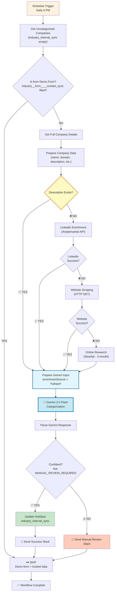

# HubSpot Company Industry Categorization - Architecture v3.0

## Overview

**Purpose**: Daily batch categorization of uncategorized companies in HubSpot using a four-tier cascading fallback system: HubSpot Description → LinkedIn → Website → Online Research.

**Trigger**: Daily at 6:00 PM (end of business day)
**Outcome**: All uncategorized companies are processed and categorized into 15 internal industry categories

## Key Changes from v2.0

1. ✅ **Simplified Description-First Logic**: If description exists, send DIRECTLY to Gemini (not enrichment-first)
2. ✅ **Added Online Research Fallback**: Fourth tier using SerpApi when all other sources fail
3. ✅ **Unified Gemini Input**: Single "Prepare Gemini Input" Code node handles all data sources
4. ✅ **Removed Duplicate Alerts**: No more "Enrichment Failed" messages
5. ✅ **Proper IF Node Branching**: All conditional nodes use correct branch parameters

## Requirements

- ✅ HubSpot Private App Token with company read/write permissions
- ✅ HubSpot custom property: `industry_internal_sync` (single-select with 15 options)
- ✅ HubSpot field check: `industry__form____contact_sync` (to skip demo form submissions)
- ✅ Google Gemini 2.0 Flash API access
- ✅ Amplemarket API key for LinkedIn company enrichment
- ✅ SerpApi key for online research (fallback)
- ✅ Slack workspace with bot access
- ✅ 15 internal industry categories defined

## Workflow Diagram (v3.0)



## Critical Logic Flow

### Tier 1: HubSpot Description (Priority)

**Node: Check Description Exists (IF)**
- **Condition**: `$json.description` is not empty
- **TRUE Branch** → Prepare Gemini Input (enrichmentSource = 'hubspot')
- **FALSE Branch** → LinkedIn Enrichment

**Key Change from v2**: Simpler check - just existence, not length > 100 chars

### Tier 2: LinkedIn Enrichment

**Node: LinkedIn Enrichment (HTTP Request)**
- **API**: Amplemarket `/company/linkedin/enrichment`
- **Input**: `linkedinUrl` from HubSpot
- **continueOnFail**: true (don't stop workflow if fails)

**Node: Check LinkedIn Success (IF)**
- **Condition**: Response has `description` field
- **TRUE Branch** → Prepare Gemini Input (enrichmentSource = 'linkedin')
- **FALSE Branch** → Website Scraping

### Tier 3: Website Scraping

**Node: Website Scraping (HTTP Request)**
- **URL**: `https://{domain}` from HubSpot
- **Method**: GET
- **continueOnFail**: true

**Node: Check Website Success (IF)**
- **Condition**: Response contains "description" text
- **TRUE Branch** → Prepare Gemini Input (enrichmentSource = 'website')
- **FALSE Branch** → Online Research

### Tier 4: Online Research (NEW!)

**Node: Online Research (HTTP Request)**
- **API**: SerpApi Google Search
- **Query**: `{companyName} company information`
- **Results**: Top 3 organic results
- **continueOnFail**: true

**Output**: Always routes to Prepare Gemini Input (enrichmentSource = 'online_research' or 'fallback')

### Unified Data Preparation

**Node: Prepare Gemini Input (Code)**
- **Purpose**: Single point where all data sources converge
- **Input**: Company data + enriched data from ANY source
- **Logic**:
  ```javascript
  1. Detect source node (Check Description Exists, Check LinkedIn Success, Check Website Success, Online Research)
  2. Set enrichmentSource ('hubspot', 'linkedin', 'website', 'online_research', 'fallback')
  3. Format enriched info based on source
  4. Build comprehensive Gemini prompt
  5. Output: {companyId, companyName, enrichmentSource, prompt}
  ```

**Prompt Structure**:
```
You are an expert business industry classifier...

COMPANY DATA:
Name: {companyName}

HubSpot Direct Data:
- Description: {description}
- About Us: {aboutUs}

Enriched Data ({enrichmentSource}):
{enrichedInfo}

RULES:
1. PRIORITIZE HubSpot description/about_us if available
2. Use enriched data as supporting evidence only
3. If confidence < 70%, respond: "MANUAL_REVIEW_REQUIRED"

Respond ONLY with category name or "MANUAL_REVIEW_REQUIRED".
```

### Gemini Categorization

**Node: Gemini Categorization (LLM)**
- **Model**: Gemini 2.0 Flash Experimental
- **Temperature**: 0.3 (more deterministic)
- **Input**: Prompt from "Prepare Gemini Input"

**Node: Parse Gemini Response (Code)**
- **Purpose**: Extract category and check confidence
- **Output**: {companyId, companyName, enrichmentSource, category, needsManualReview}

### Confidence Check & Actions

**Node: Check Confidence (IF)**
- **Condition**: `needsManualReview === false`
- **TRUE Branch** → Update HubSpot + Success Slack
- **FALSE Branch** → Manual Review Slack

**Node: Update HubSpot (HubSpot)**
- **Operation**: Update company
- **Property**: `industry_internal_sync = {category}`

**Node: Send Success Slack**
- **Message**:
  ```
  ✅ {companyName} categorized as {category}

  🔍 Source: {enrichmentSource}
  🔗 View in HubSpot
  ```

**Node: Send Manual Review Slack**
- **Message**:
  ```
  ⚠️ Manual Review Required for {companyName}

  🔍 Source: {enrichmentSource}
  📊 Could not confidently categorize
  🔗 View in HubSpot
  ```

## Data Flow Example (OVO Energy)

### Scenario: Company with good description

1. ✅ Schedule runs at 6 PM
2. ✅ Get Uncategorized Companies → OVO Energy (industry_internal_sync empty)
3. ✅ Check Demo Form → FALSE (not from demo form)
4. ✅ Get Company Details → Full HubSpot record
5. ✅ Prepare Company Data → Extract fields
6. ✅ **Check Description Exists → TRUE** (description = "OVO Energy is a UK gas and electricity company...")
7. ✅ Prepare Gemini Input → enrichmentSource = 'hubspot', build prompt
8. ✅ Gemini Categorization → "Energy"
9. ✅ Parse Gemini Response → category = "Energy", needsManualReview = false
10. ✅ Check Confidence → TRUE
11. ✅ Update HubSpot → industry_internal_sync = "Energy"
12. ✅ Send Success Slack → "✅ OVO Energy categorized as Energy (Source: hubspot)"

**Result**: No LinkedIn/Website/Research needed! Direct path from description to categorization.

### Scenario: Company with no description, LinkedIn fails, Website fails

1-6. Same as above until Check Description Exists
7. ❌ Check Description Exists → FALSE (no description)
8. ❌ LinkedIn Enrichment → API fails or empty response
9. ❌ Check LinkedIn Success → FALSE
10. ❌ Website Scraping → 404 or no content
11. ❌ Check Website Success → FALSE
12. ✅ Online Research → SerpApi returns 3 results
13. ✅ Prepare Gemini Input → enrichmentSource = 'online_research', parse search results
14. ✅ Gemini Categorization → Attempts categorization based on search snippets
15. ⚠️ Parse Gemini Response → category = "MANUAL_REVIEW_REQUIRED" (low confidence)
16. ⚠️ Check Confidence → FALSE
17. ⚠️ Send Manual Review Slack → "⚠️ Manual Review Required (Source: online_research)"

**Result**: Exhausted all sources, flagged for human review.

## Node Count & Connections

**Total Nodes**: 18
- 1 Schedule Trigger
- 3 HubSpot nodes (Get Uncategorized, Get Details, Update)
- 5 IF nodes (Demo Form, Description Check, LinkedIn Check, Website Check, Confidence Check)
- 1 Set node (Prepare Company Data)
- 4 HTTP Request nodes (LinkedIn, Website, Online Research, SerpApi)
- 2 Code nodes (Prepare Gemini Input, Parse Response)
- 1 Gemini node
- 2 Slack nodes (Success, Manual Review)

**Total Connections**: 16
- Linear flow with conditional branching
- All enrichment failures converge to next fallback tier
- Final convergence at "Prepare Gemini Input"

## Deployment Information

**Workflow ID**: `iXrOSCZoFo9pwjsC`
**n8n URL**: https://legalfly.app.n8n.cloud/workflow/iXrOSCZoFo9pwjsC
**Status**: Deployed, Inactive (ready for activation)
**Version**: 3.0.0
**Deployed**: 2026-02-16 10:11 UTC

## Configuration Notes

### API Keys Required

1. **SerpApi Key**: Update node "Online Research" parameter `api_key`
   - Current: `YOUR_SERPAPI_KEY_HERE`
   - Get key from: https://serpapi.com/

### Credentials Configured

- ✅ HubSpot: `hubspotAppToken` (ID: 5ww8XNGf4HTQu4UI)
- ✅ Slack: `slackApi` (ID: kQp4SqJ5rZ7tWAZK)
- ✅ Gemini: `googleGeminiOAuth2Api` (ID: FHlQYBpjT5PzqJX7)
- ⚠️ Amplemarket: Needs to be configured for LinkedIn enrichment

### Validation Status

**Errors**: 2 (false positives - Code node expression warnings)
- Prepare Gemini Input: Template literal validation issue (code is valid)
- Parse Gemini Response: Template literal validation issue (code is valid)

**Warnings**: 23 (mostly suggestions)
- Use `onError` instead of `continueOnFail` (legacy compatibility)
- Add error handling to HubSpot/Slack nodes
- Long linear chain (expected for cascading fallback pattern)

**Assessment**: Workflow is functional despite validation warnings. Warnings are mostly best practice suggestions, not blockers.

## Testing Checklist

- [ ] Configure SerpApi key
- [ ] Configure Amplemarket credentials
- [ ] Test with company that has description (should skip enrichment)
- [ ] Test with company without description (should try LinkedIn)
- [ ] Test with company where LinkedIn fails (should try website)
- [ ] Test with company where all enrichment fails (should try online research)
- [ ] Verify Slack messages show correct enrichment source
- [ ] Verify HubSpot property updates correctly
- [ ] Activate workflow (runs daily at 6 PM)

## Rollback Plan

If issues occur:
1. Deactivate workflow in n8n
2. Use workflow version history: `xEi26O64metQyg5n` (v2.0) or original
3. Or deploy `workflow.json` (v1.0)

## Version History

- **v1.0.0** (2026-02-15): Initial deployment - had 7 issues
- **v2.0.0** (2026-02-16): Attempted fixes, manual import required
- **v3.0.0** (2026-02-16): Complete rebuild with correct cascading logic, deployed via n8n-mcp
