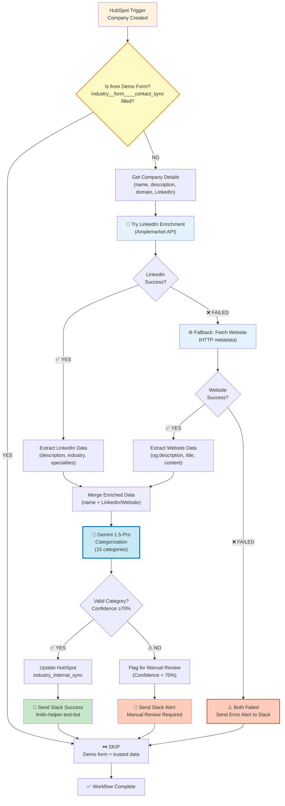

# HubSpot Company Industry Categorization - Architecture

## Overview

**Purpose**: Automatically categorize new companies added to HubSpot (excluding those added via demo form) into internal industry categories using AI-powered enrichment, and notify the team via Slack.

**Trigger**: When a new company is created in HubSpot (if NOT from demo form)
**Outcome**: Company is categorized into one of 15 internal categories based on LinkedIn + website data, and a Slack notification is sent

## Requirements

- ✅ HubSpot account with company creation events
- ✅ HubSpot custom property: `industry_internal_sync` (single-select with 15 options)
- ✅ HubSpot field check: `industry__form____contact_sync` (to skip demo form submissions)
- ✅ Google Gemini API key (Gemini 1.5-Pro for intelligent categorization)
- ✅ Amplemarket API key for LinkedIn company enrichment
- ✅ Slack workspace with access to post to a channel
- ✅ Internal industry categories defined and consistent

## Workflow Diagram



## Demo Form Check (Early Exit)

### 0. Check Demo Form Submission (n8n-nodes-base.if)
- **Purpose**: Skip categorization for companies added via demo form
- **Configuration**:
  - Condition: Check if `industry__form____contact_sync` is NOT empty
  - True Path: Stop workflow (don't categorize - form submission is trusted data)
  - False Path: Continue to company retrieval
- **Logic**:
  ```
  IF industry__form____contact_sync field exists:
    → User selected industry via form
    → Don't override their choice
    → Workflow ends (no categorization needed)
  ELSE:
    → Company created without form
    → Proceed with AI categorization
  ```

---

## Nodes Breakdown

### 1. HubSpot Trigger (n8n-nodes-base.hubspotTrigger)
- **Purpose**: Listen for new company creation events in HubSpot
- **Configuration**:
  - Credential: HubSpot OAuth2 API
  - Event: `company.creation`
  - Subscribed Events: Create webhook for company created events
- **Output**: New company object with all properties
- **Event Payload Example**:
  ```json
  {
    "objectId": "12345",
    "properties": {
      "name": "Acme Corporation",
      "industry": "Technology",
      "domain": "acme.com",
      "description": "Leading cloud software provider"
    }
  }
  ```

### 2. Get Company Details (n8n-nodes-base.hubspot)
- **Purpose**: Retrieve full company record with all available properties
- **Configuration**:
  - Operation: `Get Company`
  - Company ID: `{{ $json.objectId }}`
  - Include: All standard and custom properties
- **Output**: Complete company object with fields for categorization
- **Important Fields**:
  - `name` - Company name
  - `industry` - HubSpot industry (for reference)
  - `description` - Company description
  - `website` - Company website
  - `founded_year` - When company was founded
  - `number_of_employees` - Company size

### 3. Prepare Categorization Prompt (n8n-nodes-base.set)
- **Purpose**: Extract and format company data for AI analysis
- **Configuration**: Extract these fields as context:
  ```javascript
  {
    "companyName": "{{ $json.properties.name.value }}",
    "hubspotIndustry": "{{ $json.properties.industry.value || '' }}",
    "description": "{{ $json.properties.description.value || '' }}",
    "website": "{{ $json.properties.website.value || '' }}",
    "employees": "{{ $json.properties.numberofemployees.value || '' }}",
    "companyId": "{{ $json.id }}"
  }
  ```

### 5. LinkedIn Enrichment (n8n-nodes-base.httpRequest)
- **Purpose**: Fetch company data from LinkedIn via Amplemarket API
- **Configuration**:
  - URL: `https://api.amplemarket.com/api/v2/companies/search`
  - Method: POST
  - Authentication: Bearer token (from AMPLEMARKET_API_KEY env var)
  - Body: LinkedIn company page URL or company name
- **Output**: Company description, industry, specialties, employees
- **Error Handling**: If LinkedIn API times out or URL is invalid, continue to website enrichment
- **Fallback**: If success, use returned data; if failure, proceed to HTTP website fetch

### 6. Website Enrichment (n8n-nodes-base.httpRequest - Fallback)
- **Purpose**: Fetch website metadata if LinkedIn enrichment fails
- **Configuration**:
  - URL: Extract from HubSpot `website` field (website domain)
  - Method: GET
  - Parse response for: og:description, meta description, page title, content
- **Output**: Website metadata, company description from website
- **Error Handling**: If HTTP fetch fails, send error alert to Slack
- **Fallback Logic**: Use website data only if LinkedIn failed

### 7. AI Categorization (LangChain Google Gemini Chat Model)
- **Purpose**: Use Gemini 1.5-Pro to intelligently categorize company into internal categories
- **Configuration**:
  - Model: `gemini-1.5-pro` (most capable Gemini model for reasoning)
  - Temperature: 0.3 (deterministic, consistent results)
  - Max tokens: 100 (brief response - just category name)
  - Prompt Template:
    ```
    You are an expert business industry classifier with deep knowledge of B2B companies.

    TASK: Categorize this company into ONE of these 15 internal industry categories:
    1. Accounting | 2. Insurance | 3. Legal Services | 4. Technology | 5. Healthcare
    6. Public Sector | 7. Retail and Consumer Goods | 8. Consulting | 9. Construction
    10. Payroll and HR Services | 11. Banking | 12. Energy | 13. Financial Services
    14. Manufacturing | 15. Transportation

    AVAILABLE DATA:

    Company Name: {{ companyName }}

    Direct HubSpot Data:
    - Description: {{ description || 'Not provided' }}
    - About Us: {{ aboutUs || 'Not provided' }}
    - Keywords: {{ keywords || 'Not provided' }}

    LinkedIn Enrichment (via Amplemarket):
    - Description: {{ linkedIn.description || 'Not available' }}
    - Industry: {{ linkedIn.industry || 'Not available' }}
    - Specialties: {{ linkedIn.specialties || 'Not available' }}

    Website Enrichment (Fallback):
    - Meta Description: {{ website.description || 'Not available' }}
    - Page Title: {{ website.title || 'Not available' }}
    - Content Preview: {{ website.content || 'Not available' }}

    RULES:
    1. Analyze ALL available data to make the best decision
    2. Prioritize company description/mission over generic labels
    3. Look for keywords that indicate PRIMARY business (not tools they use)
    4. If company creates tech (software/SaaS) → Technology
    5. If company USES tech but does something else → Their actual industry
    6. Be decisive - pick ONE category that best fits
    7. If confidence < 70%, respond: "MANUAL_REVIEW_REQUIRED"

    Respond ONLY with the category name or "MANUAL_REVIEW_REQUIRED".
    Do NOT add explanations.
    ```

### 5. Validate Categorization (n8n-nodes-base.if)
- **Purpose**: Check if AI returned a valid category
- **Configuration**:
  - Condition: Check if response is one of the 15 valid categories
  - True Path: Continue to update HubSpot
  - False Path: Route to error handling
- **Valid Categories**:
  ```
  ["Accounting", "Insurance", "Legal Services", "Technology", "Healthcare",
   "Public Sector", "Retail and Consumer Goods", "Consulting", "Construction",
   "Payroll and HR Services", "Banking", "Energy", "Financial Services",
   "Manufacturing", "Transportation"]
  ```

### 6. Update HubSpot (n8n-nodes-base.hubspot)
- **Purpose**: Update the company record with the AI-determined category
- **Configuration**:
  - Operation: `Update Company`
  - Company ID: `{{ $json.companyId }}`
  - Properties to Update:
    ```javascript
    {
      "industry_internal_sync": "{{ $json.aiCategory }}"
    }
    ```
- **Output**: Confirmation of successful update

### 7. Error Handler (n8n-nodes-base.set)
- **Purpose**: Prepare error context for manual review
- **Triggered When**: AI cannot confidently categorize company
- **Configuration**: Flag for manual categorization
  ```javascript
  {
    "requiresManualReview": true,
    "companyId": "{{ $json.companyId }}",
    "companyName": "{{ $json.companyName }}",
    "reason": "AI unable to confidently categorize",
    "aiResponse": "{{ $json.aiResponse }}"
  }
  ```

### 8. Send Slack Notification (n8n-nodes-base.slack)
- **Purpose**: Notify team of categorization result
- **Configuration**:
  - Credential: Slack Bot Token
  - Resource: Message
  - Operation: Send
  - Channel: `#industry-sync` (or channel of your choice)
  - Message Format:
    ```
    ✅ Company Categorized Successfully

    Company: {{ companyName }}
    Category: {{ aiCategory }}
    HubSpot Industry: {{ hubspotIndustry }}

    View in HubSpot: https://app.hubspot.com/contacts/[PORTAL_ID]/company/{{ companyId }}
    ```
  - Error Format (when manual review needed):
    ```
    ⚠️ Manual Review Required

    Company: {{ companyName }}
    Reason: AI could not confidently categorize

    Original Industry: {{ hubspotIndustry }}
    AI Response: {{ aiResponse }}

    Please review and manually categorize this company.
    Link: https://app.hubspot.com/contacts/[PORTAL_ID]/company/{{ companyId }}
    ```

## Data Flow

**PRIORITY ORDER - Three-Tier Enrichment Strategy**

### Tier 1: Direct HubSpot Data (Most Reliable)
- Company name
- Description (company mission/goals)
- About Us (fallback if description empty)
- Keywords (vertical descriptors)

### Tier 2: Enriched Data (in priority order)
**Path A: LinkedIn Enrichment (Primary)**
1. Extract LinkedIn page URL from HubSpot
2. Call Amplemarket API with LinkedIn URL
3. Get: company description, industry, specialties, employees
4. ✅ If successful → Use LinkedIn data + HubSpot data

**Path B: Website Enrichment (Fallback)**
1. If LinkedIn fails → Extract website domain
2. HTTP request to fetch website metadata (og tags, title, meta description)
3. Get: website description, content preview
4. ✅ If successful → Use website data + HubSpot data

**Path C: Both Failed**
1. If LinkedIn AND website both fail → Send error alert to Slack
2. Include error type (API timeout, invalid URL, etc.)
3. Wait for team manual intervention
4. Do NOT update HubSpot or flag for categorization

### AI Categorization
- Gemini 1.5-Pro analyzes Tier 1 + Tier 2 data
- Determines best fit among 15 categories
- Validates confidence level (≥70% for auto-categorization)
- Flags if confidence < 70% for manual review

### Validation & Update
- Update `industry_internal_sync` if high confidence
- Flag for manual review if uncertain
- Send appropriate Slack notification
- Complete workflow

## Error Handling

**Strategy**: Graceful degradation with clear fallback paths

### LinkedIn Enrichment Failure
- Scenario: Amplemarket API timeout, invalid LinkedIn URL, API rate limit
- Action: Log error internally, proceed to website enrichment (fallback)
- Slack: No notification (this is expected fallback)

### Website Enrichment Failure
- Scenario: Website unreachable, no metadata available, timeout
- Action: If BOTH LinkedIn AND website fail → Send error alert to Slack
- Slack Notification: "⚠️ Enrichment Failed - Manual Review Required"
  - Include: Company name, error type, HubSpot link
  - Action: Team must manually categorize

### Categorization Failure
- Scenario: Gemini returns uncertain result (< 70% confidence)
- Action: Flag for manual review (don't update HubSpot)
- Slack Notification: "⚠️ Manual Review Required"
  - Include: Company name, available data, HubSpot link
  - Action: Team reviews and manually selects category

### HubSpot Update Failure
- Scenario: API error, field validation error, permission issue
- Action: Log error and continue (don't block workflow)
- Slack Notification: "❌ HubSpot Update Failed"
  - Include: Company name, error details, HubSpot link
  - Action: Team investigates

### Slack Notification Failure
- Scenario: Slack API error, bot permissions issue
- Action: Log error but don't block workflow
- Rationale: Notification is informational; categorization already complete

### Retry Strategy
- LinkedIn/Website HTTP requests: Retry 1 time on timeout (don't retry on API errors)
- No retry for Gemini (API is reliable)
- No retry for HubSpot updates (inspect error and alert team)

## Dependencies

### Credentials Required

- **HubSpot OAuth2 API**
  - Scopes: `crm.objects.companies.read`, `crm.objects.companies.write`
  - Webhook permissions: `company.creation` events
  - Status: ✅ Already configured in n8n

- **Google Gemini API**
  - Model Access: Gemini 1.5-Pro
  - API Key with appropriate rate limits
  - Status: ⚠️ Need to configure in n8n (Google AI Studio)

- **Amplemarket API**
  - API Key: `amp_609d6e04d9175091e6c6` (stored in .env)
  - Used for: LinkedIn company enrichment
  - Status: ✅ Configured in .env file

- **Slack Bot Token**
  - Permissions: `chat:write` (send messages)
  - Channel access to `#n8n-helper-test-bot` (for notifications)
  - Status: ✅ Already configured in n8n

### External Services

- **HubSpot**: https://app.hubspot.com (company creation events)
- **OpenAI API**: https://api.openai.com (GPT categorization)
- **Slack Workspace**: Your Slack instance (notifications)

### HubSpot Custom Property Setup

Before deploying, create this custom property in HubSpot:

1. Go to **Settings → Data Management → Properties → Companies**
2. Create a new property:
   - **Property Name**: `industry_internal_sync`
   - **Label**: Industry Internal Sync
   - **Type**: Enumeration (dropdown/single-select)
   - **Values**:
     ```
     Accounting
     Insurance
     Legal Services
     Technology
     Healthcare
     Public Sector
     Retail and Consumer Goods
     Consulting
     Construction
     Payroll and HR Services
     Banking
     Energy
     Financial Services
     Manufacturing
     Transportation
     ```
   - **Display Order**: Alphabetical or custom
   - **Visibility**: Internal (hide from public forms)
3. Click **Create Property**

## Testing Strategy

### Test Case 1: Technology Company
- **Input**: Company in Technology industry
- **Expected**: `industry_internal_sync` = "Technology"
- **Verification**: Check HubSpot record, verify Slack message received

### Test Case 2: Ambiguous Company
- **Input**: Generic services company with vague description
- **Expected**: Manual review flag sent to Slack
- **Verification**: Team reviews and manually categorizes

### Test Case 3: Multiple Data Points
- **Input**: Company with name, description, website, employee count
- **Expected**: AI uses all available data to make confident decision
- **Verification**: Categorization matches company's actual industry

### Error Scenarios
1. **Missing Description**: Workflow should still categorize based on name/industry
2. **API Timeout**: Retry logic should kick in (max 3 attempts)
3. **Invalid Category Response**: Trigger manual review flag
4. **HubSpot Connection Failure**: Log error and alert team

## Deployment Plan

### Pre-Deployment Checklist
- [ ] OpenAI API key configured and has GPT-4o access
- [ ] HubSpot custom property `industry_internal_sync` created with 15 values
- [ ] HubSpot OAuth2 credentials configured
- [ ] Slack bot token configured with `chat:write` permission
- [ ] Slack channel `#industry-sync` created (or use existing)
- [ ] Test HubSpot trigger webhook is working
- [ ] Reviewed category definitions with team

### Deployment Steps
1. Create HubSpot custom property (see above)
2. Import workflow to n8n
3. Configure all credentials (HubSpot, OpenAI, Slack)
4. Update Slack channel name if different
5. Update HubSpot portal ID in Slack message links
6. Run test with sample company
7. Verify categorization is correct
8. Check Slack notification was received
9. Enable workflow (set Active = true)
10. Monitor first 10 companies for quality

### Post-Deployment Validation
- [ ] First company categorized successfully
- [ ] Slack notification received with correct category
- [ ] HubSpot `industry_internal_sync` property populated
- [ ] No errors in n8n execution logs
- [ ] Team confirms categorization is accurate

### Rollback Plan
If issues occur:
1. Disable workflow in n8n UI
2. Investigate error logs in n8n
3. Review failed company in HubSpot
4. Check OpenAI response format
5. Fix issue and test with sample data
6. Re-enable workflow

## Trade-offs & Architectural Decisions

### Decision 1: Gemini 1.5-Pro for Categorization
- **Chosen**: Gemini 1.5-Pro (smarter Gemini model)
- **Alternative**: GPT-4o, GPT-4-turbo, Claude
- **Rationale**: Capable reasoning for nuanced classification, cost-effective
- **Trade-off**: Different model than GPT, but excellent for this task

### Decision 2: LinkedIn First, Website Second (Amplemarket + HTTP Fallback)
- **Chosen**: Amplemarket for LinkedIn, HTTP fetch for website as fallback
- **Alternative**: Clearbit enrichment only, no LinkedIn
- **Rationale**: LinkedIn data is most reliable; website as fallback increases success rate
- **Trade-off**: Two enrichment attempts add slight latency, but maximize data quality
- **Error Handling**: If both fail, flag for manual review (don't guess)

### Decision 3: Skip HubSpot Employee Count & Industry
- **Chosen**: Don't use HubSpot industry field or employee count
- **Alternative**: Use HubSpot data as tiebreaker
- **Rationale**: These fields are often inaccurate; rely only on enriched data
- **Trade-off**: Might miss some contextual information, but improves accuracy

### Decision 4: Skip Demo Form Companies
- **Chosen**: Don't categorize if `industry__form____contact_sync` is filled
- **Alternative**: Always categorize, let user override later
- **Rationale**: Users who submit demo form have already selected industry; respect their choice
- **Trade-off**: Slightly fewer companies categorized, but preserves user intent

### Decision 5: Real-time vs Scheduled
- **Chosen**: Real-time (webhook trigger on company creation)
- **Alternative**: Daily batch processing
- **Rationale**: Immediate categorization ensures data is current; team sees updates in real-time
- **Trade-off**: More API calls but better user experience

### Decision 6: Flag Uncertain vs Force Decision
- **Chosen**: Flag for manual review if confidence < 70%
- **Alternative**: Force AI to pick best guess even if uncertain
- **Rationale**: Better data quality; manual review ensures accuracy
- **Trade-off**: Slight manual overhead but maintains data integrity

## Estimated Complexity

- **Setup Time**: 15-20 minutes
  - Create HubSpot custom property (5 min)
  - Configure credentials (5 min)
  - Import and test workflow (5-10 min)

- **Complexity Level**: Medium
  - Standard HubSpot trigger and update
  - AI integration (straightforward with OpenAI)
  - Slack notification (simple)

- **Node Count**: 8 nodes
  - 1 Trigger (HubSpot)
  - 4 Processing (Get Details, Set Prompt, AI, Validate)
  - 2 Action (Update HubSpot, Slack)
  - 1 Error Handler (Set)

- **Maintenance**: Low
  - Update category list if needed
  - Monitor Slack channel for misclassifications
  - Adjust OpenAI prompt if needed (quarterly review)

## Version History

- **v1.0.0** (2026-02-15): Initial architecture design
  - Core workflow: HubSpot → AI Categorization → HubSpot Update → Slack Notification
  - Support for 15 internal industry categories
  - Error handling for uncertain categorizations
  - Manual review pathway
