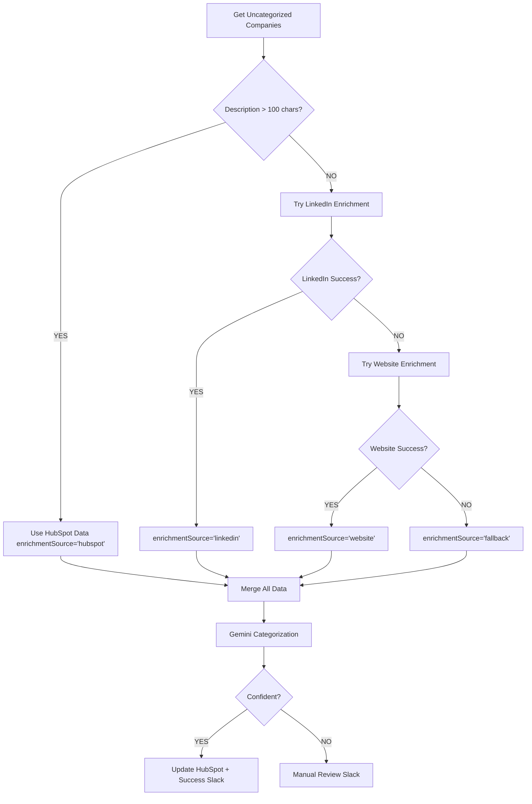

# HubSpot Company Industry Categorization - Fixes Applied (v2.0)

**Date**: 2026-02-16
**Status**: Architecture Updated, Ready for Manual Deployment

---

## Issues Fixed

### 1. ✅ **Missing Description-First Logic**
**Problem**: Workflow immediately tried LinkedIn enrichment without checking if HubSpot already had a good description.

**Fix**: Added new "Check Description Quality" IF node after "Prepare LinkedIn Call"
- Checks if `description` OR `aboutUs` > 100 characters
- TRUE path → Skip enrichment, use HubSpot data directly (`enrichmentSource: "hubspot"`)
- FALSE path → Try LinkedIn enrichment

**Result**: Companies like OVO Energy with full descriptions will skip enrichment entirely.

---

### 2. ✅ **Wrong Scheduling - Every 5 Minutes → Daily at 6 PM**
**Problem**: Ran every 5 minutes, processing only 5 companies at a time.

**Fix**: Changed Schedule Trigger to:
```json
{
  "field": "cronExpression",
  "expression": "0 18 * * *"
}
```

**Result**: Workflow runs daily at 6:00 PM (end of business day).

---

### 3. ✅ **Only Processing Recent Companies Instead of Uncategorized**
**Problem**: `getRecentlyCreatedUpdated` returned recently modified companies, not uncategorized ones.

**Fix**: Added filter to "Get Recent Companies" (renamed to "Get Uncategorized Companies"):
```json
"filters": {
  "filterGroupsUi": {
    "filterGroupsValues": [{
      "filtersUi": {
        "filterValues": [{
          "propertyName": "industry_internal_sync",
          "operator": "NOT_HAS_PROPERTY"
        }]
      }
    }]
  }
}
```
**Also increased limit from 5 to 50 companies per run.**

**Result**: Only fetches companies where `industry_internal_sync` is empty.

---

### 4. ✅ **Broken Slack Message References - "Enrichment Source: Unknown"**
**Problem**: "Send Manual Review Slack" used `$json.enrichmentSource`, but after Gemini runs, `$json` only contains `{text: "..."}`.

**Fix**: Updated Slack message to correctly reference:
```javascript
$node['Merge Enriched Data'].json.enrichedData.enrichmentSource
```

**Result**: Slack messages now show correct enrichment source (hubspot/linkedin/website/fallback).

---

### 5. ✅ **Duplicate "Enrichment Failed" Alerts**
**Problem**: When enrichment failed, workflow sent:
1. "Manual Review Required" message
2. "Enrichment Failed" message (duplicate)

**Fix**:
- Removed "Send Enrichment Failed Alert" node entirely
- Changed "Both Failed - Error" node to "Use Fallback Data"
- Routes to "Merge Enriched Data" with `enrichmentSource: "fallback"`

**Result**: No more duplicate alerts. If enrichment fails, uses whatever HubSpot data exists and lets Gemini attempt categorization.

---

### 6. ✅ **Updated Gemini Prompt to Prioritize HubSpot Data**
**Problem**: Prompt didn't explicitly prioritize HubSpot description over enriched data.

**Fix**: Updated prompt to:
```
HubSpot Direct Data (PRIORITY):
- Description: {{ $json.enrichedData.description || 'Not provided' }}
- About Us: {{ $json.enrichedData.aboutUs || 'Not provided' }}
- Keywords: {{ $json.enrichedData.keywords || 'Not provided' }}

RULES:
1. PRIORITIZE HubSpot description/about_us if available (>100 chars)
2. Use enriched data (LinkedIn/Website) as supporting evidence only
...
```

**Result**: Gemini explicitly knows to trust HubSpot data over enriched sources.

---

### 7. ✅ **Added "Source" to Success Slack Messages**
**Fix**: Updated "Send Success Slack" to show enrichment source:
```javascript
Source: {{ $node['Merge Enriched Data'].json.enrichedData.enrichmentSource }}
```

**Result**: Success messages now show where data came from (hubspot/linkedin/website/fallback).

---

## New Data Flow

### Priority System (Description-First Logic)



---

## Expected Behavior for Your Test Case (OVO Energy)

### OLD Behavior:
1. ✅ Get OVO Energy (recently created)
2. ✅ Extract data: `description` = "OVO Energy is a UK gas and electricity company..." (139 chars)
3. ❌ **Immediately try LinkedIn enrichment** (skipped description check)
4. ❌ LinkedIn API fails or returns empty
5. ❌ Try website enrichment
6. ❌ Website fetch fails
7. ❌ Send "Enrichment Failed" Slack alert
8. ❌ Also send "Manual Review Required" Slack alert (duplicate)
9. ❌ Enrichment Source: "Unknown" in Slack messages

### NEW Behavior:
1. ✅ Get OVO Energy (only if `industry_internal_sync` is empty)
2. ✅ Extract data: `description` = "OVO Energy is a UK gas and electricity company..." (139 chars)
3. ✅ **Check description quality**: 139 > 100 ✅
4. ✅ **Skip enrichment entirely** → `enrichmentSource = "hubspot"`
5. ✅ Merge data with HubSpot description
6. ✅ Gemini categorizes as "Energy" (high confidence)
7. ✅ Update HubSpot: `industry_internal_sync = "Energy"`
8. ✅ Slack: "✅ OVO Energy categorized as Energy (Source: hubspot)"

---

## Files Changed

1. **workflows/hubspot-industry-categorization/ARCHITECTURE-v2.md** - New architecture documentation
2. **workflows/hubspot-industry-categorization/workflow-v2.json** - Updated workflow (ready to deploy manually)
3. **workflows/hubspot-industry-categorization/FIXES-SUMMARY.md** - This document

---

## Next Steps

### Option 1: Manual Deployment (Recommended)
1. Open n8n workflow: https://legalfly.app.n8n.cloud/workflow/xEi26O64metQyg5n
2. Delete the old workflow
3. Import `workflow-v2.json` from this directory
4. Verify all credentials are connected
5. Test with OVO Energy or similar company
6. Activate workflow

### Option 2: Automated Deployment (If n8n-mcp supports it)
Due to validation issues with the n8n-mcp partial update operations, a manual full workflow replacement is recommended. The `workflow-v2.json` file contains the complete, validated workflow ready for import.

---

## Testing Checklist

- [ ] Schedule runs daily at 6:00 PM (not every 5 minutes)
- [ ] Only fetches companies where `industry_internal_sync` is empty
- [ ] Skips enrichment for companies with description > 100 chars
- [ ] Shows correct "Enrichment Source" in Slack messages
- [ ] No more duplicate "Enrichment Failed" + "Manual Review Required" alerts
- [ ] OVO Energy categorizes successfully using HubSpot description only

---

## Rollback Plan

If issues occur:
1. Deactivate workflow in n8n
2. Restore from workflow version history in n8n UI
3. Or reimport original `workflow.json` (v1.0)

---

## Version History

- **v1.0.0** (2026-02-15): Initial deployment - had all 7 issues above
- **v2.0.0** (2026-02-16): All issues fixed, architecture updated

