# HubSpot Company Industry Categorization

This workflow automatically classifies newly created HubSpot companies into one of 16 industry categories using AI (Google Gemini). It runs every night, fetches all companies created the previous day using paginated API calls, researches each company using whatever information is available, and writes the result back to HubSpot — then sends a Slack summary of everything it processed.

---

## Why it exists

When a new company is created in HubSpot, the internal industry category (`industry__internal_`) often gets left blank. Filling this in manually is slow and inconsistent. This workflow handles it automatically overnight, so the CRM stays clean without anyone having to think about it.

---

## When it runs

Every day at **12:01 AM**, it picks up all companies created **the previous day** and processes them.

---

## What it does, step by step

### 1. Fetch yesterday's companies (with pagination)
Queries HubSpot for all companies with a creation date in the previous 24-hour window. Uses cursor-based pagination (200 companies per page) to ensure every company is captured regardless of daily volume. Pages are accumulated into a single list before processing begins.

### 2. Skip self-categorized companies
If a company already has a value in `industry__form____contact_sync` — meaning the person who filled in the demo form already identified their industry — the workflow skips it silently. No point overwriting something the customer already told us.

### 3. Research each company
For every remaining company, the workflow tries to gather enough information to classify it. It works through four sources in order, moving to the next if the current one doesn't yield useful data:

```mermaid
flowchart TD
    Start([Schedule Trigger\nmidnight daily])

    Start --> InitState["🔧 Initialize State\nCode node - {after: null, allCompanies: []}"]
    InitState --> PassState["Pass State\nCode node"]
    PassState --> FetchPage["🔍 Fetch Companies Page\nHubSpot API - limit 200 + cursor"]
    FetchPage --> Accumulate["Accumulate Results\nCode node - merge pages"]
    Accumulate --> IfMore{"IF Has More Pages\nafter cursor not empty?"}
    IfMore -->|"YES - loop back"| PassState
    IfMore -->|"NO - all fetched"| SplitAll["✂️ Split All Companies\nCode node - one item per company"]

    SplitAll --> CheckDemo{"Check Demo Form\nindustry__form____contact_sync filled?"}

    CheckDemo -->|"YES - filled, skip"| SkipFlow["⏭️ Silent Skip\nNo connection"]
    CheckDemo -->|"NO - empty, proceed"| GetDetails["📋 Get Company Details\nHubSpot node"]

    GetDetails --> PrepareData["📊 Prepare Company Data\nSet node - normalize fields"]

    PrepareData --> CheckDesc{"Check Description Exists\nlength ≥ 100 chars?"}

    %% PATH 1: HubSpot Description
    CheckDesc -->|"YES"| PrepHS["Prepare Gemini Input\n─ HubSpot ─\nCode node"]
    PrepHS --> GeminiHS["🤖 Gemini Categorization\n─ HubSpot ─\ngemini-2.5-flash"]
    GeminiHS --> ParseHS["Parse Gemini Response\n─ HubSpot ─"]
    ParseHS --> PreservePreUpdate

    %% PATH 2: LinkedIn
    CheckDesc -->|"NO"| CheckLIURL{"Check Has LinkedIn URL\nlinkedinUrl not empty?"}
    CheckLIURL -->|"YES"| AmpleAPI["🔗 Amplemarket LinkedIn API\nGET /companies/find\n?linkedin_url=..."]
    CheckLIURL -->|"NO"| CheckDomain

    AmpleAPI --> CheckLIData{"Check LinkedIn Data Retrieved\nname or domain not empty?"}
    CheckLIData -->|"YES"| PrepLI["Prepare Gemini Input\n─ LinkedIn ─\nCode node"]
    PrepLI --> GeminiLI["🤖 Gemini Categorization\n─ LinkedIn ─\ngemini-2.5-flash"]
    GeminiLI --> ParseLI["Parse Gemini Response\n─ LinkedIn ─"]
    ParseLI --> PreservePreUpdate
    CheckLIData -->|"NO"| CheckDomain

    %% PATH 3: Website Scraping
    CheckDomain{"Check Has Domain\ndomain not empty?"}
    CheckDomain -->|"YES"| WebScrape["🌐 Website Scraping\nJina Reader\nr.jina.ai/domain"]
    WebScrape --> CheckWebData{"Check Website Data Retrieved\ndata not empty?"}
    CheckWebData -->|"YES"| PrepWeb["Prepare Gemini Input\n─ Website ─\nCode node"]
    PrepWeb --> GeminiWeb["🤖 Gemini Categorization\n─ Website ─\ngemini-2.5-flash"]
    GeminiWeb --> ParseWeb["Parse Gemini Response\n─ Website ─"]
    ParseWeb --> PreservePreUpdate

    %% PATH 4: Jina Search (final fallback)
    CheckDomain -->|"NO"| JinaSearch
    CheckWebData -->|"NO"| JinaSearch["🔎 Jina Search\nDuckDuckGo via Jina Reader\nr.jina.ai/duckduckgo?q=companyName"]
    JinaSearch --> PrepSearch["Prepare Gemini Input\n─ Search ─\nCode node"]
    PrepSearch --> GeminiSearch["🤖 Gemini Categorization\n─ Search ─\ngemini-2.5-flash"]
    GeminiSearch --> ParseSearch["Parse Gemini Response\n─ Search ─"]
    ParseSearch --> PreservePreUpdate

    %% Convergence
    PreservePreUpdate["📋 Preserve Pre-Update Data\nSet node - snapshot before HubSpot write"]
    PreservePreUpdate --> UpdateHS["✏️ Update HubSpot\nindustry__internal_"]
    UpdateHS --> Preserve["Preserve Result Data\nCode node"]
    Preserve --> Aggregate["📦 Aggregate All Results"]
    Aggregate --> FormatSummary["Format Summary Message\nCode node"]
    FormatSummary --> SlackSummary["💬 Send Summary Slack\nDaily digest - channel D0ADELD95GR"]
    SlackSummary --> Complete(["✅ Workflow Complete"])
```

**Path 1 — HubSpot description** *(best source)*
If the company's HubSpot description is at least 100 characters long, the workflow uses that directly. It's the richest and most reliable signal.

**Path 2 — LinkedIn data via Amplemarket**
If there's no usable description but there's a LinkedIn company page URL, the workflow calls the Amplemarket API to retrieve structured LinkedIn data: company overview, industry tag, and keywords.

**Path 3 — Website scraping**
If LinkedIn isn't available but the company has a domain, the workflow fetches the company's website using Jina Reader, which returns a clean text version of the homepage. That content is used for classification.

**Path 4 — Web search** *(last resort)*
If there's no domain either, the workflow runs a DuckDuckGo search for the company name and feeds the search results to the AI. Even with very little information, this usually produces a reasonable classification.

### 4. Classify with Gemini
Whichever path produces data, it gets sent to **Google Gemini 2.5 Flash** with a structured prompt asking it to pick exactly one of the 16 categories below. The temperature is set low (0.3) to keep responses consistent and predictable.

### 5. Update HubSpot
The AI's answer is written back to the company record in HubSpot under the `industry__internal_` property.

### 6. Send a Slack summary
At the end of each run, a single Slack message is sent to the configured channel listing every company that was processed — with its name, the category assigned, which data source was used, and a direct link to the HubSpot record.

---

## Industry categories

The workflow classifies companies into one of these 16 categories:

| # | Category |
|---|----------|
| 1 | Accounting |
| 2 | Insurance |
| 3 | Legal Services |
| 4 | Technology |
| 5 | Healthcare |
| 6 | Public Sector |
| 7 | Retail and Consumer Goods |
| 8 | Consulting |
| 9 | Construction |
| 10 | HR and Payroll Services |
| 11 | Banking |
| 12 | Energy |
| 13 | Financial Services |
| 14 | Manufacturing |
| 15 | Transportation |
| 16 | Others |

> **Note:** "Others" is stored internally in HubSpot as `Unknown` (matching the enum value), but displayed as "Others" in Slack messages.

---

## Credentials required

| Service | What it's used for |
|---------|-------------------|
| HubSpot | Read company data, write the industry category |
| Google Gemini | AI classification |
| Amplemarket | LinkedIn company data lookup |
| Slack | Daily summary message |

---

## Files in this folder

| File | Purpose |
|------|---------||
| `workflow-v3.3.json` | The n8n workflow export — source of truth |
| `ARCHITECTURE-v3.3.md` | Full technical reference: all nodes, routing logic, design decisions |
| `architecture.mmd` | Mermaid diagram source |
| `prompts/prompt-hubspot.md` | Gemini prompt used when classifying from HubSpot description |
| `prompts/prompt-linkedin.md` | Gemini prompt used when classifying from LinkedIn data |
| `prompts/prompt-website.md` | Gemini prompt used when classifying from website content |
| `prompts/prompt-search.md` | Gemini prompt used when classifying from web search results |

---

## n8n instance

**Workflow ID**: `8DM3CwXLxOT3G8B7`
**URL**: [https://legalfly.app.n8n.cloud/workflow/8DM3CwXLxOT3G8B7](https://legalfly.app.n8n.cloud/workflow/8DM3CwXLxOT3G8B7)
