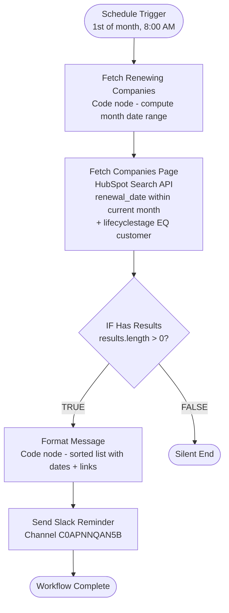

# HubSpot Monthly Renewal Reminder v1.0 - Architecture

## Overview

Monthly workflow that sends a Slack digest of all customer companies with a contract renewal date in the current month. Runs on the 1st of each month at 8:00 AM UTC. If no companies are renewing, the workflow ends silently.

**Workflow ID**: `BKMGY6W4ZHwawdeG`
**n8n URL**: `https://legalfly.app.n8n.cloud/workflow/BKMGY6W4ZHwawdeG`
**Status**: Inactive (ready to activate)

---

## Workflow Diagram

---

## Node Reference

### Schedule Trigger (`schedule-trigger`)
- **Type**: scheduleTrigger v1.3
- **Purpose**: Fires monthly
- **Config**: Cron `0 8 1 * *` (1st of every month at 8:00 AM UTC)

### Fetch Renewing Companies (`fetch-renewing`)
- **Type**: code v2
- **Purpose**: Calculates the current month's date range as epoch-ms timestamps
- **Config**: Computes `firstOfMonth` and `firstOfNextMonth` using `Date.UTC`. Also formats `monthName` for the Slack message header.
- **Output**: `{ firstOfMonth, firstOfNextMonth, monthName }`

### Fetch Companies Page (`fetch-page`)
- **Type**: httpRequest v4.2
- **Purpose**: Queries HubSpot for companies renewing this month
- **Config**:
  - POST `https://api.hubapi.com/crm/v3/objects/companies/search`
  - Filters: `contract___renewal_date GTE firstOfMonth` AND `contract___renewal_date LT firstOfNextMonth` AND `lifecyclestage EQ customer`
  - Properties: `name`, `contract___renewal_date`
  - Limit: 200
  - Auth: `hubspotAppToken` (credential: `hubspot`)
- **Output**: HubSpot search results

### IF Has Results (`if-has-results`)
- **Type**: if v2.3
- **Purpose**: Skips Slack notification if no companies are renewing
- **Config**: `($json.results || []).length > 0`
- **TRUE output**: Format Message
- **FALSE output**: Silent end (no connection)

### Format Message (`format-message`)
- **Type**: code v2
- **Purpose**: Builds a Slack-formatted digest
- **Config**:
  - Reads results from `$('Fetch Companies Page')`
  - Parses renewal dates, sorts chronologically
  - Formats each company as: `name -- date -- HubSpot link`
  - Header includes month name and company count
- **Output**: `{ message }` for Slack

### Send Slack Reminder (`slack-reminder`)
- **Type**: slack v2.4
- **Purpose**: Posts the monthly digest to Slack
- **Config**:
  - Resource: message, Operation: post
  - Channel: `C0APNNQAN5B` (by ID)
  - Text: `{{ $json.message }}`
  - Auth: `slackApi` (credential: `Slack`)

---

## Complete Node List

| ID | Name | Type |
|----|------|------|
| schedule-trigger | Schedule Trigger | scheduleTrigger |
| fetch-renewing | Fetch Renewing Companies | code |
| fetch-page | Fetch Companies Page | httpRequest |
| if-has-results | IF Has Results | if |
| format-message | Format Message | code |
| slack-reminder | Send Slack Reminder | slack |
| sticky-overview | Sticky: Overview | stickyNote |
| sticky-slack | Sticky: Slack | stickyNote |

**Total**: 8 nodes (6 functional + 2 sticky notes)

---

## Credentials Required

| Service | Credential Name | Type |
|---------|----------------|------|
| HubSpot | `hubspot` | hubspotAppToken |
| Slack | `Slack` | slackApi |

---

## Key Design Decisions

- **8:00 AM UTC**: Business hours so the team sees the reminder right away at the start of the month.
- **Date range filter on HubSpot**: Queries `contract___renewal_date` directly with GTE/LT on the current month boundaries. Independent of the calculator workflow — doesn't rely on `days_until_next_renewal` being already updated.
- **Sorted by date**: Companies listed chronologically so the earliest renewals appear at the top for prioritization.
- **Silent when empty**: If no companies are renewing this month, the workflow ends without posting. No noise in Slack.
- **No pagination**: Unlikely to have >200 companies renewing in a single month. If this becomes an issue in the future, pagination can be added following the same cursor-based pattern as the calculator workflow.
- **Error workflow**: Linked to `TA6Iq4wMW0KYsCiH` (shared error handler). Crashes auto-post to errors Slack channel.
