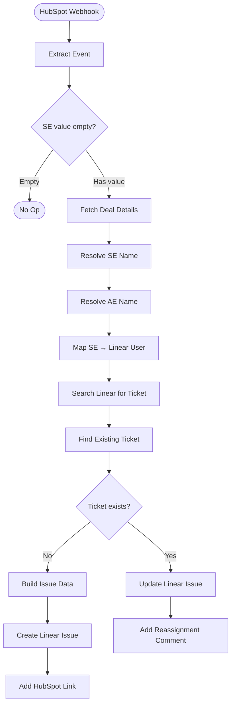

# HubSpot SE Assignment → Linear Ticket — Architecture v1.1

## Overview

When a Solutions Engineer is assigned to a HubSpot deal (via the `solutions_engineer` property), this workflow creates a Linear ticket in the Solutions Engineering team backlog. If the SE changes on a deal that already has a ticket, it updates the assignee and adds a reassignment comment.

Triggered via HubSpot Private App webhook subscription (configured manually in the developer portal).

## Workflow Diagram

## Node Reference

### HubSpot Webhook (`webhook-trigger`)
- **Type**: n8n-nodes-base.webhook v2.1
- **Purpose**: Receives POST from HubSpot when `solutions_engineer` changes on a deal
- **Path**: `/hubspot-se-assignment`
- **Mode**: Respond immediately (200 OK on receive)

### Extract Event (`extract-event`)
- **Type**: n8n-nodes-base.code v2
- **Purpose**: HubSpot sends events as an array — extracts the first event
- **Output**: `objectId`, `propertyName`, `propertyValue`, `portalId`, `changeSource`

### SE Empty Guard (`guard-se-empty`)
- **Type**: n8n-nodes-base.if v2.3
- **Condition**: `propertyValue` is not empty
- **TRUE** → continue | **FALSE** → Stop

### Fetch Deal Details (`fetch-deal`)
- **Type**: n8n-nodes-base.httpRequest v4.4
- **URL**: `https://api.hubapi.com/crm/v3/objects/deals/{{objectId}}?properties=dealname,dealstage,amount,potential_amount,closedate,hubspot_owner_id,solutions_engineer`
- **Auth**: hubspotAppToken (predefined credential)
- **Retry**: 3 attempts, 1s between

### Resolve SE Name (`resolve-se`)
- **Type**: n8n-nodes-base.httpRequest v4.4
- **URL**: `https://api.hubapi.com/crm/v3/owners/{{solutions_engineer}}`
- **Output**: SE `firstName`, `lastName`

### Resolve AE Name (`resolve-ae`)
- **Type**: n8n-nodes-base.httpRequest v4.4
- **URL**: `https://api.hubapi.com/crm/v3/owners/{{hubspot_owner_id}}` (referenced from Fetch Deal Details node)
- **Output**: AE `firstName`, `lastName`

### Map SE → Linear User (`map-linear-user`)
- **Type**: n8n-nodes-base.code v2
- **Purpose**: Match HubSpot SE ID to Linear user ID using hardcoded mapping
- **Mapping**:

| HubSpot SE | HubSpot ID | Linear User ID |
|---|---|---|
| Harry Day | 1891381453 | `127d293c-86a5-439d-be0e-31e59022e840` |
| Anastasia Screve | 29995860 | `633f0c0d-c45d-4fa1-b75d-0cced134efe3` |
| Stephanie Adriaens | 32163999 | `1f66b0f0-3476-43dc-8c99-1899dcf4f79a` |

- **Fallback**: If no match, `linearUserId` is null (ticket created unassigned)

### Search Linear for Ticket (`search-linear`)
- **Type**: n8n-nodes-base.httpRequest v4.4
- **Method**: POST to `https://api.linear.app/graphql`
- **Auth**: linearApi (predefined credential)
- **Query**: `attachments` filtered by URL containing `deal/{{dealId}}`
- **Returns**: Issues with matching HubSpot link attachments

### Find Existing Ticket (`filter-exact-match`)
- **Type**: n8n-nodes-base.code v2
- **Purpose**: Filters attachment search results to issues belonging to Solutions Engineering team
- **Output**: `{ existingIssue, found }` — the matched issue or null

### Ticket Exists? (`ticket-exists`)
- **Type**: n8n-nodes-base.if v2.3
- **Condition**: `found` is true
- **TRUE** → Update path | **FALSE** → Create path

### Build Issue Data (`build-issue-data`)
- **Type**: n8n-nodes-base.code v2
- **Title format**: `{{dealName}} ({{amountAbbr}}) — SE support`
- **Description**: Deal details, AE owner, HubSpot link, `hs-deal-id:` tag

### Create Linear Issue (`create-issue`)
- **Type**: n8n-nodes-base.linear v1.1
- **Team**: Solutions Engineering (`fa68a3c7-fcbe-407e-8d66-94b572c31522`)
- **State**: Backlog (`3a018a5f-a622-41f6-b989-f63dfc3a9d99`)

### Add HubSpot Link (`add-link`)
- **Type**: n8n-nodes-base.linear v1.1
- **Link**: `https://app.hubspot.com/contacts/142047914/deal/{{dealId}}`

### Update Linear Issue (`update-issue`)
- **Type**: n8n-nodes-base.linear v1.1
- **Updates**: assigneeId → new SE's Linear user ID

### Add Reassignment Comment (`add-comment`)
- **Type**: n8n-nodes-base.linear v1.1
- **Comment**: `SE reassigned: {{previous}} → {{new}} (updated from HubSpot)`

## Routing Logic

- **SE Empty Guard**: TRUE (has value) → main flow; FALSE (empty/removed) → Stop
- **Ticket Exists?**: TRUE (attachment match found) → Update + Comment; FALSE → Create + Link

## Error Handling

- HTTP Request nodes: `retryOnFail: true`, 3 attempts, 1s between retries
- Error workflow: `TA6Iq4wMW0KYsCiH` — all unhandled errors forwarded for alerting

## Design Decisions

1. **Webhook node instead of HubSpot Trigger** — HubSpot Private Apps don't support the Developer API credential that the native trigger node requires. Manual webhook subscription via the developer portal works reliably.
2. **Attachment-based dedup** — Searches Linear's `attachments` API for issues with a HubSpot link containing the deal ID. More reliable than description text search since attachments can't be accidentally edited.
3. **Hardcoded SE mapping by HubSpot ID** — Only 3 SEs in the team. Easy to update in the Code node when team changes.
4. **Guard for empty SE** — Prevents orphan tickets when an SE is removed from a deal.
5. **Linear native node for CRUD, HTTP Request for GraphQL** — The Linear node doesn't support attachment queries, so GraphQL is used for the search.

## Credentials Required

| Service | Credential Type | Used By |
|---|---|---|
| HubSpot | hubspotAppToken (`5ww8XNGf4HTQu4UI`) | HTTP Request nodes |
| Linear | linearApi (`Hy0y7IGsd1kE4waU`) | Linear nodes + GraphQL search |

**Required HubSpot scope**: `crm.objects.owners.read`

## n8n Instance

- **Workflow ID**: `UNU5IniUPrnckW91`
- **URL**: https://legalfly.app.n8n.cloud/workflow/UNU5IniUPrnckW91
