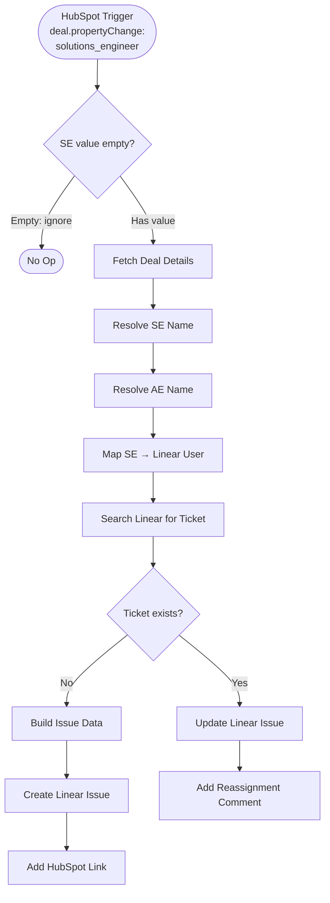

# HubSpot SE Assignment → Linear Ticket — Architecture v1.0

## Overview

When a Solutions Engineer is assigned to a HubSpot deal (via the `solutions_engineer` property), this workflow creates a Linear ticket in the Solutions Engineering team backlog. If the SE changes on a deal that already has a ticket, it updates the assignee and adds a reassignment comment.

## Workflow Diagram

## Node Reference

### HubSpot Trigger (`hs-trigger`)
- **Type**: n8n-nodes-base.hubspotTrigger v1
- **Purpose**: Fires when `solutions_engineer` property changes on any deal
- **Event**: `deal.propertyChange` → property: `solutions_engineer`
- **Output**: `objectId` (deal ID), `propertyValue` (new SE's HubSpot user ID), `portalId`
- **Credentials**: hubspotDeveloperApi

### SE Empty Guard (`guard-se-empty`)
- **Type**: n8n-nodes-base.if v2.3
- **Purpose**: Skip processing if SE was removed from the deal (value cleared)
- **Condition**: `$json.propertyValue` is not empty
- **TRUE** → continue to Fetch Deal Details
- **FALSE** → Stop (No Op)

### Stop (`stop-no-op`)
- **Type**: n8n-nodes-base.noOp v1
- **Purpose**: Terminal node for ignored events

### Fetch Deal Details (`fetch-deal`)
- **Type**: n8n-nodes-base.httpRequest v4.4
- **URL**: `https://api.hubapi.com/crm/v3/objects/deals/{{objectId}}?properties=dealname,dealstage,amount,potential_amount,closedate,hubspot_owner_id,solutions_engineer`
- **Auth**: hubspotAppToken (predefined credential)
- **Retry**: 3 attempts, 1s between
- **Output**: Full deal properties

### Resolve SE Name (`resolve-se`)
- **Type**: n8n-nodes-base.httpRequest v4.4
- **URL**: `https://api.hubapi.com/crm/v3/owners/{{solutions_engineer}}`
- **Auth**: hubspotAppToken
- **Output**: SE `firstName`, `lastName`

### Resolve AE Name (`resolve-ae`)
- **Type**: n8n-nodes-base.httpRequest v4.4
- **URL**: `https://api.hubapi.com/crm/v3/owners/{{hubspot_owner_id}}`
- **Auth**: hubspotAppToken
- **Output**: AE `firstName`, `lastName`

### Map SE → Linear User (`map-linear-user`)
- **Type**: n8n-nodes-base.code v2
- **Purpose**: Match HubSpot SE ID to Linear user ID using hardcoded mapping
- **Mapping**:

| HubSpot SE | HubSpot ID | Linear User ID |
|---|---|---|
| Harry Day | 1891381453 | `127d293c-86a5-439d-be0e-31e59022e840` |
| Anastasia Screve | 29995860 | `633f0c0d-c45d-4fa1-b75d-0cced134efe3` |
| Stephanie Adriaens | 32163999 | `1f66b0f0-3476-43dc-8c99-1899dcf4f79a` |

- **Fallback**: If no match, `linearUserId` is null (ticket created unassigned)
- **Output**: Merged object with dealId, dealName, dealStage, amounts (formatted), closeDate, seName, aeName, linearUserId, portalId

### Search Linear for Ticket (`search-linear`)
- **Type**: n8n-nodes-base.httpRequest v4.4
- **Method**: POST to `https://api.linear.app/graphql`
- **Auth**: linearApi (predefined credential)
- **Query**: `issueSearch` with query `hs-deal-id:{{dealId}}` filtered to Solutions Engineering team
- **Output**: Existing issue ID, identifier, current assignee

### Ticket Exists? (`ticket-exists`)
- **Type**: n8n-nodes-base.if v2.3
- **Condition**: `$json.data.issueSearch.nodes.length > 0`
- **TRUE** → Update Issue path
- **FALSE** → Create Issue path

### Build Issue Data (`build-issue-data`)
- **Type**: n8n-nodes-base.code v2
- **Purpose**: Construct title and markdown description for the Linear issue
- **Title format**: `{{dealName}} ({{amountAbbr}}) — SE support`
- **Description**: Deal details, AE owner, HubSpot link, `hs-deal-id:` tag

### Create Linear Issue (`create-issue`)
- **Type**: n8n-nodes-base.linear v1.1
- **Operation**: issue.create
- **Team**: Solutions Engineering (`fa68a3c7-fcbe-407e-8d66-94b572c31522`)
- **State**: Backlog (`3a018a5f-a622-41f6-b989-f63dfc3a9d99`)
- **Assignee**: Linear user ID from mapping (or null)

### Add HubSpot Link (`add-link`)
- **Type**: n8n-nodes-base.linear v1.1
- **Operation**: issue.addLink
- **Link**: `https://app.hubspot.com/contacts/142047914/deal/{{dealId}}`

### Update Linear Issue (`update-issue`)
- **Type**: n8n-nodes-base.linear v1.1
- **Operation**: issue.update
- **Updates**: assigneeId → new SE's Linear user ID

### Add Reassignment Comment (`add-comment`)
- **Type**: n8n-nodes-base.linear v1.1
- **Operation**: comment.addComment
- **Comment**: `SE reassigned: {{previous_assignee}} → {{new_se_name}} (updated from HubSpot)`

## Routing Logic

- **SE Empty Guard**: TRUE (has value) → main flow; FALSE (empty/removed) → Stop
- **Ticket Exists?**: TRUE (search returned results) → Update + Comment; FALSE (no results) → Create + Link

## Error Handling

- HTTP Request nodes: `retryOnFail: true`, 3 attempts, 1s wait between retries
- Code nodes: Will throw on missing data (workflow stops — intentional, as bad data should not create incorrect tickets)

## Design Decisions

1. **Hardcoded SE mapping by HubSpot ID** — More reliable than name matching. Only 3 SEs in the team. Easy to update in the Code node when team changes.
2. **`hs-deal-id:` tag in description** — Searchable dedup marker via Linear GraphQL `issueSearch`. Visible but unobtrusive at the bottom of the description.
3. **Guard for empty SE** — Prevents orphan tickets when an SE is removed from a deal.
4. **Linear native node for CRUD, HTTP Request for GraphQL search** — The Linear node doesn't support `issueSearch` queries, so GraphQL is used only where needed.
5. **hubspotAppToken for REST calls** — Reuses existing credential from other workflows. Developer API credential reserved for the trigger's webhook subscription.

## Credentials Required

| Service | Credential Type | Used By |
|---|---|---|
| HubSpot | hubspotDeveloperApi | Trigger node |
| HubSpot | hubspotAppToken (`5ww8XNGf4HTQu4UI`) | HTTP Request nodes |
| Linear | linearApi | Linear nodes + GraphQL search |

## n8n Instance

- **Workflow ID**: `UNU5IniUPrnckW91`
- **URL**: https://legalfly.app.n8n.cloud/workflow/UNU5IniUPrnckW91
