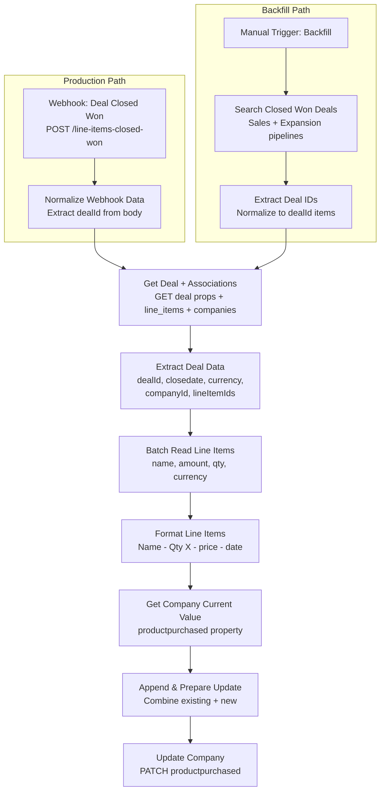

# Line Items to Company Property — Architecture v1.0

## Overview

This workflow extracts line items from deals that move to Closed Won in the Sales or Expansion pipeline, formats them as a human-readable string (product name, quantity, net price with currency, close date), and appends them to the company's `productpurchased` property in HubSpot.

Two entry points: a webhook for production (triggered by a HubSpot internal workflow) and a manual trigger for backfilling existing closed-won deals.

## Workflow Diagram

## Node Reference

### Webhook: Deal Closed Won (`webhook-1`)
- **Type**: n8n-nodes-base.webhook v2.1
- **Purpose**: Production entry point — receives deal ID from HubSpot internal workflow
- **Config**: POST method, path `line-items-closed-won`, responds immediately
- **Output**: `{body: {dealId: "123"}}`

### Normalize Webhook Data (`normalize-webhook`)
- **Type**: n8n-nodes-base.code v2
- **Purpose**: Extracts dealId from webhook body, handles both `body.dealId` and `dealId` formats
- **Mode**: Run Once for All Items
- **Output**: `{dealId: "123"}`

### Manual Trigger: Backfill (`manual-1`)
- **Type**: n8n-nodes-base.manualTrigger v1
- **Purpose**: Backfill entry point — click to process all existing closed-won deals

### Search Closed Won Deals (`search-deals`)
- **Type**: n8n-nodes-base.httpRequest v4.4
- **Purpose**: Searches HubSpot for all deals in Closed Won stage across both pipelines
- **API**: POST `/crm/v3/objects/deals/search`
- **Filters**: Two filter groups (OR logic):
  - Sales Pipeline (`default`) + stage `closedwon`
  - Expansion Pipeline (`3585124587`) + stage `4914500817`
- **Limit**: 100 deals per run
- **Retry**: 3 attempts, 1s between tries

### Extract Deal IDs (`extract-deals`)
- **Type**: n8n-nodes-base.code v2
- **Purpose**: Normalizes search results to individual items with `{dealId}`
- **Mode**: Run Once for All Items
- **Error**: Throws if no deals found

### Get Deal + Associations (`get-deal`)
- **Type**: n8n-nodes-base.httpRequest v4.4
- **Purpose**: Fetches deal properties AND associated line item/company IDs in one call
- **API**: GET `/crm/v3/objects/deals/{dealId}?properties=pipeline,deal_currency_code,closedate&associations=line_items,companies`
- **Retry**: 3 attempts, 1s between tries

### Extract Deal Data (`extract-deal-data`)
- **Type**: n8n-nodes-base.code v2
- **Purpose**: Extracts and structures deal metadata from the API response
- **Mode**: Run Once for Each Item
- **Handles**: Both `line items` (space) and `line_items` (underscore) association keys
- **Errors**: Throws if deal has no associated company or no line items
- **Output**: `{dealId, closedate, currency, companyId, lineItemIds: [...]}`

### Batch Read Line Items (`batch-line-items`)
- **Type**: n8n-nodes-base.httpRequest v4.4
- **Purpose**: Fetches all line item details in a single batch call
- **API**: POST `/crm/v3/objects/line_items/batch/read`
- **Properties**: `name`, `amount`, `quantity`, `hs_line_item_currency_code`
- **Body**: Dynamic — uses `$json.lineItemIds` from previous node
- **Retry**: 3 attempts, 1s between tries

### Format Line Items (`format-line-items`)
- **Type**: n8n-nodes-base.code v2
- **Purpose**: Formats each line item into the display string
- **Mode**: Run Once for Each Item
- **Data sources**:
  - Line items from `$input.item.json.results`
  - Deal metadata from `$('Extract Deal Data').item.json`
- **Currency mapping**: EUR→€, USD→$, GBP→£, CAD→CA$
- **Date format**: DD/MM/YYYY from deal's `closedate`
- **Output format**: `Product Name - Qty X - €500.00 - Closed Won on DD/MM/YYYY`
- **Output**: `{companyId, newLineItems: "formatted\nstring"}`

### Get Company Current Value (`get-company`)
- **Type**: n8n-nodes-base.httpRequest v4.4
- **Purpose**: Reads the company's current `productpurchased` value (for appending)
- **API**: GET `/crm/v3/objects/companies/{companyId}?properties=productpurchased`
- **Retry**: 3 attempts, 1s between tries

### Append & Prepare Update (`append-prepare`)
- **Type**: n8n-nodes-base.code v2
- **Purpose**: Combines existing product-purchased text with new line items
- **Mode**: Run Once for Each Item
- **Data sources**:
  - Current company value from `$input.item.json`
  - New formatted items from `$('Format Line Items').item.json`
- **Logic**: If existing value exists, appends with newline separator. Otherwise uses new items only.
- **Output**: `{companyId, updatedProductPurchased: "full text"}`

### Update Company (`update-company`)
- **Type**: n8n-nodes-base.httpRequest v4.4
- **Purpose**: Writes the updated `productpurchased` property to the company
- **API**: PATCH `/crm/v3/objects/companies/{companyId}`
- **Body**: `{properties: {productpurchased: "..."}}`
- **Retry**: 3 attempts, 1s between tries

## Routing Logic

### Two Entry Points → Shared Processing
- **Webhook path**: Single deal at a time, triggered by HubSpot internal workflow
- **Backfill path**: Multiple deals, triggered manually
- Both paths normalize to items with `{dealId}` and feed into the same processing pipeline

### Data Persistence Between Nodes
The workflow uses `$('Node Name').item.json` to reference data from earlier nodes after HTTP Request nodes replace the current item:
- `Format Line Items` references `$('Extract Deal Data').item.json` for deal metadata
- `Append & Prepare Update` references `$('Format Line Items').item.json` for formatted text

## Error Handling

- All HTTP Request nodes have **retry on fail** (3 attempts, 1s wait)
- Code nodes throw explicit errors for missing data (no company, no line items)
- Webhook responds immediately (no blocking on processing)

## Design Decisions

1. **Webhook + HubSpot workflow (not HubSpot Trigger node)**: The n8n HubSpot Trigger fires on ANY deal stage change, wasting executions. A HubSpot internal workflow filters at the source — only Closed Won in the right pipelines triggers n8n.

2. **HubSpot App Token (not API key or OAuth2)**: HubSpot API keys are deprecated. The Private App Token is the current standard and works with all CRM v3 endpoints.

3. **Single GET with associations (not multiple calls)**: The `?associations=line_items,companies` parameter fetches deal properties + association IDs in one API call, reducing latency.

4. **Batch read for line items (not individual GETs)**: A deal may have multiple line items. The batch read endpoint handles all of them in one call.

5. **`amount` field (not `price`)**: The `amount` property is the net price after discounts — exactly what the client paid. The `price` property is the unit price before discounts.

6. **Append logic (not overwrite)**: New line items are appended to existing `productpurchased` text with newline separation, preserving the purchase history across multiple deals.

7. **`$('Node Name').item.json` for cross-node data**: HTTP Request nodes replace item data with their response. This syntax pairs items across nodes, maintaining data integrity even when processing multiple deals in the backfill path.

## Credentials Required

| Service | Credential Name | Type | Used By |
|---------|----------------|------|---------|
| HubSpot | hubspot | App Token (Private App) | All HTTP Request nodes |

## n8n Instance

- **Workflow ID**: `TQHGk5e2V0XL8D4f`
- **URL**: https://legalfly.app.n8n.cloud/workflow/TQHGk5e2V0XL8D4f
