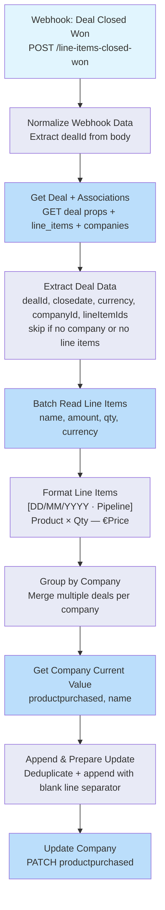

# Line Items to Company Property — Architecture v2.0

## Overview

This workflow extracts line items from deals that move to Closed Won in the Sales or Expansion pipeline, formats them as a human-readable block (date header, product name, quantity, net price), and appends them to the company's `productpurchased` property in HubSpot.

Triggered by a HubSpot internal workflow via webhook whenever a deal closes. Processes all companies regardless of lifecycle stage. Deduplicates on re-fire. Errors route to the shared Slack error handler.

## Workflow Diagram



## Node Reference

### Webhook: Deal Closed Won (`webhook-1`)
- **Type**: n8n-nodes-base.webhook v2.1
- **Purpose**: Production entry point — receives deal ID from HubSpot internal workflow when a deal moves to Closed Won
- **Config**: POST method, path `line-items-closed-won`
- **Output**: `{body: {dealId: "123"}}`

### Normalize Webhook Data (`normalize-webhook`)
- **Type**: n8n-nodes-base.code v2
- **Purpose**: Extracts dealId from webhook body, handles both `body.dealId` and root `dealId` formats
- **Mode**: Run Once for All Items
- **Error**: Throws if no dealId found
- **Output**: `{dealId: "123"}`

### Get Deal + Associations (`get-deal`)
- **Type**: n8n-nodes-base.httpRequest v4.4
- **Purpose**: Fetches deal properties AND associated line item/company IDs in one API call
- **API**: GET `/crm/v3/objects/deals/{dealId}?properties=pipeline,deal_currency_code,closedate&associations=line_items,companies`
- **Retry**: 3 attempts, 1s between tries

### Extract Deal Data (`extract-deal-data`)
- **Type**: n8n-nodes-base.code v2
- **Purpose**: Extracts and structures deal metadata; skips deals with no company or no line items
- **Mode**: Run Once for All Items (flatMap)
- **Skip logic**: Returns `[]` (no error) if deal has no associated company or no line items — handles churn deals and deals without products gracefully
- **Handles**: Both `line items` (space) and `line_items` (underscore) association key formats
- **Output**: `{dealId, closedate, currency, pipeline, companyId, lineItemIds: [...]}`

### Batch Read Line Items (`batch-line-items`)
- **Type**: n8n-nodes-base.httpRequest v4.4
- **Purpose**: Fetches all line item details in a single batch call
- **API**: POST `/crm/v3/objects/line_items/batch/read`
- **Properties**: `name`, `amount`, `quantity`, `hs_line_item_currency_code`
- **Body**: Dynamic — built from `$json.lineItemIds`
- **Retry**: 3 attempts, 1s between tries

### Format Line Items (`format-line-items`)
- **Type**: n8n-nodes-base.code v2
- **Purpose**: Formats each deal's line items into a readable block with a date/pipeline header
- **Mode**: Run Once for All Items (flatMap, skips if no results)
- **Data sources**: Line items from `$input`, deal metadata from `$('Extract Deal Data').all()[index]`
- **Currency mapping**: EUR→€, USD→$, GBP→£, CAD→CA$
- **Pipeline mapping**: `default`→New Business, `3585124587`→Expansion
- **Date format**: DD/MM/YYYY
- **Output format**:
  ```
  [03/03/2026 · New Business]
  Contract License × 2 — €10,000.00
  Implementation Services × 1 — €3,500.00
  ```
- **Output**: `{companyId, newLineItems: "formatted string"}`

### Group by Company (`group-by-company`)
- **Type**: n8n-nodes-base.code v2
- **Purpose**: Merges multiple deal blocks for the same company (relevant when a webhook fires for a company with multiple concurrent deals — rare in production but handled correctly)
- **Mode**: Run Once for All Items
- **Join**: Multiple deal blocks separated by `\n\n` (blank line)
- **Output**: `{companyId, newLineItems: "merged string"}`

### Get Company Current Value (`get-company`)
- **Type**: n8n-nodes-base.httpRequest v4.4
- **Purpose**: Reads the company's current `productpurchased` value before appending
- **API**: GET `/crm/v3/objects/companies/{companyId}?properties=productpurchased,name,lifecyclestage`
- **Retry**: 3 attempts, 1s between tries

### Append & Prepare Update (`append-prepare`)
- **Type**: n8n-nodes-base.code v2
- **Purpose**: Combines existing property text with new line items; deduplicates to prevent double-writes
- **Mode**: Run Once for All Items
- **Data sources**: Company data from `$input`, grouped line items from `$('Group by Company').all()[i]`
- **Deduplication**: Splits existing value by `\n`; only adds lines not already present. Empty strings (`""`) are always passed through to preserve blank line separators between deal groups.
- **Append separator**: Uses `\n\n` between old content and newly appended content
- **Output**: `{companyId, companyName, updatedProductPurchased: "full text"}`

### Update Company (`update-company`)
- **Type**: n8n-nodes-base.httpRequest v4.4
- **Purpose**: Writes the updated `productpurchased` property to the company
- **API**: PATCH `/crm/v3/objects/companies/{companyId}`
- **Body**: `{properties: {productpurchased: "..."}}`
- **Retry**: 3 attempts, 1s between tries

## Output Format

```
[03/03/2026 · New Business]
Contract License × 2 — €10,000.00
Implementation Services × 1 — €3,500.00

[15/01/2026 · Expansion]
Platform Subscription × 1 — €24,000.00
```

Each deal group is separated by a blank line. New groups are appended below existing content, also separated by a blank line.

## Error Handling

- All HTTP Request nodes have **retry on fail** (3 attempts, 1s wait)
- Deals with no line items or no associated company are **silently skipped** (no error thrown)
- Webhook responds immediately — processing is asynchronous
- Workflow errors route to **Error Handler - Slack Notification** (`TA6Iq4wMW0KYsCiH`) via `errorWorkflow` setting

## Design Decisions

1. **Webhook + HubSpot internal workflow (not HubSpot Trigger node)**: The n8n HubSpot Trigger fires on ANY deal stage change. A HubSpot internal workflow filters at the source — only Closed Won in the right pipelines triggers n8n.

2. **No lifecycle stage filter**: All companies are updated regardless of lifecycle stage. New clients signing their first deal need the property populated too — filtering by `customer` would miss them.

3. **Skip instead of throw for missing data**: Churn deals and deals without line items return `[]` from Extract Deal Data rather than throwing. This keeps the workflow running cleanly without noise in the error handler.

4. **`amount` field (not `price`)**: The `amount` property is the net price after discounts — exactly what the client paid. `price` is the unit list price before discounts.

5. **Deduplication on every run**: If the HubSpot workflow fires the webhook twice for the same deal, no duplicate lines are written. The check compares full line strings.

6. **Blank line deduplication exception**: Empty strings (`""`) are always passed through the deduplication filter, because they're structural separators between deal groups — not content lines. Filtering them would collapse multiple deal groups into one block.

7. **`\n\n` separator when appending**: New content is joined to existing content with a double newline, ensuring a blank line separator between old and new deal groups regardless of which batch they came from.

8. **Single GET with associations**: The `?associations=line_items,companies` parameter fetches deal properties + association IDs in one API call, reducing latency and API quota usage.

9. **Batch read for line items**: A deal may have multiple line items. The batch read endpoint handles all of them in one call.

## Credentials Required

| Service | Credential Name | Type | Used By |
|---------|----------------|------|---------|
| HubSpot | hubspot | App Token (Private App) | All HTTP Request nodes |

## n8n Instance

- **Workflow ID**: `TQHGk5e2V0XL8D4f`
- **URL**: https://legalfly.app.n8n.cloud/workflow/TQHGk5e2V0XL8D4f
- **Error Handler**: `TA6Iq4wMW0KYsCiH` (Error Handler - Slack Notification)
