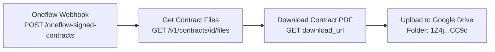

# Oneflow Signed Contract to Google Drive -- Architecture v1.0

## Overview

When a contract is signed in Oneflow (all parties have signed), Oneflow sends a webhook event (`contract:sign`) to this workflow. The workflow then fetches the signed contract's PDF file from the Oneflow API and uploads it to a designated Google Drive folder for archival.

## Workflow Diagram

## Node Reference

### Oneflow Webhook (`a1b2c3d4-webhook`)
- **Type**: n8n-nodes-base.webhook v2
- **Purpose**: Receives POST requests from Oneflow when a contract:sign event fires
- **Key config**: Path `oneflow-signed-contracts`, HTTP Method POST, responds immediately with 200
- **Output**: Full webhook payload including `body.data.subject.id` (contract ID) and `body.data.subject.name` (contract name)

### Get Contract Files (`a1b2c3d4-getfiles`)
- **Type**: n8n-nodes-base.httpRequest v4.2
- **Purpose**: Fetches the list of files associated with the signed contract from Oneflow API
- **Key config**: GET `https://api.oneflow.com/v1/contracts/{{ $json.body.data.subject.id }}/files` with `x-oneflow-api-token` header authentication
- **Output**: JSON array of file objects containing `download_url` and file metadata

### Download Contract PDF (`a1b2c3d4-download`)
- **Type**: n8n-nodes-base.httpRequest v4.2
- **Purpose**: Downloads the actual PDF binary from the Oneflow file download URL
- **Key config**: GET request to `{{ $json.download_url || $json[0].download_url }}` with same Oneflow header auth, response format set to `file`
- **Output**: Binary PDF data

### Upload to Google Drive (`a1b2c3d4-upload`)
- **Type**: n8n-nodes-base.googleDrive v3
- **Purpose**: Uploads the downloaded PDF to the designated Google Drive folder
- **Key config**: Upload operation, folder ID `1Z4j_Y_8RURFbG_rVHn2inU2LOwIaCC9c`, file name derived from contract subject name
- **Credential**: Google Drive account (googleDriveOAuth2Api, ID: AuwcL65OqohMjmOj)
- **Output**: Google Drive file metadata (file ID, URL, etc.)

### Workflow Info (`a1b2c3d4-sticky`)
- **Type**: n8n-nodes-base.stickyNote v1
- **Purpose**: In-workflow documentation describing the workflow purpose and configuration

## Routing Logic

Linear flow with no branching:
1. Webhook receives event -> passes full payload to Get Contract Files
2. Get Contract Files -> passes file list to Download Contract PDF
3. Download Contract PDF -> passes binary to Upload to Google Drive

## Error Handling

- Default n8n error handling (workflow stops on error)
- HTTP Request nodes will fail if Oneflow API returns non-2xx status
- Google Drive upload will fail if credentials are invalid or folder doesn't exist
- Consider adding error notification (e.g., Slack/email) in a future version

## Design Decisions

- **Inline API token in headers**: The Oneflow API token is passed directly in HTTP Request header parameters rather than using a stored credential, since n8n does not have a native Oneflow credential type
- **Two-step file download**: Oneflow's API requires first fetching the file list, then downloading the actual file from the returned URL -- this cannot be done in a single request
- **Dynamic file naming**: The uploaded file is named after the contract subject from the webhook payload, with `.pdf` extension, for easy identification in Google Drive
- **Response mode onReceived**: Webhook responds immediately with 200 to Oneflow to prevent timeout retries

## Credentials Required

| Service | Credential name | Used for |
|---------|----------------|---------|
| Google Drive | Google Drive account | Uploading signed PDF to Drive folder |
| Oneflow | (inline x-oneflow-api-token header) | Fetching contract files and downloading PDF |

## n8n Instance
- **Workflow ID**: `00YFVcmBURJZ3cGU`
- **URL**: https://legalfly.app.n8n.cloud/workflow/00YFVcmBURJZ3cGU
