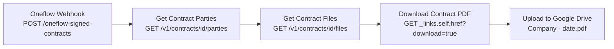

# Oneflow Signed Contract to Google Drive -- Architecture v1.2

## Overview

When a contract is fully signed in Oneflow (all parties have signed), Oneflow sends a `contract:sign` webhook event to this workflow. The workflow fetches the counterparty company name and signed contract PDF from the Oneflow API, and uploads it to a designated Google Drive folder named `{Company Name} - {YYYY-MM-DD}.pdf`.

Event filtering is done at the Oneflow webhook level (EVENT_TYPE filter), so only `contract:sign` events reach this workflow — no in-workflow filtering needed.

## Workflow Diagram

## Node Reference

### Oneflow Webhook (`a1b2c3d4-webhook`)
- **Type**: n8n-nodes-base.webhook v2
- **Purpose**: Receives POST requests from Oneflow for `contract:sign` events
- **Key config**: Path `oneflow-signed-contracts`, HTTP Method POST, responds immediately with 200
- **Output**: Full webhook payload including `body.contract.id`, `body.events[0].type`

### Get Contract Parties (`a1b2c3d4-getparties`)
- **Type**: n8n-nodes-base.httpRequest v4.2
- **Purpose**: Fetches the list of parties (companies/individuals) on the contract to get the counterparty name
- **Key config**: GET `https://api.oneflow.com/v1/contracts/{{ $json.body.contract.id }}/parties` with httpHeaderAuth credential
- **Output**: JSON with `data[]` array containing party objects with `name`, `my_party` (boolean), `type`, `participants[]`

### Get Contract Files (`a1b2c3d4-getfiles`)
- **Type**: n8n-nodes-base.httpRequest v4.2
- **Purpose**: Fetches the list of files associated with the signed contract
- **Key config**: GET `https://api.oneflow.com/v1/contracts/{{ $('Oneflow Webhook').item.json.body.contract.id }}/files` — references webhook directly since `$json` now contains parties response
- **Output**: JSON with `data[]` array containing file objects with `_links.self.href`, `name`, `extension`

### Download Contract PDF (`a1b2c3d4-download`)
- **Type**: n8n-nodes-base.httpRequest v4.2
- **Purpose**: Downloads the actual PDF binary from the Oneflow file download URL
- **Key config**: GET `{{ $json.data[0]._links.self.href }}?download=true` with httpHeaderAuth credential, response format `file`, follow redirects enabled
- **Output**: Binary PDF data (Oneflow redirects to S3 presigned URL)

### Upload to Google Drive (`a1b2c3d4-upload`)
- **Type**: n8n-nodes-base.googleDrive v3
- **Purpose**: Uploads the downloaded PDF to Google Drive with a recognisable company name and date
- **Key config**: Upload operation, folder ID `1Z4j_Y_8RURFbG_rVHn2inU2LOwIaCC9c`
- **File name**: `={{ $('Get Contract Parties').item.json.data.filter(p => !p.my_party)[0].name }} - {{ $now.format('yyyy-MM-dd') }}.pdf` — filters parties to find the counterparty (`my_party: false`), uses their company name + today's date
- **Credential**: Google Drive account (googleDriveOAuth2Api, ID: AuwcL65OqohMjmOj)

### Workflow Info (`a1b2c3d4-sticky`)
- **Type**: n8n-nodes-base.stickyNote v1
- **Purpose**: In-workflow documentation

## Routing Logic

1. Oneflow sends only `contract:sign` events (filtered at webhook source, webhook ID 20565)
2. Webhook receives event -> passes to Get Contract Parties
3. Get Contract Parties -> calls Oneflow API with `body.contract.id` -> passes party data downstream
4. Get Contract Files -> references webhook node directly for contract ID (since `$json` is now parties data) -> passes file list
5. Download Contract PDF -> uses HAL link from files response -> passes binary
6. Upload to Google Drive -> names file using counterparty name from parties response + current date

## Error Handling

- Default n8n error handling (workflow stops on error)
- HTTP Request nodes will fail if Oneflow API returns non-2xx status
- Google Drive upload will fail if credentials are invalid or folder doesn't exist

## Design Decisions

- **Source-side event filtering**: Oneflow webhook (ID: 20565) is configured with `EVENT_TYPE = contract:sign` filter via the Oneflow API. This prevents unnecessary workflow executions for irrelevant events (publish, delete, participant sign, etc.). No in-workflow IF filter needed.
- **Stored httpHeaderAuth credential**: Uses n8n's credential store ("Oneflow") for security.
- **Counterparty name via parties API**: Calls `GET /contracts/{id}/parties` and filters for `my_party: false` to get the counterparty company name. This is used in the file name for easy identification.
- **Explicit webhook reference in Get Contract Files**: After the Get Contract Parties node, `$json` in downstream nodes refers to the parties response, not the webhook. Get Contract Files uses `$('Oneflow Webhook').item.json...` to reach back to the original webhook payload for the contract ID.
- **Oneflow payload structure**: The real Oneflow webhook payload uses `body.contract.id` for the contract ID and `body.events[0].type` for the event type (not `body.data.subject.id` or `body.type` as initially assumed).
- **Date in file name**: Uses `$now.format('yyyy-MM-dd')` for the current date when the workflow runs, providing a clear chronological reference.

## Credentials Required

| Service | Credential name | Used for |
|---------|----------------|---------|
| Google Drive | Google Drive account | Uploading signed PDF to Drive folder |
| Oneflow | Oneflow (httpHeaderAuth) | API calls to fetch parties, files, and download PDF |

## n8n Instance
- **Workflow ID**: `00YFVcmBURJZ3cGU`
- **URL**: https://legalfly.app.n8n.cloud/workflow/00YFVcmBURJZ3cGU
