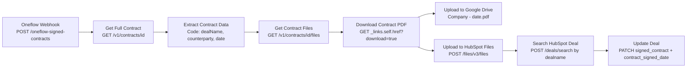

# Oneflow Signed Contract to Google Drive + HubSpot -- Architecture v2.0

## Overview

When a contract is fully signed in Oneflow (all parties have signed), Oneflow sends a `contract:sign` webhook event to this workflow. The workflow fetches the full contract details (including HubSpot deal name from Oneflow's `data_fields`), downloads the signed PDF, and:

1. **Uploads to Google Drive** -- `{Company Name} - {YYYY-MM-DD}.pdf` in the signed contracts folder
2. **Uploads to HubSpot File Manager** -- same PDF stored in `/signed-contracts/`
3. **Updates the HubSpot deal** -- sets `signed_contract` (file) and `contract_signed_date` (date) properties

Event filtering is done at the Oneflow webhook level (EVENT_TYPE filter), so only `contract:sign` events reach this workflow.

## Workflow Diagram

## Node Reference

### Oneflow Webhook (`a1b2c3d4-webhook`)
- **Type**: n8n-nodes-base.webhook v2
- **Purpose**: Receives POST requests from Oneflow for `contract:sign` events
- **Key config**: Path `oneflow-signed-contracts`, HTTP Method POST, responds immediately with 200
- **Output**: Full webhook payload including `body.contract.id`, `body.events[0].created_time`

### Get Full Contract (`get-full-contract`)
- **Type**: n8n-nodes-base.httpRequest v4.2
- **Purpose**: Fetches the complete contract object including `data_fields` (with HubSpot deal name) and `parties`
- **Key config**: GET `https://api.oneflow.com/v1/contracts/{{ $json.body.contract.id }}` with httpHeaderAuth credential
- **Output**: Full contract JSON with `data_fields[]`, `parties[]`, `lifecycle_state`, `state`, etc.

### Extract Contract Data (`extract-data`)
- **Type**: n8n-nodes-base.code v2
- **Purpose**: Extracts the key fields needed downstream from the full contract response
- **Key config**: JavaScript code that extracts:
  - `dealName` from `data_fields` where `custom_id === 'hs_deal_dealname'`
  - `counterpartyName` from `parties` where `my_party === false`
  - `contractId` from the contract object
  - `signingDate` from webhook `events[0].created_time`, formatted as `YYYY-MM-DD`
- **Output**: `{ contractId, dealName, counterpartyName, signingDate }`

### Get Contract Files (`get-files`)
- **Type**: n8n-nodes-base.httpRequest v4.2
- **Purpose**: Fetches the list of files associated with the signed contract
- **Key config**: GET `https://api.oneflow.com/v1/contracts/{{ $json.contractId }}/files`
- **Output**: JSON with `data[]` array containing file objects with `_links.self.href`, `name`, `extension`

### Download Contract PDF (`download-pdf`)
- **Type**: n8n-nodes-base.httpRequest v4.2
- **Purpose**: Downloads the actual PDF binary from the Oneflow file download URL
- **Key config**: GET `{{ $json.data[0]._links.self.href }}?download=true`, response format `file`, follow redirects enabled
- **Output**: Binary PDF data (Oneflow redirects to S3 presigned URL)

### Upload to Google Drive (`upload-gdrive`)
- **Type**: n8n-nodes-base.googleDrive v3
- **Purpose**: Uploads the downloaded PDF to Google Drive with company name and date
- **Key config**: Upload operation, folder ID `1Z4j_Y_8RURFbG_rVHn2inU2LOwIaCC9c`
- **File name**: `={{ $('Extract Contract Data').item.json.counterpartyName }} - {{ $('Extract Contract Data').item.json.signingDate }}.pdf`

### Upload to HubSpot Files (`upload-hubspot`)
- **Type**: n8n-nodes-base.httpRequest v4.2
- **Purpose**: Uploads the PDF to HubSpot's File Manager so it can be attached to a deal property
- **Key config**: POST `https://api.hubapi.com/files/v3/files`, multipart/form-data with binary file, options `{"access":"PRIVATE","overwrite":false}`, folderPath `/signed-contracts`
- **Output**: HubSpot file object with `url` field used as the deal property value

### Search HubSpot Deal (`search-deal`)
- **Type**: n8n-nodes-base.httpRequest v4.2
- **Purpose**: Finds the HubSpot deal by exact deal name match
- **Key config**: POST `https://api.hubapi.com/crm/v3/objects/deals/search` with filter `dealname EQ {{ dealName }}`
- **Output**: Search results with `results[0].id` containing the deal ID

### Update Deal (`update-deal`)
- **Type**: n8n-nodes-base.httpRequest v4.2
- **Purpose**: Sets the signed contract file and signing date on the HubSpot deal
- **Key config**: PATCH `https://api.hubapi.com/crm/v3/objects/deals/{{ $json.results[0].id }}` with properties:
  - `signed_contract`: HubSpot File Manager URL from Upload to HubSpot Files
  - `contract_signed_date`: `YYYY-MM-DD` formatted signing date
- **Retry**: 3 attempts with 1s delay

### Workflow Info (`sticky-note`)
- **Type**: n8n-nodes-base.stickyNote v1
- **Purpose**: In-workflow documentation

## Routing Logic

1. Oneflow sends only `contract:sign` events (filtered at webhook source, webhook ID 20565)
2. Webhook receives event -> passes to Get Full Contract
3. Get Full Contract -> calls Oneflow API with contract ID -> returns full contract with data_fields and parties
4. Extract Contract Data -> extracts dealName, counterpartyName, contractId, signingDate
5. Get Contract Files -> fetches file list for the contract
6. Download Contract PDF -> downloads binary using HAL link
7. **Parallel split** after Download:
   - **Top branch**: Upload to Google Drive (ends here)
   - **Bottom branch**: Upload to HubSpot Files -> Search HubSpot Deal by name -> Update Deal with file + date

## Oneflow-to-HubSpot Linkage

The Oneflow contract's `data_fields` contain HubSpot data populated when the contract was created from HubSpot. The key field is:
- `custom_id: "hs_deal_dealname"` -> contains the exact HubSpot deal name

This deal name is used to search HubSpot deals via the CRM Search API. The search returns the deal ID which is used for the PATCH update.

Other available HubSpot fields in Oneflow `data_fields`:
- `hs_owner_fullname`, `hs_owner_email` -- deal owner info
- `hs_participant_*_fullname`, `hs_participant_*_email` -- contact info
- `hs_deal_*` prefixed fields -- various deal properties (service start date, initial term, billing info, etc.)

## Error Handling

- Default n8n error handling (workflow stops on error)
- Update Deal node has retry: 3 attempts with 1s delay
- HTTP Request nodes will fail if APIs return non-2xx status
- If deal name search returns no results, Update Deal will fail on `$json.results[0].id`

## Design Decisions

- **Full contract API instead of parties-only**: v2.0 calls `GET /contracts/{id}` instead of `/contracts/{id}/parties`. This returns the full contract including `data_fields` with the HubSpot deal name, eliminating the need for a separate parties call.
- **Deal name search**: The Oneflow contract doesn't store a HubSpot deal ID directly, but the `hs_deal_dealname` data field provides an exact match for searching. This works because Oneflow contracts are created from HubSpot deals, and deal names are unique enough for reliable matching.
- **HubSpot File Manager upload**: The `signed_contract` deal property is a file type, which requires the file to be hosted in HubSpot's File Manager. The file is uploaded with `access: PRIVATE` to the `/signed-contracts/` folder.
- **Parallel upload branches**: After downloading the PDF, both Google Drive and HubSpot uploads run in parallel. The HubSpot branch continues sequentially (upload -> search -> update) since each step depends on the previous.
- **Signing date from webhook event**: Uses `events[0].created_time` from the webhook payload as the contract signing date, formatted as `YYYY-MM-DD` for HubSpot's date property.
- **Source-side event filtering**: Oneflow webhook (ID: 20565) is configured with `EVENT_TYPE = contract:sign` filter.

## Credentials Required

| Service | Credential name | Type | Used for |
|---------|----------------|------|----------|
| Google Drive | Google Drive account | Google Drive OAuth2 API | Uploading signed PDF to Drive folder |
| Oneflow | Oneflow | httpHeaderAuth (x-oneflow-api-token) | API calls to fetch contract, files, and download PDF |
| HubSpot | hubspot | hubspotAppToken | File Manager upload, deal search, deal update |

### HubSpot Scopes Required
- `files` -- upload files to File Manager
- `crm.objects.deals.write` -- update deal properties
- `crm.objects.deals.read` -- search deals (existing)

## n8n Instance
- **Workflow ID**: `00YFVcmBURJZ3cGU`
- **URL**: https://legalfly.app.n8n.cloud/workflow/00YFVcmBURJZ3cGU
