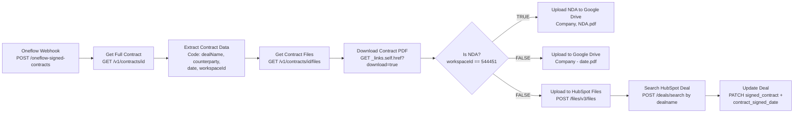

# Oneflow Signed Contract to Google Drive + HubSpot -- Architecture v2.1

## Overview

When a contract is fully signed in Oneflow (all parties have signed), Oneflow sends a `contract:sign` webhook event to this workflow. The workflow fetches the full contract details, downloads the signed PDF, and routes based on the Oneflow workspace:

- **NDA workspace (544451)**: Uploads PDF to a dedicated NDA Google Drive folder as `{Company Name}, NDA.pdf`. No HubSpot integration.
- **All other workspaces**: Uploads to the regular contracts Google Drive folder, uploads to HubSpot File Manager, and updates the HubSpot deal with the file and signing date.

Event filtering is done at the Oneflow webhook level (EVENT_TYPE filter), so only `contract:sign` events reach this workflow.

## Workflow Diagram

## Node Reference

### Oneflow Webhook (`a1b2c3d4-webhook`)
- **Type**: n8n-nodes-base.webhook v2
- **Purpose**: Receives POST requests from Oneflow for `contract:sign` events
- **Key config**: Path `oneflow-signed-contracts`, HTTP Method POST, responds immediately with 200
- **Output**: Full webhook payload including `body.contract.id`, `body.events[0].created_time`

### Get Full Contract (`get-full-contract`)
- **Type**: n8n-nodes-base.httpRequest v4.2
- **Purpose**: Fetches the complete contract object including `data_fields` (with HubSpot deal name), `parties`, and `_private` (with workspace ID)
- **Key config**: GET `https://api.oneflow.com/v1/contracts/{{ $json.body.contract.id }}` with httpHeaderAuth credential
- **Output**: Full contract JSON with `data_fields[]`, `parties[]`, `_private.workspace_id`, etc.

### Extract Contract Data (`extract-data`)
- **Type**: n8n-nodes-base.code v2
- **Purpose**: Extracts the key fields needed downstream from the full contract response
- **Key config**: JavaScript code that extracts:
  - `dealName` from `data_fields` where `custom_id === 'hs_deal_dealname'`
  - `counterpartyName` from `parties` where `my_party === false`
  - `contractId` from the contract object
  - `signingDate` from webhook `events[0].created_time`, formatted as `YYYY-MM-DD`
  - `workspaceId` from `_private.workspace_id`
- **Output**: `{ contractId, dealName, counterpartyName, signingDate, workspaceId }`

### Get Contract Files (`get-files`)
- **Type**: n8n-nodes-base.httpRequest v4.2
- **Purpose**: Fetches the list of files associated with the signed contract
- **Key config**: GET `https://api.oneflow.com/v1/contracts/{{ $json.contractId }}/files`
- **Output**: JSON with `data[]` array containing file objects with `_links.self.href`, `name`, `extension`

### Download Contract PDF (`download-pdf`)
- **Type**: n8n-nodes-base.httpRequest v4.2
- **Purpose**: Downloads the actual PDF binary from the Oneflow file download URL
- **Key config**: GET `{{ $json.data[0]._links.self.href }}?download=true`, response format `file`, follow redirects enabled
- **Output**: Binary PDF data (Oneflow redirects to S3 presigned URL)

### Is NDA? (`is-nda`)
- **Type**: n8n-nodes-base.if v2
- **Purpose**: Routes the workflow based on the Oneflow workspace the contract belongs to
- **Key config**: Checks if `workspaceId` (from Extract Contract Data) equals `544451` (NDA workspace)
- **TRUE output (main[0])**: NDA contracts → Google Drive NDA folder only
- **FALSE output (main[1])**: Regular contracts → Google Drive + HubSpot

### Upload NDA to Google Drive (`upload-gdrive-nda`)
- **Type**: n8n-nodes-base.googleDrive v3
- **Purpose**: Uploads signed NDA PDFs to a dedicated NDA folder in Google Drive
- **Key config**: Upload operation, folder ID `1X1oWqRPxQEEZvK8MYLVLAHO_HHIeU2s4`
- **File name**: `={{ $('Extract Contract Data').item.json.counterpartyName }}, NDA.pdf`
- **Terminal node**: No downstream connections (NDA path ends here)

### Upload to Google Drive (`upload-gdrive`)
- **Type**: n8n-nodes-base.googleDrive v3
- **Purpose**: Uploads signed contract PDFs (non-NDA) to Google Drive with company name and date
- **Key config**: Upload operation, folder ID `1I9R0bHc_teD5v1hNlb_1h9rOZSMy1ke4`
- **File name**: `={{ $('Extract Contract Data').item.json.counterpartyName }} - {{ $('Extract Contract Data').item.json.signingDate }}.pdf`

### Upload to HubSpot Files (`upload-hubspot`)
- **Type**: n8n-nodes-base.httpRequest v4.2
- **Purpose**: Uploads the PDF to HubSpot's File Manager so it can be attached to a deal property
- **Key config**: POST `https://api.hubapi.com/files/v3/files`, multipart/form-data with binary file, options `{"access":"PUBLIC_NOT_INDEXABLE","overwrite":false}`, folderPath `/signed-contracts`
- **Output**: HubSpot file object with `id` field used as the deal property value

### Search HubSpot Deal (`search-deal`)
- **Type**: n8n-nodes-base.httpRequest v4.2
- **Purpose**: Finds the HubSpot deal by exact deal name match
- **Key config**: POST `https://api.hubapi.com/crm/v3/objects/deals/search` with filter `dealname EQ {{ dealName }}`, returns `dealname` and `signed_contract` properties
- **Output**: Search results with `results[0].id` (deal ID) and `results[0].properties.signed_contract` (existing file IDs)

### Update Deal (`update-deal`)
- **Type**: n8n-nodes-base.httpRequest v4.2
- **Purpose**: Sets the signed contract file and signing date on the HubSpot deal
- **Key config**: PATCH `https://api.hubapi.com/crm/v3/objects/deals/{{ $json.results[0].id }}` with properties:
  - `signed_contract`: Appends new file ID to existing value (semicolon-separated). Never overwrites existing files.
  - `contract_signed_date`: `YYYY-MM-DD` formatted signing date (always overwrites)
- **Retry**: 3 attempts with 1s delay

## Routing Logic

1. Oneflow sends only `contract:sign` events (filtered at webhook source, webhook ID 20565)
2. Webhook receives event → Get Full Contract (includes `_private.workspace_id`)
3. Extract Contract Data → extracts dealName, counterpartyName, contractId, signingDate, **workspaceId**
4. Get Contract Files → Download Contract PDF
5. **Is NDA?** node checks `workspaceId == 544451`:
   - **TRUE (NDA)**: Upload to NDA Google Drive folder → workflow ends
   - **FALSE (Regular)**: Parallel split:
     - **Top branch**: Upload to Google Drive (contracts folder) — ends here
     - **Bottom branch**: Upload to HubSpot Files → Search HubSpot Deal → Update Deal

## Oneflow-to-HubSpot Linkage

The Oneflow contract's `data_fields` contain HubSpot data populated when the contract was created from HubSpot. The key field is:
- `custom_id: "hs_deal_dealname"` → contains the exact HubSpot deal name

This is only used for regular (non-NDA) contracts. NDA contracts do not go through the HubSpot path.

## Error Handling

- **Error workflow**: `TA6Iq4wMW0KYsCiH` -- sends Slack notification on failure
- Update Deal node has retry: 3 attempts with 1s delay
- HTTP Request nodes will fail if APIs return non-2xx status
- If deal name search returns no results, Update Deal will fail on `$json.results[0].id`

## Design Decisions

- **Workspace-based routing**: The `_private.workspace_id` field on the Oneflow contract object identifies which workspace a contract belongs to. NDA workspace ID `544451` routes to a separate Google Drive folder with no HubSpot integration, since NDAs are standalone documents not linked to HubSpot deals.
- **NDA file naming**: NDAs use `{Company Name}, NDA.pdf` format (no date) since there's typically one NDA per counterparty. Regular contracts keep the `{Company Name} - {YYYY-MM-DD}.pdf` format.
- **Updated Google Drive folders**: v2.1 uses separate folder IDs for NDAs vs regular contracts (both updated from v2.0).
- **Full contract API instead of parties-only**: v2.0+ calls `GET /contracts/{id}` which returns the full contract including `_private.workspace_id`, `data_fields`, and `parties`.
- **Deal name search**: The Oneflow contract doesn't store a HubSpot deal ID directly, but the `hs_deal_dealname` data field provides an exact match for searching.
- **HubSpot File Manager upload**: The `signed_contract` deal property is a file type, requiring files in HubSpot's File Manager with `access: PUBLIC_NOT_INDEXABLE`.
- **File append, not overwrite**: The `signed_contract` property uses semicolon-separated file IDs. The workflow appends new files, preserving existing ones.
- **Source-side event filtering**: Oneflow webhook (ID: 20565) is configured with `EVENT_TYPE = contract:sign` filter.

## Credentials Required

| Service | Credential name | Type | Used for |
|---------|----------------|------|----------|
| Google Drive | Google Drive account | Google Drive OAuth2 API | Uploading signed PDFs to Drive (both NDA and contracts folders) |
| Oneflow | Oneflow | httpHeaderAuth (x-oneflow-api-token) | API calls to fetch contract, files, and download PDF |
| HubSpot | hubspot | hubspotAppToken | File Manager upload, deal search, deal update (regular contracts only) |

### HubSpot Scopes Required
- `files` -- upload files to File Manager
- `crm.objects.deals.write` -- update deal properties
- `crm.objects.deals.read` -- search deals

## n8n Instance
- **Workflow ID**: `00YFVcmBURJZ3cGU`
- **URL**: https://legalfly.app.n8n.cloud/workflow/00YFVcmBURJZ3cGU
